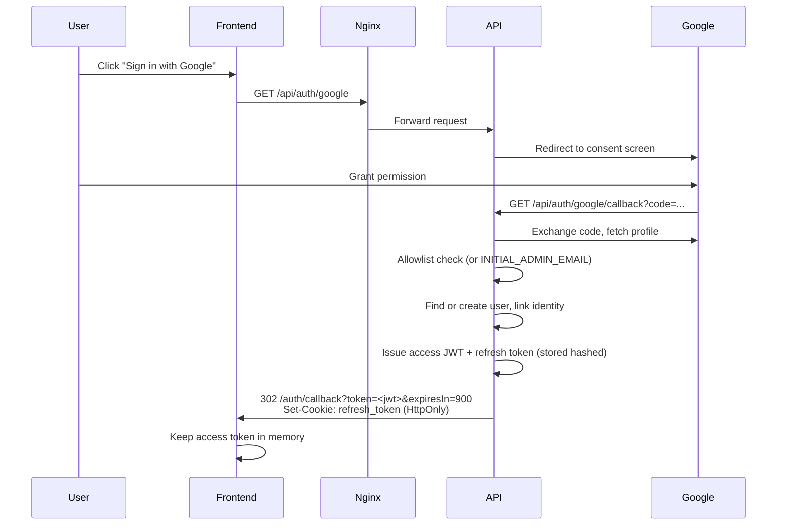
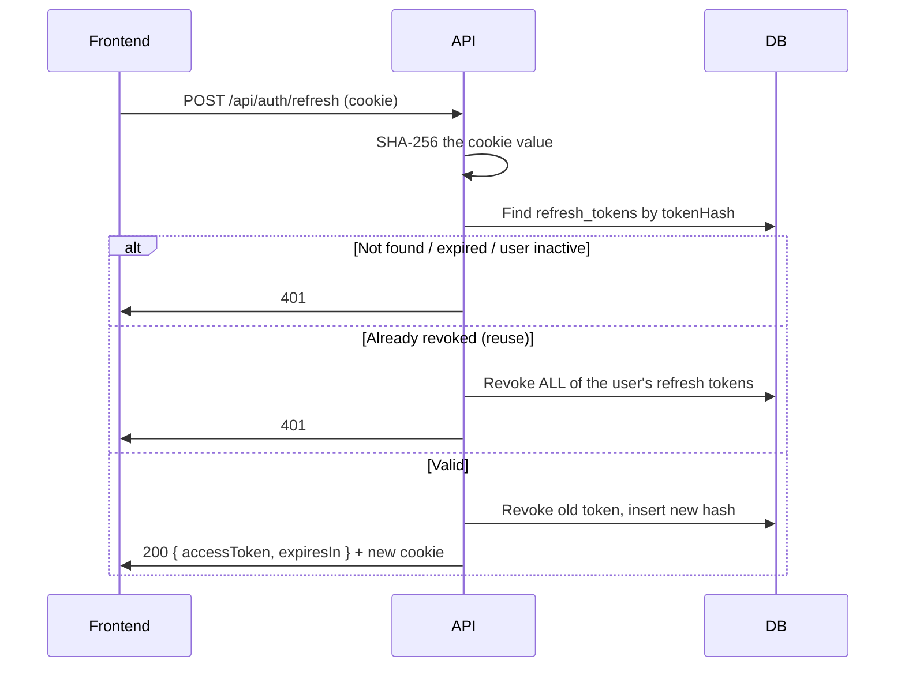
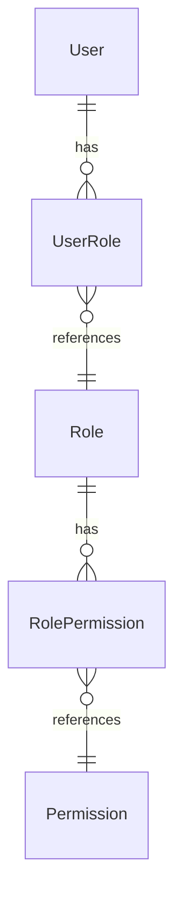
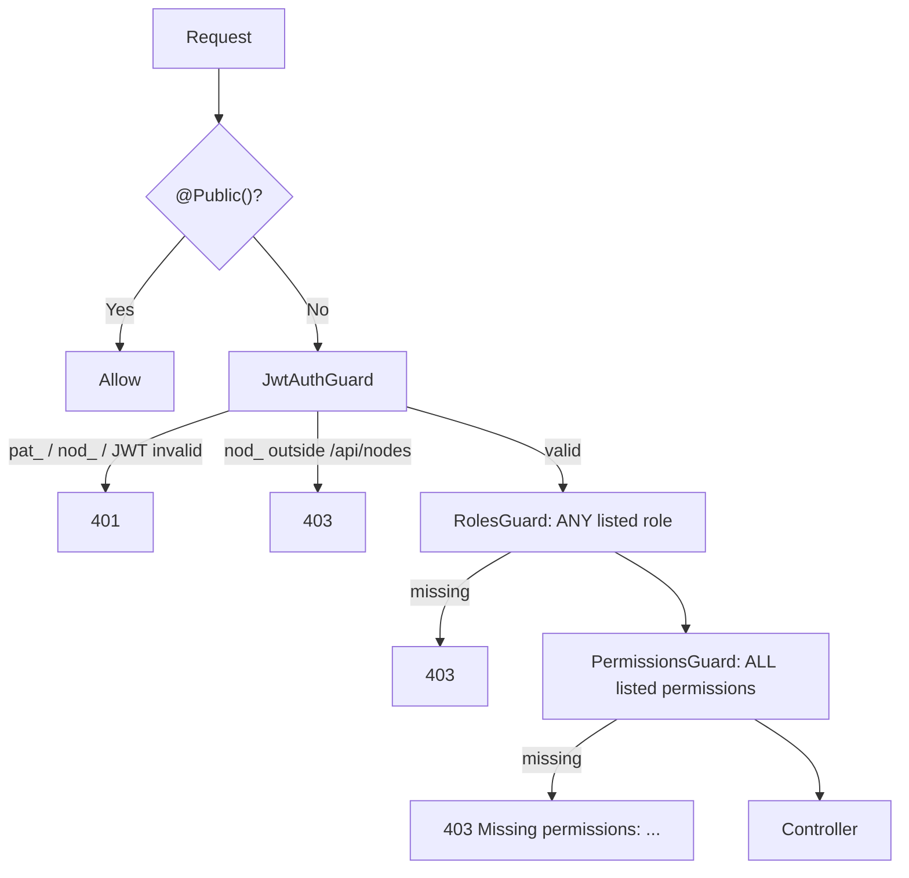
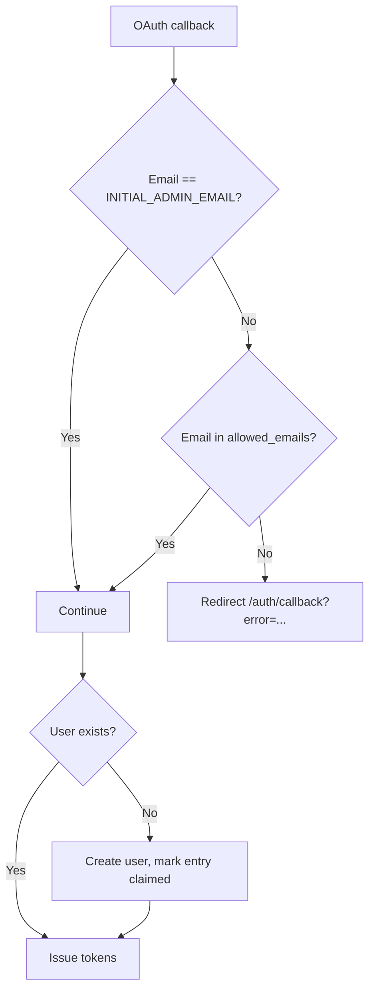

# Security Architecture

This document describes how the application authenticates callers, authorizes
them, protects the secrets it holds, and hardens the edge. It is the design
reference; the permission matrix lives in
[ARCHITECTURE.md](ARCHITECTURE.md#7-authorization) and the per-endpoint
contract lives in the generated OpenAPI document (`/api/docs`).

**Summary**

- **Authentication**: Google OAuth 2.0 / OpenID Connect. No passwords are stored.
- **Access control**: an email allowlist decides who may sign in at all.
- **Sessions**: 15-minute JWT access tokens held in memory, plus a rotating
  refresh token in an HttpOnly cookie, stored hashed.
- **Other credentials**: personal access tokens (`pat_`), worker-node
  credentials (`nod_`), device-flow tokens, and per-job brokered secrets. See
  [Credential kinds](#2-credential-kinds).
- **Authorization**: RBAC with three roles (Admin, Contributor, Viewer) and
  fine-grained permissions, enforced server-side by guards.
- **Secrets at rest**: runtime-configured secrets are encrypted with
  AES-256-GCM under `SECRETS_ENCRYPTION_KEY`.
- **Edge**: Nginx serves UI and API from one origin and sets HSTS, CSP,
  Permissions-Policy and framing headers.
- **Audit**: security-relevant actions are written to `audit_events`.

## Contents

1. [Authentication](#1-authentication)
2. [Credential kinds](#2-credential-kinds)
3. [Session tokens](#3-session-tokens)
4. [Authorization (RBAC)](#4-authorization-rbac)
5. [Email allowlist](#5-email-allowlist)
6. [Request lifecycle](#6-request-lifecycle)
7. [Audit logging and security tables](#7-audit-logging-and-security-tables)
8. [File storage security](#8-file-storage-security)
9. [Infrastructure security](#9-infrastructure-security)
10. [Encrypted credential storage](#10-encrypted-credential-storage)
11. [Attack mitigation matrix](#11-attack-mitigation-matrix)
12. [Configuration reference](#12-configuration-reference)
13. [Test authentication (development only)](#13-test-authentication-development-only)
14. [Fastify and Passport](#14-fastify-and-passport)
15. [File reference](#15-file-reference)
16. [Developer checklist](#16-developer-checklist)

---

## 1. Authentication

### OAuth 2.0 flow with Google

All interactive sign-in goes through Google. The application never sees or
stores a password.



| Route | Purpose |
|---|---|
| `GET /api/auth/providers` | Public. Lists enabled providers |
| `GET /api/auth/google` | Public. Redirects to Google |
| `GET /api/auth/google/callback` | Public. Provisions the user, sets the refresh cookie, redirects to the web app |

On success the callback redirects to `<APP_URL>/auth/callback?token=<accessToken>&expiresIn=<seconds>`.
On failure it redirects to `<APP_URL>/auth/callback?error=<message>`. The
message has newlines replaced, is truncated to 200 characters and is URL
encoded, so an exception text can never inject a header.

### User provisioning

`AuthService.handleGoogleLogin` runs these steps:

1. Lowercase the email. Reject with 403 unless it is in `allowed_emails` or
   equals `INITIAL_ADMIN_EMAIL`.
2. Look up the identity by `(provider, providerSubject)`. If absent, look up
   the user by email and link the identity.
3. If there is no user, create one inside a transaction: the user row, the
   identity, default user settings, the default role (`viewer`) and, when
   `AdminBootstrapService.shouldGrantAdminRole` says so, the `admin` role.
   The allowlist entry is then marked claimed.
4. Reject an inactive user (`isActive = false`).
5. Refresh the provider display name and picture.
6. Issue tokens.

The admin role is granted only when the email matches `INITIAL_ADMIN_EMAIL`
and no other active admin exists. Seeding adds `INITIAL_ADMIN_EMAIL` to the
allowlist.

### Access token (JWT)

```json
{
  "sub": "user-uuid",
  "email": "user@example.com",
  "roles": ["viewer"],
  "iat": 1706123456,
  "exp": 1706124356
}
```

- Signed HS256 with `JWT_SECRET` (at least 32 characters).
- Sent as `Authorization: Bearer <jwt>`. The strategy reads only the header,
  never a cookie.
- `JwtStrategy` verifies signature and expiry, then loads the user with roles
  and permissions from the database on every request and rejects an inactive
  user. Roles in the token are informational; the database is authoritative,
  so a role change or deactivation takes effect on the next request.

---

## 2. Credential kinds

Every credential the system accepts or holds, and where it is valid.

| Kind | Format | Stored as | Lifetime | Accepted on | Revocation |
|---|---|---|---|---|---|
| Session access token | JWT (HS256) | Not stored | `JWT_ACCESS_TTL_MINUTES` (15) | Every `@Auth()` route | Expiry; deactivating the user |
| Refresh token | 32 random bytes, hex, in `refresh_token` cookie | SHA-256 hash in `refresh_tokens` | `JWT_REFRESH_TTL_DAYS` (14) | `/api/auth/*` only (cookie path) | Logout, logout-all, rotation, reuse detection |
| Personal access token | `pat_` + 64 hex | SHA-256 hash in `personal_access_tokens`, shown once | Chosen at creation | Every `@Auth()` route, with the owner's full authority | `DELETE /api/pat/{id}`; deactivating the user |
| Node credential | `nod_` + 64 hex | SHA-256 hash in `node_credentials`, shown once | No mandatory expiry | `/api/nodes` and `/api/nodes/*` only | `DELETE /api/node-credentials/{id}` or the admin fleet view |
| Device-flow token | Session JWT + refresh token, or a `pat_` | As above | `DEVICE_TOKEN_EXPIRY_DAYS` (7) or `DEVICE_PAT_EXPIRY_DAYS` (90) | As above | `DELETE /api/auth/device/sessions/{id}`, immediately, for either kind |
| Per-job node secret | Short-lived PostgreSQL login role | Only its handle, in `job_node_secrets` | The job's lease + 60 s | The database, from one node, for one job | Job settles, sweep cron, or `VALID UNTIL` |
| Runtime-configured secret | Provider key, SMTP password, VAPID key, etc. | AES-256-GCM ciphertext | Until replaced | Server-side only, never returned | Replace or delete in the admin UI |
| `STACK_AGENT_TOKEN` | 32 random hex bytes | Plaintext in `.env`, on both the `api` and `stack-agent` services | Until rotated | Bearer on `stack-agent`'s `/v1/*` routes only, reachable from `app-network` only | Edit `.env` and recreate `stack-agent`/`api` |

`JwtAuthGuard` recognizes the bearer families by prefix before Passport runs:
`Bearer pat_…` goes to `PatService.validateToken`, `Bearer nod_…` to
`NodeCredentialService.validateToken`, anything else to the JWT strategy.

### Session tokens

The access JWT and refresh cookie are what the web app uses. See
[Session tokens](#3-session-tokens).

### Personal access tokens (`pat_`)

A PAT is a user delegating their own authority to a script. It is accepted on
every authenticated route with the owner's roles and permissions.

- 32 random bytes, prefixed `pat_`. Only the SHA-256 hash and a display
  prefix (`tokenPrefix`, e.g. `pat_1a2b`) are stored. The raw value is
  returned once, at creation.
- Validation rejects unknown, revoked and expired tokens, and tokens whose
  owner is inactive. `lastUsedAt` is updated on success.
- Managed at `/settings/tokens` or `POST/GET/DELETE /api/pat`. See
  [personal-access-tokens.md](personal-access-tokens.md).

### Node credentials (`nod_`)

A node credential is authority handed to an unattended worker process on a
machine the deployment may not own. It resolves to its owning user (an
admin, since `nodes:write` is Admin-only), so the guard confines it.

- Same shape as a PAT: `nod_` + 32 random bytes, SHA-256 at rest, shown once.
- **Route allowlist.** A `nod_` bearer is accepted only on `/api/nodes` and
  paths under `/api/nodes/`. The guard checks the raw URL *before* looking up
  the token, so a refused request costs no database round trip and does not
  touch `lastUsedAt`. Everything else answers 403.
- **Cannot mint another.** `/api/node-credentials` is outside that prefix on
  purpose. Minting and revoking need a session or a `pat_`, so a leaked node
  token cannot regrow itself.
- The admin fleet view is on a different prefix (`/api/admin/nodes`) and is
  equally unreachable with a `nod_` token.

Design: [specs/worker-nodes.md](specs/worker-nodes.md). Operator guide:
[runbooks/run-worker-nodes.md](runbooks/run-worker-nodes.md).

### Device-flow tokens

The device authorization grant (RFC 8628) lets the CLI and other headless
clients sign in through the browser at `/activate`. When the user approves,
`POST /api/auth/device/token` returns one of two credentials, chosen by the
client's `clientInfo.tokenType`:

- **Session** (default): a JWT access token and a refresh token, both living
  `DEVICE_TOKEN_EXPIRY_DAYS` days.
- **PAT** (`tokenType: "pat"`): a `pat_` token living `DEVICE_PAT_EXPIRY_DAYS`
  days, with no refresh token.

The credential a device session issues is linked to the `DeviceCode` row that
minted it: a session-kind access token carries a `did` claim naming that row,
which `AuthService.validateJwtPayload` re-checks on every request, and the
paired refresh token carries the same link, enforced again on every rotation.
`DELETE /api/auth/device/sessions/{id}` revokes the session **and** whatever
it issued in one step — the linked PAT (if any), every refresh token minted
from it, and, via the `did` check, the access token itself, immediately
rather than at its eventual expiry. Revoking the same PAT independently from
`DELETE /api/pat/{id}` or the Access Tokens page is not an error either way.
`POST /api/auth/logout-all` and deactivating the user remain the tools for
revoking every credential a user holds, not just one device. See
[DEVICE-AUTH.md](DEVICE-AUTH.md#device-session-management).

### Per-job brokered secrets

Some node-eligible jobs need a credential of their own; the database backup
needs a database connection. A node never persists such a secret.

- The node asks `POST /api/nodes/{id}/jobs/{jobId}/secret`. The server checks
  that the node holds the job, then the job type's `nodeSecretBroker` mints
  the secret. For the backup this is a login role with `CONNECT`, `USAGE` and
  `SELECT` only, `VALID UNTIL` the job's lease plus 60 seconds.
- The secret is returned once and held in the node's memory.
- `job_node_secrets` records the broker kind, the handle (the role name) and
  the expiry. It has no column that could hold the material.
- Three independent paths revoke it: the job-settle listener, the ten-minute
  `node-secret-sweep` cron, and PostgreSQL's own `VALID UNTIL`.
- Brokering is off unless the `nodes.jobSecretBrokerEnabled` system setting is
  on. A database role without `CREATEROLE` answers `guided` with paste-ready
  SQL rather than an error.

Operator guide: [runbooks/node-job-secrets.md](runbooks/node-job-secrets.md).

### Encrypted runtime secrets

Secrets an administrator enters in the UI (SMTP password, VAPID private key,
object-storage secret key, AI provider org keys) and secrets a user brings
(AI provider keys) are encrypted under `SECRETS_ENCRYPTION_KEY` and never
returned by any route. See [Encrypted credential storage](#10-encrypted-credential-storage).

---

## 3. Session tokens

### Access token vs refresh token

| Aspect | Access token | Refresh token |
|---|---|---|
| Type | JWT | 32 random bytes, hex |
| Client storage | Memory only (the API client's private field) | HttpOnly cookie `refresh_token` |
| Server storage | None | SHA-256 hash in `refresh_tokens` |
| Lifetime | 15 minutes | 14 days |
| Exposed to JavaScript | Yes (needed for the header) | No |
| Revocable | No; expires | Yes |
| Rotation | New one on every refresh | Single use; replaced on every refresh |

Short-lived access tokens bound the damage of a stolen token. The HttpOnly
cookie keeps the refresh token away from XSS. Hashing means a database leak
does not yield usable tokens.

### Rotation



### Reuse detection

A refresh token is single use. If a revoked token is presented, someone else
has used it: the API revokes every refresh token the user holds, logs
`Refresh token reuse detected for user: <id>` at warn level, and returns 401.
Every session must sign in again.

### Cookie settings

```typescript
const COOKIE_OPTIONS = {
  httpOnly: true,
  secure: process.env.NODE_ENV === 'production',
  sameSite: 'lax' as const,
  path: '/api/auth',
  maxAge: 14 * 24 * 60 * 60, // seconds
};
```

| Setting | Why |
|---|---|
| `httpOnly` | JavaScript cannot read it |
| `secure` in production | Sent only over HTTPS |
| `sameSite: 'lax'` | Not sent on cross-site POST, so a third-party page cannot drive a refresh |
| `path: '/api/auth'` | Sent only to the auth routes, not with every API call |

Fastify's cookie plugin is registered with `COOKIE_SECRET` (falling back to
`JWT_SECRET`).

### Logout and disabled users

- `POST /api/auth/logout` revokes the current refresh token and clears the cookie.
- `POST /api/auth/logout-all` revokes every refresh token the user holds.
- Deactivating a user (`PATCH /api/users/{id}` with `isActive: false`) stops
  their JWTs, refresh tokens, PATs and node credentials on the next request,
  because every validator checks `isActive`.

### Cleanup

A daily cron (03:00) enqueues the `auth.token.cleanup` job, which deletes
expired and revoked refresh tokens. The cron only enqueues; the work runs on
the job queue.

---

## 4. Authorization (RBAC)

### Model



Three seeded roles:

- **Admin**: every permission.
- **Contributor**: manage own settings and storage objects, use AI.
- **Viewer**: the default for new users. Manage own settings, read storage.

The full permission list and the role-to-permission matrix are in
[ARCHITECTURE.md](ARCHITECTURE.md#7-authorization). Seed data lives in
`apps/api/prisma/seed-data.ts` (`ROLE_PERMISSIONS`); `npm run prisma:seed`
upserts it, so re-seeding an existing database adds new permissions without
duplicating grants.

### Guards

There is no global authentication guard. The only global guard is the
maintenance-mode guard. Authentication and RBAC are applied per controller or
per route with `@Auth()`, which composes three guards:



- **JwtAuthGuard**: skips `@Public()` routes; handles `pat_` and `nod_`
  bearers; otherwise runs the JWT strategy.
- **RolesGuard**: if `roles` is set, the user needs **any** of them.
- **PermissionsGuard**: if `permissions` is set, the user needs **all** of
  them. The 403 names the missing ones.

A route with neither `@Auth()` nor `@Public()` is unauthenticated. Every new
controller therefore needs `@Auth()` at class or method level.

### Decorators

```typescript
import { Auth } from '../auth/decorators/auth.decorator';
import { PERMISSIONS } from '../common/constants/roles.constants';

@Auth()                                                     // any signed-in user
@Get('profile')
getProfile(@CurrentUser() user: RequestUser) {}

@Auth({ permissions: [PERMISSIONS.SYSTEM_SETTINGS_WRITE] }) // one permission
@Patch('system-settings')
updateSystemSettings() {}

@Public()                                                   // no auth at all
@Get('providers')
getProviders() {}
```

`@Auth()` also stamps an `x-rbac` extension into the OpenAPI document, so the
API reference states each route's requirements. Prefer permissions over
roles: a permission can be granted to another role without a code change.

---

## 5. Email allowlist

Only pre-authorized addresses can sign in, even with a valid Google account.



| Field | Meaning |
|---|---|
| `email` | Unique, lowercased |
| `addedById`, `addedAt` | Who allowlisted it, and when |
| `claimedById` (unique), `claimedAt` | The user who first signed in with it; `null` means **pending** |
| `notes` | Optional, up to 500 characters |

| Route | Permission | Behavior |
|---|---|---|
| `GET /api/allowlist` | `allowlist:read` | Paginated; filter by status, search by email |
| `POST /api/allowlist` | `allowlist:write` | 409 if the email already exists. Sends an invitation email |
| `DELETE /api/allowlist/{id}` | `allowlist:write` | 400 if the entry is claimed |

A claimed entry cannot be removed. To cut off an existing user, deactivate
them instead. Additions and removals write `allowlist:add` and
`allowlist:remove` audit events. The UI is the Allowlist tab at
`/admin/settings/users`.

---

## 6. Request lifecycle

A protected request passes these checkpoints in order:

1. **Nginx**: same-origin routing and security headers ([§9](#9-infrastructure-security)).
2. **MaintenanceGuard** (global): 503 while a maintenance window is open,
   except for routes marked `@AllowDuringMaintenance()`.
3. **JwtAuthGuard**: credential family, signature, expiry, revocation, user active.
4. **RolesGuard / PermissionsGuard**: RBAC.
5. **ZodValidationPipe** (global): validates body, query and params against
   the route's Zod DTO. Unknown keys are stripped.
6. **Controller and service**: business logic, including ownership checks.
7. **HttpExceptionFilter** (global): turns every error into the standard
   error envelope with a closed `code` set and no stack trace.

After the guards, `request.user` is the full `AuthenticatedUser` (with role
and permission relations) and `request.requestUser` is the flattened
`{ id, email, roles[], permissions[] }` the controllers use via
`@CurrentUser()`.

---

## 7. Audit logging and security tables

| Table | Security role |
|---|---|
| `users` | `isActive` stops every credential of that user |
| `user_identities` | `(provider, providerSubject)` is unique |
| `roles`, `permissions`, `role_permissions`, `user_roles` | RBAC; seeded, changed by admins |
| `refresh_tokens` | SHA-256 hashes, `revokedAt` |
| `personal_access_tokens`, `node_credentials` | SHA-256 hashes, display prefix, `revokedAt` |
| `device_codes` | Device-flow codes, stored hashed |
| `allowed_emails` | The allowlist |
| `credentials`, `user_credentials`, `user_ai_keys` | Encrypted secrets |
| `job_node_secrets` | Handles of brokered per-job secrets, never material |
| `audit_events` | Append-only audit log |

`audit_events` rows carry `actorUserId` (null for system actions), `action`,
`targetType`, `targetId`, `meta` (JSON) and `createdAt`, indexed on actor,
target and time. Actions are `<area>:<verb>` strings, for example
`allowlist:add`, `user:roles_update`, `system_settings:patch`,
`storage:object:delete`, `storage_config:test`, `ai_config:set_key`.
Audit `meta` never contains key material.

---

## 8. File storage security

### Where the bucket comes from

Provider, bucket, region, endpoint and credential are configured at runtime
at `/admin/settings/storage` (`storage_config:read`/`storage_config:write`).
The secret access key is stored encrypted and never returned. See
[specs/storage-providers.md](specs/storage-providers.md) and
[runbooks/storage-configuration.md](runbooks/storage-configuration.md).

### Object access

- Every `/api/storage/objects` route requires `storage:read` (list, get,
  download) or `storage:write` (uploads, metadata update, delete,
  upload complete/abort).
- `ObjectsService` also enforces ownership on top of the permission: list
  returns only the caller's objects, and get, download, metadata update and
  upload complete/abort all return 403 unless `uploadedById` is the caller.
- A caller who also holds `storage:delete_any` may delete another user's
  object, with one exception: another user's profile image is refused with
  403 and can only be removed by its owner, through
  `DELETE /api/user-settings/profile-image`.
- The AI platform's storage-input resolver (an image to edit, audio to
  transcribe, a file a response reads) is ownership-only: no permission lets
  one user use another's object there.

### Upload limits

| Setting | Env var | Default |
|---|---|---|
| Max file size | `MAX_FILE_SIZE` | 10 GiB |
| Allowed MIME types | `ALLOWED_MIME_TYPES` | empty (allow every type) |
| Signed URL lifetime | `SIGNED_URL_EXPIRY` | 3600 s |
| Multipart part size | `STORAGE_PART_SIZE` | 10 MiB |

`ObjectsService` enforces `MAX_FILE_SIZE` on the resumable upload's init
route (`413` when the declared size is too large) and `ALLOWED_MIME_TYPES` on
both upload routes (`415` for a disallowed type). An empty `ALLOWED_MIME_TYPES`
allows every type; when set, entries are exact MIME types or `type/*`
wildcards, matched case-insensitively.

The simple upload route (`POST /api/storage/objects`) is capped by the
Fastify multipart plugin at the smaller of 100 MB and `MAX_FILE_SIZE`, so a
deployment limit below 100 MB also binds this route. Profile images are
stricter: at most 5 MiB, and the type is detected from magic bytes (JPEG,
PNG, GIF, WebP), not from the declared MIME type.

### Signed URLs

- Downloads use a presigned GET, valid `SIGNED_URL_EXPIRY` seconds (1 hour by
  default). The browser never sees the storage credential.
- Resumable uploads return one presigned PUT per part (1 hour by default);
  the bytes go straight to the bucket, then the client calls
  `POST /api/storage/objects/{id}/upload/complete`.
- Worker nodes use the same presigned data plane, so job bytes never pass
  through the API.

### Avatar routes

Uploaded profile pictures are served by two purpose-built routes, not the
generic object routes:

| Route | Auth | Serves |
|---|---|---|
| `GET /api/users/{userId}/avatar/{objectId}` | Public (an `` cannot send a bearer) | Only while that object is exactly the user's selected uploaded avatar, `ready`, owned by them, under `avatars/<userId>/`, and a valid image by magic bytes. Every failure is the same 404, so the route cannot enumerate users or objects |
| `GET /api/user-settings/profile-image` | `user_settings:read` | The caller's own stored upload, whatever source is selected. No user or object id in the path, so it cannot reach anyone else's |

Both share one lookup and streaming path in `AvatarService`, and both send
`X-Content-Type-Options: nosniff`, `Content-Disposition: inline` and
`Content-Security-Policy: default-src 'none'; sandbox`. The public route
caches `private, max-age=86400`; the authenticated one sends
`private, no-store`.

### Bucket hardening

`POST /api/admin/storage-config/bucket` creates the bucket and applies Block
Public Access, default encryption and a CORS rule for this deployment's
origin. If the credential cannot create buckets, it answers 200 with
`outcome: "guided"` and a paste-ready command block. For a bucket created by
hand, apply the same settings:

```json
{
  "BlockPublicAcls": true,
  "IgnorePublicAcls": true,
  "BlockPublicPolicy": true,
  "RestrictPublicBuckets": true
}
```

```json
{
  "CORSRules": [
    {
      "AllowedOrigins": ["https://yourdomain.com"],
      "AllowedMethods": ["PUT", "GET", "HEAD"],
      "AllowedHeaders": ["*"],
      "ExposeHeaders": ["ETag"],
      "MaxAgeSeconds": 3600
    }
  ]
}
```

`ExposeHeaders: ["ETag"]` is required: without it a browser multipart upload
transfers every byte and then fails to complete. Also consider denying
non-TLS access with a bucket policy (`aws:SecureTransport: false` → Deny) and
enabling access logging and versioning.

### Storage audit events

`storage:upload:complete`, `storage:upload:abort`, `storage:object:delete`,
`storage:object:metadata:update`, `user_settings:profile_image:upload`,
`user_settings:profile_image:delete`, plus `storage_config:test` and
`storage_config:provision_bucket` for configuration changes.

---

## 9. Infrastructure security

### Same origin

Nginx serves the web app at `/`, the API at `/api` and the API reference at
`/api/docs` from one host. Cookies and bearer tokens never cross origins in
normal use.

### Security headers

Set at server level in `infra/nginx/nginx.conf`, with `always` so they also
apply to error responses:

| Header | Value |
|---|---|
| `Strict-Transport-Security` | `max-age=31536000; includeSubDomains` (ignored by browsers over plain HTTP, so inert on `http://localhost:3535`) |
| `Content-Security-Policy` | Per path, from `infra/nginx/csp.conf` (see below) |
| `X-Frame-Options` | `SAMEORIGIN` |
| `X-Content-Type-Options` | `nosniff` |
| `Referrer-Policy` | `strict-origin-when-cross-origin` |
| `Permissions-Policy` | `camera=(), microphone=(self), geolocation=(), payment=()` |
| `X-XSS-Protection` | `1; mode=block` (legacy browsers) |

`microphone=(self)`, not `()`: an empty allowlist disables the device for the
app's own origin too, so the AI Playground's Voice mode could never get a
microphone, no matter what the browser or site permission said.

The CSP is chosen by a `map $uri $csp_policy`:

- **Default (the app)**: `default-src 'self'; script-src 'self'; style-src 'self' 'unsafe-inline'; img-src 'self' data: blob: https:; media-src 'self' blob: https:; font-src 'self' data:; connect-src 'self' https:; worker-src 'self'; manifest-src 'self'; object-src 'none'; base-uri 'self'; form-action 'self'; frame-ancestors 'self'`.
  `connect-src` allows `https:` so Voice mode can POST its WebRTC SDP offer
  directly to the runtime-configured provider connect URL (e.g.
  `https://api.openai.com/v1/realtime/calls`) with the server-minted
  ephemeral secret; that host isn't knowable in advance, so it can't be
  listed explicitly. The trade-off is scoped: `connect-src`
  governs fetch/WebSocket/WebRTC destinations, not script execution — the
  XSS control is `script-src 'self'`, which stays strict. `/api/docs` keeps
  `connect-src 'self'`, since the Scalar reference has no such caller.
- **`/api/docs`**: additionally allows scripts and styles from
  `cdn.jsdelivr.net` and fonts from `fonts.scalar.com`, for the Scalar reference.
- **Development**: `dev.compose.yml` mounts `csp.dev.conf` instead, which adds
  `'unsafe-inline' 'unsafe-eval'` to `script-src` for Vite's React Refresh.

nginx's `add_header` replaces rather than merges: a `location` that declares
its own `add_header` must repeat the security headers.

### CORS

`apps/api/src/common/cors/cors-options.ts` builds the CORS policy from
`CORS_ORIGIN` at startup:

- **Unset (default)**: `{ origin: false }` — no CORS headers at all, so
  browsers enforce same-origin. The same-origin deployment doesn't need CORS.
- **Set**: a comma-separated list of exact origins (`scheme://host[:port]`, no
  path) is allowed with credentials — `{ origin: [...], credentials: true }`.
  Each entry must match the browser's `Origin` header byte for byte.
- **Invalid**: a `*` anywhere in the list, or an entry that isn't an exact
  serialized origin, throws at bootstrap and the process exits before binding
  the port.

The refresh cookie's `SameSite=Lax` and `/api/auth` path, and the in-memory
access token, limit what a cross-origin page could do, but do not rely on
that alone.

### Rate limiting

There is no global HTTP rate limiter in the API or Nginx. The device flow
enforces its polling interval (`slow_down`), and the AI platform has its own
per-user and per-model limits. See [API.md](API.md#rate-limiting).

### Environment secrets

| Variable | Requirement |
|---|---|
| `JWT_SECRET` | At least 32 random characters |
| `COOKIE_SECRET` | Random; falls back to `JWT_SECRET` |
| `GOOGLE_CLIENT_SECRET` | From the Google Cloud Console |
| `POSTGRES_PASSWORD` | Strong password |
| `SECRETS_ENCRYPTION_KEY` | `openssl rand -base64 32` |

The API builds its database URL from the `POSTGRES_*` variables at runtime;
there is no `DATABASE_URL` to configure. `npm run setup` (`appctl init`)
generates `infra/compose/.env` with random secrets at mode `0600`. Never
commit `.env`. In production, inject secrets from your platform's secret
manager and use different values per environment.

### Docker socket / stack-agent

A VPS deployment's `stack-agent` service (`infra/compose/vps.compose.yml`,
code in `apps/stack-agent/`) is the **only** container in the stack that
mounts `/var/run/docker.sock`. That socket is root-equivalent on the host:
whoever can talk to it can start a privileged container that mounts `/`.
Rather than mount it into the API — a large, internet-facing NestJS process
with a broad route surface and third-party dependencies — it is confined to
this one small, purpose-built sidecar, which:

- **accepts no parameters at all.** No path segment, query string, header
  value or request body (drained up to 1 KB and discarded) is ever read into
  a command. It runs exactly `docker compose up -d --no-build greptimedb
  otel-collector` and `docker compose ps` of those same two services, both
  fixed in the code.
- **discovers its own project from its own container's compose labels**, so
  it cannot be redirected at a different project or a different set of
  services.
- **is published on no port.** Only containers on `app-network` — in
  practice, the API — can reach it.
- **answers `/v1/*` only with `STACK_AGENT_TOKEN`** (constant-time compare),
  refusing every call with `503` when the token is unset or shorter than 32
  characters, and scrubbing the token from anything it might otherwise echo
  back (redacted `compose up` output).
- **runs read-only**, with every Linux capability dropped and
  `no-new-privileges`, on a 128 MB memory limit.

What remains is the residual risk any socket holder carries: a compromise of
`stack-agent` itself is a compromise of the host. Confining the socket to a
process this small and this constrained is the mitigation, not a claim that
the risk is eliminated.

**Rejected: mounting the socket into the API.** The API already handles
arbitrary authenticated requests, parses bodies, and (per the AI platform)
loads third-party provider SDKs; any bug anywhere in that surface would hand
an attacker the host, not just the telemetry containers. The sidecar's tiny,
parameter-free surface is reviewable in one sitting, which the API's is not.

See [specs/telemetry.md §10](specs/telemetry.md#10-deploying-the-stack-stack-agent)
for the full design and the admin-facing deploy flow, and the credential
table above for `STACK_AGENT_TOKEN`'s lifecycle.

---

## 10. Encrypted credential storage

Deploy-time secrets live in the environment. Secrets an administrator or a
user enters **through the application** cannot, because changing an
environment variable needs a redeploy. Those are encrypted at rest.

| Store | Owner | Table | Cipher purpose | Holds |
|---|---|---|---|---|
| `CredentialsService` | The deployment | `credentials` | The row's purpose: `smtp`, `push_vapid`, `storage`, `ai`, `telemetry_greptime` | SMTP password, VAPID private key, object-storage secret key, AI provider org keys, GreptimeDB reader/admin passwords |
| `UserCredentialsService` | A user | `user_credentials` | `user:<userId>:<purpose>` | Generic per-user secrets (no production purposes declared yet) |
| `UserAiKeysService` | A user | `user_ai_keys` | `ai_user_key` | A user's own AI provider keys (BYOK) |

None of these stores has a generic HTTP surface. Each feature exposes its own
narrow admin or user routes, which call the store. No route, log line,
span, error body or audit row returns key material; `describe`/`list` reads
never even select the ciphertext column. AWS SES still takes
`AWS_ACCESS_KEY_ID`/`AWS_SECRET_ACCESS_KEY` from the environment; those two
are for email only and do not authorize storage.

### The cipher

`apps/api/src/common/crypto/secret-cipher.ts`:

- **AES-256-GCM**, key from `SECRETS_ENCRYPTION_KEY` (base64, 32 bytes).
- Stored as one base64 string: `[iv 12 bytes][auth tag 16 bytes][ciphertext]`.
- A fresh random IV per encryption; equal secrets never produce equal ciphertext.
- Any tampering, a wrong key, or a wrong purpose fails authentication and
  throws. It never returns corrupted plaintext.

### Purpose-bound keys

The master key is never used directly:

```
derivedKey = HMAC-SHA256(masterKey, "enterpriseappbase:secret-cipher:v1:" + purpose)
```

A ciphertext copied into another purpose's row, or another user's row (the
owner id is part of the per-user purpose), fails authentication instead of
decrypting in the wrong context. HMAC rather than a password KDF is correct
here because the input is already 32 bytes of full entropy. The label string
is permanent: changing it makes every stored credential undecryptable (see
[RENAMING.md](RENAMING.md#do-not-rename)).

### Startup validation

`verifyEncryptionKeyAtStartup` runs in `main.ts` before the port is bound:

| Key | Rows in `credentials` | Result |
|---|---|---|
| Malformed (bad base64 or length) | any | Boot fails |
| Well-formed | any | Boots |
| Absent or empty | at least one | Boot fails, in every environment |
| Absent or empty | none | Warns and boots |
| any | Table unreachable or unmigrated | Warns and boots |

There is no development fallback key and `NODE_ENV` plays no part. The check
counts rows; it does not decrypt them, so a *wrong* but well-formed key is
only detected when a secret is read. Rotation is
[runbooks/rotate-secrets-encryption-key.md](runbooks/rotate-secrets-encryption-key.md).

In practice the key is required: uploads, avatars and backups all need the
storage secret it protects. Keep it only in the deployment's environment or
secret manager, never in the database or the repository.

### Per-user secrets

`UserCredentialsService` and `UserAiKeysService` hold keys users bring
themselves. A user credential that exists but fails to decrypt throws; it
never silently falls back to the deployment's key, so the organization is
never billed for a user whose own key broke. Design:
[specs/user-credentials.md](specs/user-credentials.md) and
[specs/ai-platform.md](specs/ai-platform.md).

---

## 11. Attack mitigation matrix

| Attack | Mitigation |
|---|---|
| SQL injection | Prisma parameterized queries |
| XSS | React escaping; strict CSP (`script-src 'self'` in production) |
| CSRF | Bearer access token (not a cookie); refresh cookie `SameSite=Lax`, path `/api/auth` |
| Token theft via XSS | Access token in memory only; refresh token HttpOnly |
| Token theft in transit | HTTPS, `secure` cookie in production, HSTS |
| Password attacks | No passwords; Google OAuth only |
| Session hijacking | 15-minute access tokens; refresh rotation |
| Refresh token replay | Reuse detection revokes every session |
| Leaked node credential | Route allowlist; cannot mint credentials; revocable |
| Leaked database of tokens | Every bearer token and refresh token stored as SHA-256 |
| Leaked database of secrets | AES-256-GCM, purpose-bound keys, key only in the environment |
| Privilege escalation | Server-side guards; roles and permissions reloaded from the database per request |
| IDOR | Ownership checks in services (storage objects, AI runs, PATs, device sessions) |
| Mass assignment | Zod DTOs strip unknown keys |
| Clickjacking | `X-Frame-Options: SAMEORIGIN`, CSP `frame-ancestors 'self'` |
| MIME sniffing | `nosniff`; avatar CSP sandbox; magic-byte detection for images |
| Information disclosure | Global exception filter; no stack traces; OAuth errors sanitized |
| Denial of service | No global rate limiter; add one at the edge (see [§9](#rate-limiting)) |

---

## 12. Configuration reference

Security-relevant environment variables. The full list is in
`infra/compose/.env.example`.

```bash
# JWT and cookies
JWT_SECRET=                      # at least 32 characters
JWT_ACCESS_TTL_MINUTES=15
JWT_REFRESH_TTL_DAYS=14
COOKIE_SECRET=

# Encryption of runtime-configured secrets
SECRETS_ENCRYPTION_KEY=          # openssl rand -base64 32

# Google OAuth (required)
GOOGLE_CLIENT_ID=
GOOGLE_CLIENT_SECRET=
GOOGLE_CALLBACK_URL=http://localhost:3535/api/auth/google/callback

# Admin bootstrap
INITIAL_ADMIN_EMAIL=admin@example.com

# Device flow
DEVICE_CODE_EXPIRY_MINUTES=15
DEVICE_CODE_POLL_INTERVAL=5
DEVICE_TOKEN_EXPIRY_DAYS=7
DEVICE_PAT_EXPIRY_DAYS=90

# Database (the API builds its connection string from these)
POSTGRES_HOST=
POSTGRES_PORT=5432
POSTGRES_USER=
POSTGRES_PASSWORD=
POSTGRES_DB=
POSTGRES_SSL=false

# Application
NODE_ENV=production              # also removes the test-auth module
APP_URL=https://yourdomain.com   # OAuth redirects; must be HTTPS in production
```

Shorter lifetimes trade convenience for exposure. A high-security deployment
might use `JWT_ACCESS_TTL_MINUTES=5` and `JWT_REFRESH_TTL_DAYS=1`.

---

## 13. Test Authentication (Development Only)

A sign-in bypass lets Playwright authenticate as any role without Google.
It is disabled in production by four independent layers:

| Layer | Mechanism |
|---|---|
| Build | `/testing/login` is only routed when `!import.meta.env.PROD` (`App.tsx`) |
| Module | `TestAuthModule` is only imported when `NODE_ENV !== 'production'` (`app.module.ts`) |
| Runtime | `TestEnvironmentGuard` rejects the route when `NODE_ENV` is `production` |
| Boot | `main.ts` throws if `NODE_ENV=production` and `TEST_AUTH_ENABLED=true` |

Flow:

1. Playwright opens `/testing/login`, enters an email and picks a role.
2. The page posts to `POST /api/auth/test/login` with
   `{ "email": "...", "role": "admin" | "contributor" | "viewer", "displayName"?: "..." }`.
3. The API finds or creates that user with that role, issues real tokens, sets
   the refresh cookie and redirects to `/auth/callback?token=<jwt>&expiresIn=<s>`.
4. The web app completes sign-in through its normal callback.

The users and tokens are real; only Google is skipped. All RBAC still
applies. Use a recognizable domain such as `@test.local`. See
[TESTING.md](TESTING.md#end-to-end-tests-playwright).

---

## 14. Fastify and Passport

The API runs on Fastify, but Passport expects raw Node request and response
objects. `GoogleOAuthGuard` (`apps/api/src/auth/guards/google-oauth.guard.ts`)
returns `request.raw` and `response.raw` to Passport and copies the
authenticated profile back onto the Fastify request in `handleRequest`.
Reuse that pattern for any additional Passport strategy. Controllers reply
with Fastify's `reply.code(...).send(...)`, never Express's
`res.status(...).json(...)`. More detail:
[DEVELOPMENT.md](DEVELOPMENT.md).

---

## 15. File reference

| Area | Files |
|---|---|
| OAuth and sessions | `apps/api/src/auth/auth.controller.ts`, `auth.service.ts`, `strategies/google.strategy.ts`, `strategies/jwt.strategy.ts` |
| Guards and decorators | `apps/api/src/auth/guards/` (`jwt-auth.guard.ts`, `roles.guard.ts`, `permissions.guard.ts`, `google-oauth.guard.ts`), `apps/api/src/auth/decorators/` |
| Token cleanup | `apps/api/src/auth/tasks/token-cleanup.task.ts`, `auth/handlers/token-cleanup.handler.ts` |
| Admin bootstrap | `apps/api/src/common/services/admin-bootstrap.service.ts` |
| Roles and permissions | `apps/api/src/common/constants/roles.constants.ts`, `apps/api/prisma/seed-data.ts` |
| Allowlist | `apps/api/src/allowlist/` |
| PATs | `apps/api/src/pat/` |
| Device flow | `apps/api/src/device-auth/` |
| Node credentials and brokered secrets | `apps/api/src/nodes/node-credential.service.ts`, `node-credential.controller.ts`, `node-secret-broker.service.ts`, `apps/api/src/jobs/job-secret-broker.ts`, `apps/api/src/db-backup/pg-job-role.broker.ts` |
| Encrypted stores | `apps/api/src/common/crypto/secret-cipher.ts`, `encryption-key-startup-check.ts`, `apps/api/src/credentials/`, `apps/api/src/user-credentials/`, `apps/api/src/ai/keys/` |
| Test auth | `apps/api/src/test-auth/`, `apps/web/src/pages/TestLoginPage.tsx` |
| Edge | `infra/nginx/nginx.conf`, `infra/nginx/csp.conf`, `infra/nginx/csp.dev.conf` |
| Web session | `apps/web/src/contexts/AuthContext.tsx`, `apps/web/src/services/api.ts` |
| Compose | `infra/compose/base.compose.yml` (api, web, nginx; no database service), `infra/compose/.env.example` |

---

## 16. Developer checklist

**When adding code**

- Put `@Auth()` on every new controller; use `@Public()` only deliberately.
- Gate on permissions, and use the exact permission string the seed defines.
- Validate every input with a Zod DTO (`createZodDto`).
- Check ownership in the service for any user-owned resource.
- Use Prisma; never build SQL from strings.
- Never log or return tokens, keys or passwords. Store secrets through the
  encrypted stores, never in plain settings.
- Write a security event to `audit_events` for administrative changes.
- Cover RBAC with integration tests ([TESTING.md](TESTING.md)).

**Before deploying**

- [ ] `NODE_ENV=production` (secure cookies, no test auth)
- [ ] Strong `JWT_SECRET`, `COOKIE_SECRET`, `POSTGRES_PASSWORD`
- [ ] `SECRETS_ENCRYPTION_KEY` set before configuring storage, SMTP, push or AI
- [ ] HTTPS in front of Nginx, `APP_URL` on `https://`
- [ ] `CORS_ORIGIN` set only if another browser origin must call the API with credentials; leave unset for same-origin deployments
- [ ] Production Google OAuth client with the production redirect URI
- [ ] `INITIAL_ADMIN_EMAIL` correct; database seeded
- [ ] A rate limiter at the edge, if the deployment is internet-facing
- [ ] Database backups configured
- [ ] `npm audit` run (no CI gate); Dependabot is configured in `.github/dependabot.yml`

**Monitor**

- `Refresh token reuse detected` warnings
- Role changes, allowlist changes and credential changes in `audit_events`
- Sign-in denials (`Login denied - email not in allowlist`)
- Node credential `lastUsedAt` for machines that should be idle
