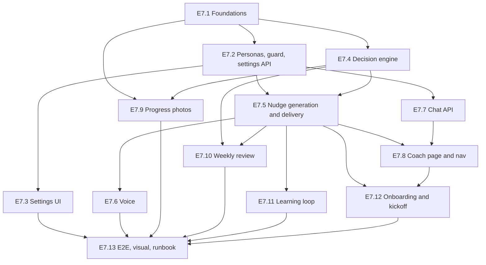

# Epic E7 — AI Coach: accountability, nudges, chat, voice and progress photos

> **Status:** Delivered (all 13 stories implemented) · **Epic issue:** #240 · **Design spec:** [docs/specs/ai-coach.md](../specs/ai-coach.md) · **Template:** [epic.yml](../../.github/ISSUE_TEMPLATE/epic.yml) · **Stories:** E7.1 to E7.13

This file is the body of the GitHub epic plus the full definition of each of its 13 child stories.
The design (data model, decision engine, personas, safety) lives in the spec and is not restated here; stories link to its sections.
Each story carries a copy-paste prompt for a fresh Claude Code session.

Contents:

- [Epic body](#epic-body) (the fields of the GitHub epic form)
- [Rules every story inherits](#rules-every-story-inherits)
- Stories: [E7.1](#e71--foundations-models-settings-ai-feature-ids-reset-wiring), [E7.2](#e72--persona-registry-content-guard-and-settings-api), [E7.3](#e73--coach-settings-ui-user-admin-and-model-assignments), [E7.4](#e74--decision-engine-and-sweep), [E7.5](#e75--nudge-generation-delivery-and-feedback), [E7.6](#e76--voice-tts-fallback-preview-and-retention), [E7.7](#e77--coach-chat-api), [E7.8](#e78--coach-page-navigation-and-today-integration), [E7.9](#e79--progress-photos), [E7.10](#e710--weekly-review-email-and-weekly-streak), [E7.11](#e711--learning-loop-angle-bandit), [E7.12](#e712--onboarding-meet-coach-and-kickoff), [E7.13](#e713--e2e-visual-baselines-runbook-and-doc-rows)

---

## Epic body

Title when filed: `[Epic]: AI Coach — accountability, nudges, chat, voice & progress photos`. Labels: `epic`, `triage`.

### Goal / Objective

The product's core loop is Track, Reassess, Improve, and adherence is its centre ([VISION.md](../../VISION.md): the AI coaching profile, gamification that rewards behaviour, progress photos, weekly reviews built on real data).
Today the app builds plans and computes adherence (`GET /api/training/signals`), but nothing turns that into accountability: no coach notices a missed week, there is no personality, no chat, no voice, no weekly email and no progress photos.

Intent: an AI agent that

- monitors plan progress and decides **when** to reach out (and when to stay quiet);
- writes engaging, persona-tailored notifications, inspired by Duolingo's retention mechanics (text by default; audio on opt-in, and audio always arrives with text);
- chats with the user, grounded in their real data;
- sends a weekly progress review email with numbers that come from the signals service, never from the model;
- encourages and stores progress photos;
- lets admins choose the models per agent, and lets users choose a personality, including an 18+ opt-in profane drill-sergeant mode.

The Coach becomes central to the UX: it is the fourth primary tab, the hero of Today and the home of the timeline of nudges, chat and reviews.

The split of authority is the core invariant: the deterministic layer decides when the coach **may** speak; the AI decides whether it **should** and what to say. The AI never bypasses caps, quiet hours or safety. See [spec §2.1 Architecture and the authority split](../specs/ai-coach.md#21-architecture-and-the-authority-split).

### Scope

In scope:

- New API module `apps/api/src/coach/` and new Prisma models `CoachMessage`, `CoachState`, `ProgressPhoto`.
- User settings namespace `coach` and system setting `coach`; AI feature ids `coach.decision`, `coach.chat`, `coach.voice` in a new `coach` group.
- Persona registry (7 personas), content guard, profanity unlock rules.
- Decision engine (`planCoachMoments`), hourly `coach.sweep`, nudge generation (`ai.coach.nudge`), delivery job, notification events `coach.nudge`, `coach.celebration`, `coach.photo_prompt`, `coach.weekly_review`.
- Optional voice through OpenAI TTS (`speak()`), with text fallback, preview and retention purge.
- Streaming chat with read-only tools plus `pause_coach`.
- Weekly review job, email template, weekly streak with passes.
- Progress photos API and Health gallery with compare and ghost overlay.
- Learning loop (`pickAngle`) and admin engagement stats.
- `/coach` page; Coach replaces Gyms as the fourth primary tab while Coach is visible (Gyms keeps the slot when AI is off); Today `CoachHero` and card.
- User settings `/settings/coach`, admin `/admin/settings/coach`, Coach section on the AI Model Assignments page.
- Onboarding: the existing `ai_plan` get-started step becomes "Meet your coach" once a plan exists (the checklist stays at four steps), plus the kickoff message on plan activation.
- E2E with the fake AI provider, visual baselines, runbook, doc rows.

Out of scope (see [spec §7 Out of scope and follow-ups](../specs/ai-coach.md#7-out-of-scope-and-follow-ups)):

- Native mobile push sounds (Web Push cannot play audio; the push carries text and a "Hear Coach" action).
- Non-OpenAI TTS providers.
- AI analysis of bodies or photos. Progress photos are never sent to AI.
- XP, badges and leagues (a separate gamification epic).
- Realtime voice chat.
- Social features and leaderboards.
- SMS.

### Success Criteria

1. A user who misses 2 planned sessions receives exactly one persona-tailored nudge within their next eligible window. It is never sent during quiet hours and never exceeds the daily cap (`min(user, system ceiling)`).
2. An audio-enabled user always gets text plus playable audio, or text with a recorded fallback (`audioStatus=failed`). Audio never replaces text.
3. The weekly review email arrives Sunday evening local time (18:00), once per ISO week, and its numbers equal `GET /api/training/signals` for that week.
4. Profanity is impossible unless all four unlock conditions hold. A tripwire test proves it.
5. Coach is the fourth primary tab while AI is on (Gyms takes the slot back when AI is off); `PRIMARY_DESTINATION_LIMIT` stays 4; Gyms stays reachable from the rail, user menu and Train.
6. Every suite under `apps/api/test/ai/` passes with the new routes and job types discovered automatically.
7. Progress photos never reach an AI provider or a notification payload; they appear in health export and are removed by user-data reset and factory reset.
8. KPIs are instrumented and visible on the admin Coach page: weekly adherence %, nudge open rate, 24h conversion, chat sessions per weekly active user, photo cadence adherence, opt-out rate.
9. `npm test --workspace=api`, `npm run test:db --workspace=api`, `npm run test:run --workspace=web`, all three typechecks and `npm run openapi:dump && npm run openapi:lint` pass.

### Sub-issues / Tasks

- [x] #241 E7.1 — Foundations: models, settings, AI feature ids, reset wiring
- [x] #242 E7.2 — Persona registry, content guard and settings API
- [x] #243 E7.3 — Coach settings UI (user, admin) and Model Assignments section
- [x] #244 E7.4 — Decision engine and sweep
- [x] #245 E7.5 — Nudge generation, delivery and feedback
- [x] #246 E7.6 — Voice: TTS, fallback, preview and retention
- [x] #247 E7.7 — Coach chat API
- [x] #248 E7.8 — Coach page, navigation and Today integration
- [x] #249 E7.9 — Progress photos
- [x] #250 E7.10 — Weekly review, email and weekly streak
- [x] #251 E7.11 — Learning loop (angle bandit)
- [x] #252 E7.12 — Onboarding meet_coach and kickoff
- [x] #253 E7.13 — E2E, visual baselines, runbook and doc rows

### Affected Component(s)

API (Backend), Web (Frontend), Database, Documentation.

### Priority

Critical.

### Additional Context

Research summary (the design is built on these; full citations in the spec):

- **Duolingo send-or-not bandit** (Yancey and Settles, KDD 2020, [research.duolingo.com/papers/yancey.kdd20.pdf](https://research.duolingo.com/papers/yancey.kdd20.pdf)): a "sleeping, recovering" bandit over message templates, scored by reward when used versus when eligible but not used, with a recency penalty `γ·0.5^(d/h)` against novelty decay. Reported +0.5% DAU and +2% new-user retention.
- **Send time:** reminders about 23.5 hours after the last session; stop after 7 inactive days with a final "I'll back off" message to protect the channel.
- **Streak freeze:** reportedly cut at-risk churn by 21% ([blog.duolingo.com/how-duolingo-streak-builds-habit](https://blog.duolingo.com/how-duolingo-streak-builds-habit/)). Lesson: reward consistency, not bingeing.
- **Behavioural science:** implementation intentions (d≈0.31 for exercise; Gollwitzer and Sheeran, 2006); loss framing beats gain framing (Patel et al., 2016); the exercise megastudy's best intervention was a micro-reward for returning after a miss ("never miss twice", Milkman et al., 2021); the fresh-start effect (Dai, Milkman and Riis, 2014); one miss does not break a habit (Lally et al., 2010).
- **CARROT Weather** ([carrotapp.com](https://www.meetcarrot.com/weather/)) is the persona model: persona × intensity, profanity as a separate top-level opt-in, a plain professional default, a large line pool.
- **Grok "Unhinged"** was gated behind 18+ and an NSFW toggle and later removed: a real age gate plus explicit opt-in is non-negotiable.
- **Web Push cannot play audio** (no browser supports `sound`; a service worker has no audio output). The push carries text plus a "Hear Coach" action; the click deep-links to `/coach?m=<id>&autoplay=1`, and the click is the user gesture that satisfies autoplay rules ([MDN Notification.actions](https://developer.mozilla.org/en-US/docs/Web/API/Notification/actions)).
- **OpenAI TTS** `gpt-4o-mini-tts` ([platform.openai.com/docs/guides/text-to-speech](https://platform.openai.com/docs/guides/text-to-speech)): 13 voices (alloy, ash, ballad, coral, echo, fable, nova, onyx, sage, shimmer, verse, marin, cedar), an `instructions` field steers tone, adjustable speed, about $0.015 per minute, AI disclosure required. It sometimes refuses profane text, so refusal is detected and delivery falls back to text.
- **LLM usage policy:** Anthropic and OpenAI permit operator- or user-enabled profanity; none permit slurs, insults about protected traits, sexual content or self-harm themes. Body and weight shaming is excluded here for health reasons.

Decisions confirmed with the product owner:

| Decision | Outcome |
|---|---|
| Phone bottom bar | Coach replaces Gyms as the 4th primary tab |
| Personas | Original archetypes that borrow Goggins/Hartman themes but never use their names or quote film lines |
| TTS | OpenAI only in this epic |
| Navigation with AI off | Coach takes the 4th primary slot only while it is visible to the user (AI on and `ai:use`); otherwise Gyms keeps the slot, so the bar is never left with 3 tabs |
| Onboarding step cap | No fifth step: the existing `ai_plan` step becomes "Meet your coach" once a plan exists and completes when coach settings have been saved at least once (an amendment to the onboarding spec) |
| Spec additions accepted | `GET /api/coach/state`; the weekly review sits outside the daily cap; conversion windows (24h workout or check-in, 48h photo); the weekly email is always in the clean register; a health-profile age under 18 blocks profanity regardless of attestation; defaults `maxNudgesPerDayCeiling` 4 and `allowAudio` true |
| Deliverable | Spec plus GitHub issues (this file feeds them) |

Dependency graph:



Delivery order (suggested waves; stories in one wave can run in parallel worktrees or branches):

| Wave | Stories | Why this grouping |
|---|---|---|
| 1 | E7.1 | Everything else needs the schema, settings and feature ids |
| 2 | E7.2, E7.4, E7.7 (needs only E7.2, so it may start once E7.2 merges), E7.9 | Independent after foundations: personas/guard, pure decision engine, chat, photos |
| 3 | E7.3, E7.5 | Settings UI needs E7.2; nudge generation needs E7.2 and E7.4 |
| 4 | E7.6, E7.8, E7.10, E7.11 | All need E7.5 (E7.8 also E7.7; E7.10 also E7.4) |
| 5 | E7.12, E7.13 | Onboarding needs E7.5 and E7.8; E2E and docs need everything |

Note on the dependency graph versus waves: E7.7 depends only on E7.2, so it can start in wave 2 even though it is listed with the others there; E7.8 is in wave 4 because it needs both E7.5 and E7.7.

---

## Rules every story inherits

Source: [CLAUDE.md](../../CLAUDE.md). A story is not done if it breaks one of these.

| Rule | What it means for every story |
|---|---|
| Issue per story | Each story has its own GitHub issue (feature template), filed before work starts. Commits and the PR reference it (`Relates to #<n>` / `Fixes #<n>`). |
| Branch | In a cloud session, work on the designated branch. Otherwise create `worktrees/<short-name>` with `git worktree add worktrees/<short-name> -b feat/<short-name>`; never develop in the main checkout. No PR unless asked. |
| Commits | Small, one intent each, Conventional Commits `<type>(<scope>): <summary>`. Scopes: `api`, `web`, `db`, `ai`, `jobs`, `notifications`, `storage`, `ui`, `core`, `docs`, `tests`, `infra`. A behaviour change carries its tests in the same or the next commit. Cadence: scaffold, core, edge cases, tests, cleanup, docs. |
| Settings UI pattern | Every new settings page is declared in `apps/web/src/config/userSettingsSections.tsx` or `apps/web/src/config/adminSections.tsx`. Append, never insert between existing cards. Never add a tab to an existing settings page. The card `permission` is the exact string the controller enforces. Reuse `SettingsHub.tsx`. The five breakpoint gates (`sm` = 600px) are never touched. |
| Queue rule | Anything that outlives the request or cron tick is a registered `JobHandler` enqueued through `JobsService`. A `@Cron` only decides whether work is due and enqueues it (reference: `apps/api/src/jobs/tasks/job-history-purge.task.ts`, helper `apps/api/src/jobs/housekeeping.enqueue.ts`). No fourth exemption. No detached `void this.doX()`; no `@OnEvent` body that does I/O beyond enqueueing (`apps/api/test/jobs/on-event-no-io.spec.ts`). |
| Job profile | A job type may declare `profile: { maxRuntimeMs, maxAttempts }` only. Never add `leaseMs` or `heartbeatMs`. A job `type` string is permanent once jobs exist. |
| AI jobs server-only | Every `ai.*` job type implements neither `nodeResultSchema` nor `persistNodeResult`. All Coach job types in this epic are server-only. |
| AI via the gateway | Never import a provider SDK outside `apps/api/src/ai/providers/<provider>/`. Call `AiService.forUser(userId, { jobId })`. No LangGraph or LangChain import in `coach/`. Keys never leave the server, and never appear in a log, span, error or row. |
| Route guards | Consumer routes `/api/coach/*`: `@Auth()` + `AiEnabledGuard` + `ai:use`. Admin routes `/api/admin/coach/*`: `ai_config:read`/`ai_config:write`, not behind `AiEnabledGuard`. Progress photos use `health_data:*` and are not AI-gated. No new permission family. Every endpoint declares `@Auth()` unless deliberately public. |
| notify() | `notify()` and `notifyNow()` run after the triggering write commits, outside any `$transaction` ([notifications README](../../apps/api/src/notifications/README.md)). |
| No env vars | Coach, AI, storage and push configuration is runtime-configured in the admin UI. Never add an environment variable for it. Never add a commented `# KEY=value` line to `infra/compose/.env.example`. |
| New user-related models | Follow [user-data-reset §4](../specs/user-data-reset.md#4-extending-it-in-a-fork) steps 1 to 7 (keep/delete decision, purge ordering, storage ids collected, tests). Factory reset shares `apps/api/src/user-data/user-data-purge.ts`. |
| Raw-SQL indexes | Partial unique indexes live only in migration SQL. Never "fix" the drift with `@@unique`. |
| Validation | Zod schemas on every endpoint and every AI structured output. |
| Numbers | Any number shown to a user (adherence, streak, counts) comes from the signals service, never the model. |
| Docs | Follow the docs-dev rules: one home per fact, present tense, no issue numbers outside a spec's History, relative links, new docs listed in `docs/README.md`. Link check: `npx jest --config apps/api/test/jest.config.js --rootDir apps/api test/docs-links`. |
| Subagents | Delegate: backend code to `backend-dev`, frontend to `frontend-dev`, schema and migrations to `database-dev`, tests to `testing-dev`, docs to `docs-dev`, container/migration/typecheck chores to `ops-dev` (which never runs state-changing git). The main agent only reads, plans, coordinates and runs simple commands. |

Common verification block every prompt refers to as "the standard gates":

```bash
npm test --workspace=api
npm run test:db --workspace=api            # when the story touches Prisma, jobs or purge
npm run test:run --workspace=web           # when the story touches web
npm run typecheck --workspace=api
npm run typecheck --workspace=web
npm run openapi:dump && npm run openapi:lint   # when routes or DTOs change
npx jest --config apps/api/test/jest.config.js --rootDir apps/api test/docs-links
```

Common observability conventions (each story adds its own names):

- Spans and counters use the `coach.` prefix and attribute keys `coach.moment`, `coach.persona`, `coach.angle`, `coach.reason`. No attribute holds a message body, prompt, audio script or user free text.
- Log lines carry ids only (`userId`, `messageId`, `jobId`, `aiRunId`), never content.

---

## E7.1 — Foundations: models, settings, AI feature ids, reset wiring

### Goal

Lay the schema and configuration every other story builds on: the three Prisma models, the `coach` user and system settings, the three AI feature ids in a new `coach` group, and the user-data and factory reset wiring.

### Depends on

None. Wave 1. Also confirm [spec §2.2 Data model](../specs/ai-coach.md#22-data-model) is merged.

### Scope

In:

- Prisma models `CoachMessage` (`coach_messages`), `CoachState` (`coach_states`), `ProgressPhoto` (`progress_photos`) and one migration. Fields and the `(userId, createdAt desc)` index per [spec §2.2 Data model](../specs/ai-coach.md#22-data-model).
- User settings namespace `coach` (Zod strict, no `.default()` on the optional namespace, per the note in `user-settings-namespaces.schema.ts`) and system setting `coach`, with the keys in [spec §3 Configuration and permissions](../specs/ai-coach.md#3-configuration-and-permissions).
- AI feature ids `coach.decision`, `coach.chat`, `coach.voice` appended to `AI_FEATURE_IDS` and `AI_FEATURES`; widen the group union with `'coach'` in all four places.
- Reset wiring: delete the three models and collect progress-photo and audio storage ids in `user-data-purge.ts`.
- `docs/README.md` row is deferred to E7.13; this story only updates schema-owning docs.

Out:

- Any route, job, UI or persona code.
- Any env var.
- Any change to `Gym`, `Workout` or other models.

### Files to touch

| Path | Change |
|---|---|
| `apps/api/prisma/schema.prisma` | Add `CoachMessage`, `CoachState`, `ProgressPhoto`, relations on `User` |
| `apps/api/prisma/migrations/<timestamp>_coach_foundations/migration.sql` (new) | Generated migration (`npm run prisma:migrate:dev -- --name coach_foundations` in `apps/api`) |
| `apps/api/src/common/schemas/user-settings-namespaces.schema.ts` | Add `coach` user namespace schema (strict) |
| `apps/api/src/common/schemas/settings.schema.ts` | Register the optional `coach` user namespace and the system `coach` setting; append the three ids to `AI_FEATURE_IDS`. A new key goes through the six places listed in [onboarding spec §4.4](../specs/onboarding.md#44-add-another-stored-fact) (`userSettingsSchema.parse` strips unknown keys), including the PUT and PATCH DTOs, `UserSettingsValue`, the user-settings service `toResponse` and the web `UserSettings` type |
| `apps/api/src/common/types/settings.types.ts` | Types for both |
| `apps/api/src/settings/dto/update-system-settings.dto.ts` | Accept the `coach` system key |
| `apps/api/src/ai/assignments/ai-features.ts` | Append `coach.decision`, `coach.chat`, `coach.voice` (`coach.voice` declares `needs: ['audio_speech']`); add the `'coach'` group |
| `apps/api/src/ai/assignments/dto/ai-feature-resolution.dto.ts` | Widen group union |
| `apps/api/src/ai/assignments/dto/ai-assignments.dto.ts` | Widen group union |
| `apps/web/src/services/aiAssignments.ts` | Widen group union |
| `apps/api/src/user-data/user-data-purge.ts` | Three `deleteMany` calls in `deleteUserOwnedRows`, counts in `ZERO_ROW_COUNTS`, photo and audio storage ids in `collectUserObjectIds` (factory reset shares this file) |
| `apps/api/src/user-data/user-data-reset.handler.ts` | Update the keep/delete survey for the three models |
| `apps/web/src/__tests__/mocks/fixtures/aiFeatures.ts` | Fixture gains the `coach.*` features |
| `apps/api/src/common/schemas/settings-parity.spec.ts` | Extend: `coach` accepted in every settings layer, unknown keys rejected |
| `apps/api/test/ai/` and `apps/api/src/ai/assignments/ai-feature-resolution.spec.ts` | Extend for new ids |
| `apps/api/test/user-data/user-data-reset.db.spec.ts` | Cover new models |
| `apps/api/test/admin-factory-reset/` | Cover new models |
| `docs/ARCHITECTURE.md` | Table list gains the three tables |

### API / contracts

- No new routes.
- `coach` user namespace: `enabled` (default `false`; turned on by picking a persona), `personaId` (default `coach`), `intensity` 1 to 3, `profanity` boolean, `adultConfirmedAt?`, `audio {enabled, voice, speed 0.75 to 1.5}`, `quietHours {start '21:30', end '07:30'}`, `maxNudgesPerDay` 1 to 4 (default 2), `lockScreenSafe` (default true), `photoCadence` (`off|weekly|biweekly|monthly`, default `biweekly`), `why?` (max 200 chars), `preferredTime?`.
- System `coach`: `enabled` (default `true`), `allowProfanePersonas` (default `false`), `allowAudio` (default `true`), `maxNudgesPerDayCeiling` (default 4), `audioRetentionDays` (default 30), `autoSilenceAfterIgnored` (default 3), `inactiveStopDays` (default 7).
- Absent namespace means built-in defaults; the schemas never apply `.default()` to the namespace itself.

### Acceptance criteria

1. Given a clean database, when `npm run prisma:migrate` runs, then the three tables and the `(user_id, created_at desc)` index on `coach_messages` exist and `npm run prisma:generate` succeeds.
2. Given a user with coach rows, when the user is deleted, then `coach_messages`, `coach_states` and `progress_photos` rows for that user are gone (cascade or explicit purge, per spec §2.2).
3. Given a user-data reset for a user with progress photos and audio messages, when it runs, then all three tables are emptied for that user and the photo and audio storage object ids are returned for storage deletion.
4. Given a factory reset, when it runs, then all coach tables are empty and their storage objects are scheduled for deletion.
5. Given a PATCH of user settings with `coach.intensity = 4`, then the API answers 400 with a Zod issue; with an unknown key inside `coach`, then 400 (strict).
6. Given a user with no `coach` namespace, when settings are read, then the namespace is absent (not defaulted) and consumers apply built-in defaults.
7. Given `GET /api/admin/ai/assignments` (existing route), when the response is built, then it lists the three `coach.*` features in the `coach` group and `coach.voice` is flagged as needing `audio_speech`.
8. Given the resolver, when `coach.voice` is resolved against a model without `audio_speech`, then resolution reports it as unusable (the same behaviour as other features' `needs`).
9. Given the web `AiAssignmentsPage`, when it renders the new group, then it type-checks (`npm run typecheck --workspace=web`) even before the E7.3 UI work (the group renders under a generic fallback or is filtered until E7.3).
10. Given `settings-parity.spec.ts`, when run, then the `coach` namespace is accepted in every settings layer (PUT, PATCH, response, web type) and an unknown key inside it is rejected.
11. Given the purge, when the reset handler runs, then its keep/delete survey lists the three models and `ZERO_ROW_COUNTS` carries their counts.

### Error handling

- Invalid settings: 400 with the Zod issue list (existing settings error shape; see [API conventions](../API.md)).
- Migration must be forward-only and idempotent against a fresh database; no data backfill.

### Observability

- No new spans. The migration adds no runtime behaviour.
- Reset code logs counts only (existing purge logging), never storage keys.

### Security

- `ProgressPhoto` and audio rows are private: no public URL column; access only through authenticated routes added in later stories.
- `adultConfirmedAt` is a timestamp only; no free-text age data stored.
- No secret in any new column. No env var added.

### Tests to add

- `apps/api/src/common/schemas/coach-settings.schema.spec.ts` (new): bounds, strictness, absent-namespace behaviour.
- Extend `apps/api/src/ai/assignments/ai-feature-resolution.spec.ts` for the new ids and the `needs` flag.
- Extend `apps/api/src/common/schemas/settings-parity.spec.ts` and the web fixture `apps/web/src/__tests__/mocks/fixtures/aiFeatures.ts`.
- Extend `apps/api/test/user-data/user-data-reset.db.spec.ts` and the factory-reset suite under `apps/api/test/admin-factory-reset/`.
- Extend `apps/api/test/prisma/` schema tripwires if one lists tables or user relations.

### Docs to update

- `docs/ARCHITECTURE.md`: table list (the one home for tables).
- `docs/specs/user-data-reset.md` only if its inventory lists models.
- Nothing else; the spec already owns the design.

### Agents

`database-dev` (schema, migration), then `backend-dev` (settings schemas, feature ids, purge), then `testing-dev`, then `docs-dev`.

### Claude Code prompt

```text
You are implementing story E7.1 (issue #241) of Epic E7 "AI Coach".
Read first: docs/epics/ai-coach-epic.md (section E7.1 and "Rules every story inherits"),
docs/specs/ai-coach.md sections 2.2 Data model and 3 Configuration and permissions,
CLAUDE.md, and docs/specs/user-data-reset.md section 4.

Goal: foundations only. Add the Prisma models CoachMessage, CoachState, ProgressPhoto with one migration; the
`coach` user-settings namespace and `coach` system setting (Zod, strict, no .default() on the optional namespace);
append coach.decision, coach.chat, coach.voice to AI_FEATURE_IDS/AI_FEATURES (apps/api/src/ai/assignments/ai-features.ts)
with a new 'coach' group, widening the group union in ai-features.ts, ai/assignments/dto/ai-feature-resolution.dto.ts,
ai/assignments/dto/ai-assignments.dto.ts and apps/web/src/services/aiAssignments.ts; wire the three models into
apps/api/src/user-data/user-data-purge.ts (deleteMany in deleteUserOwnedRows, counts in ZERO_ROW_COUNTS, photo and audio storage ids in collectUserObjectIds; update the survey in user-data-reset.handler.ts) for both user reset and factory reset.
Follow the six-place pattern of docs/specs/onboarding.md section 4.4 for the new settings keys and extend settings-parity.spec.ts. No routes, jobs, UI or env vars.

Rules: delegate to subagents in this order: database-dev (schema + migration), backend-dev (settings, feature ids, purge),
testing-dev (tests below), docs-dev (docs/ARCHITECTURE.md table list). Do not hand-write code yourself.
Do not use @@unique for partial indexes. Never add env vars.
Commit cadence (Conventional Commits, scope per change, reference #241): feat(db) schema+migration; feat(core) settings schemas;
feat(ai) feature ids and group; feat(core) reset wiring; test(...) tests; docs(docs) ARCHITECTURE table list.

Acceptance criteria (all must be proven by tests): migration creates 3 tables + index; deleting a user and a user-data reset
remove their coach rows and surface storage ids; factory reset empties coach tables; coach.intensity=4 and unknown keys are 400;
absent namespace stays absent; assignments admin API lists the three coach.* features in group 'coach' with coach.voice needing audio_speech;
web typechecks.

Tests to add: apps/api/src/common/schemas/coach-settings.schema.spec.ts, extend ai-feature-resolution.spec.ts,
test/user-data/user-data-reset.db.spec.ts, test/admin-factory-reset/*.
Run: npm run typecheck --workspace=api; npm run typecheck --workspace=web; npm test --workspace=api;
npm run test:db --workspace=api; npm run openapi:dump && npm run openapi:lint; the docs link check.
Report anything you could not run.
```

---

## E7.2 — Persona registry, content guard and settings API

### Goal

Provide the seven personas, the single function that decides whether profanity is unlocked, the content guard every coach-written string passes through, and the routes to read personas and read and update coach settings (user and system).

### Depends on

E7.1. Wave 2.

### Scope

In:

- Persona registry `apps/api/src/coach/personas/*.persona.ts`, one file per persona (`coach`, `drill_sergeant`, `stoic`, `analyst`, `butler`, `hype`, `nana`), collected in `apps/api/src/coach/personas/index.ts`, served by `GET /api/coach/personas`. Content per [spec §2.3 Personas](../specs/ai-coach.md#23-personas); the example lines in the spec are the registry's sample lines.
- `resolveRegister(userSettings, systemSettings, profile)` per [spec §2.4 Profanity unlock](../specs/ai-coach.md#24-profanity-unlock): the only function that answers "is profanity allowed", called by the prompt builder, the guard, the preview route and the settings route.
- Content guard `apps/api/src/coach/guard/coach-content-guard.ts` and `banned-terms.ts` per [spec §2.6 Nudge generation and the content guard](../specs/ai-coach.md#26-nudge-generation-and-the-content-guard) (banned terms and topics, profanity gate, insult target, lock-screen rule, numbers rule, length, supportive-register rule).
- `GET/PUT /api/coach/settings` (user namespace, unlock rules applied) and `GET/PUT /api/admin/coach/settings` (system setting).
- `CoachModule` registered in the app module.

Out:

- Any AI call, job, delivery or UI.
- Voice preview (E7.6).
- The numbers rule is implemented here as a pure function of `(text, allowedNumbers)`; E7.5 supplies the context numbers.

### Files to touch

| Path | Change |
|---|---|
| `apps/api/src/coach/coach.module.ts` (new) | Module |
| `apps/api/src/coach/personas/persona.types.ts` (new) | `Persona`, `CoachMoment`, `Intensity`, sample-line types |
| `apps/api/src/coach/personas/*.persona.ts` (new), `apps/api/src/coach/personas/index.ts` (new) | Seven personas and `COACH_PERSONAS` |
| `apps/api/src/coach/personas/resolve-register.ts` (new) | `resolveRegister` returning `{ profane, reason }` |
| `apps/api/src/coach/guard/coach-content-guard.ts` (new), `apps/api/src/coach/guard/banned-terms.ts` (new) | Guard and lists |
| `apps/api/src/coach/coach-settings.controller.ts`, `coach-settings.service.ts` (new) | Consumer settings and personas routes |
| `apps/api/src/coach/admin/coach-admin-settings.controller.ts` (new) | `GET/PUT /api/admin/coach/settings` |
| `apps/api/src/coach/dto/*.ts` (new) | Zod DTOs |
| `apps/api/src/health-profile/health-profile.service.ts` | Read the date of birth through the service (do not edit) |
| `apps/api/src/app.module.ts` | Register `CoachModule` |

### API / contracts

| Method | Route | Auth | Notes |
|---|---|---|---|
| GET | `/api/coach/personas` | `ai:use` + `AiEnabledGuard` | Persona cards: id, name, tagline, avatar, default voice, sample lines per moment per intensity. The uncensored Sarge L3 lines are returned only when the caller's register is profane; otherwise the L2 lines stand in |
| GET | `/api/coach/settings` | same | Stored namespace plus `effective: { maxNudgesPerDay (clamped to the ceiling), register: { profane, reason } }` |
| PUT | `/api/coach/settings` | same | Zod-validated; applies the unlock rules. Body may carry `confirmAdult: true`, which the server stamps as `adultConfirmedAt = now` (the dialog of spec §2.4); the client never sends the timestamp |
| GET | `/api/admin/coach/settings` | `ai_config:read`, no `AiEnabledGuard` | System `coach` setting |
| PUT | `/api/admin/coach/settings` | `ai_config:write`, no `AiEnabledGuard` | Validates and stores the system setting |

`register.reason` values (the failed unlock condition): `system_disabled`, `age_unverified`, `underage`, `toggle_off`, `persona_or_intensity`.
Error codes from [spec §3.7](../specs/ai-coach.md#37-error-codes): `COACH_PROFANITY_LOCKED` (403, `details.reason`), `COACH_AUDIO_DISABLED` (403), `COACH_PERSONA_UNKNOWN` (400), `COACH_DISABLED` (403, enabling coach while the system switch is off).

### Acceptance criteria

1. Given the registry, when iterated, then every persona has non-empty sample lines for every moment at every intensity and a default voice from the OpenAI voice list; every sample line passes the content guard in its own register; only Sarge at L3 contains profanity.
2. Given `resolveRegister`, when evaluated over the truth table of (system `allowProfanePersonas`, age ≥ 18, `profanity` toggle, persona and level), then `profane` is true only for (true, true, true, `drill_sergeant` at 3); every other combination is false, with the reason naming the failed condition. The other six personas are never profane at any level.
3. Given a health profile whose `dateOfBirth` makes the user under 18 and `adultConfirmedAt` set, when resolved, then `profane` is false with reason `underage` (the DOB wins over the attestation); given no DOB and `adultConfirmedAt` set, then condition 2 passes.
4. Given a locked register and persona `drill_sergeant` at 3, when the prompt builder asks for the rubric, then it receives the L2 (clean) rubric; failing closed means Sarge L3 renders as Sarge L2.
5. Given the guard, when profane text is checked and the register is clean, then it fails `profanity` in any field (title, body, push fields, audio script); when the register is profane the same text passes for `drill_sergeant` L3 only.
6. Given text containing a slur, a protected-trait insult, body or weight shaming, sexual content, a self-harm theme, diet-restriction or extreme-exercise framing, or a medical claim (fixture lists), when guarded, then it fails regardless of the register.
7. Given a profane register, when an insult targets the body, weight or health instead of effort or excuses, then the guard fails `insult_target`.
8. Given `lockScreenSafe` is on, when `pushTitle` or `pushBody` contains profanity, a health term or a digit, then the guard fails `lock_screen`; `pushBody` over 140 characters or `title` over 60 or `body` over 320 or any empty field fails `length`.
9. Given a number in `title`, `body` or `audioScript` that is not in the allowed-numbers set, when guarded, then it fails `invented_number`.
10. Given a supportive register, when the text uses a challenge phrasing or a pushy angle, then the guard fails `supportive_register`.
11. Given `GET /api/coach/personas` for a caller whose register is not profane, when requested, then the response contains no uncensored L3 line; for an unlocked caller it contains them.
12. Given `PUT /api/coach/settings` with `profanity: true` while any of conditions 1, 2 or 4 fails, then 403 `COACH_PROFANITY_LOCKED` with `details.reason`, and the stored settings are unchanged.
13. Given `PUT` with `confirmAdult: true`, when it succeeds, then `adultConfirmedAt` is stored server-side; given the same call with a DOB under 18 and then `profanity: true`, then 403 reason `underage`.
14. Given the system switch is turned off after a user enabled profanity, when settings are read, then `effective.register.profane` is false and stored settings are untouched (the next generation is clean).
15. Given `maxNudgesPerDay` above the system ceiling, when saved, then `effective.maxNudgesPerDay` equals the ceiling; given `audio.enabled: true` while system `allowAudio` is off, then 403 `COACH_AUDIO_DISABLED`; given an unknown `personaId`, then 400 `COACH_PERSONA_UNKNOWN`.
16. Given the admin settings routes, when called with `ai_config:read` or `ai_config:write` as appropriate, then they work with AI switched off; without the permission, 403.
17. Given AI is disabled, when any `/api/coach/*` consumer route is called, then `AiEnabledGuard` refuses it; given a user without `ai:use`, then 403.

### Error handling

- Unknown `personaId` or intensity outside 1 to 3: 400 with Zod issues.
- Registry content missing at boot fails fast at module init, not at request time.
- Admin write with an invalid value (for example `inactiveStopDays` below its minimum): 400 with Zod issues.

### Observability

- Counter `coach.guard.rejected{reason}` (`profanity`, `banned_term`, `insult_target`, `lock_screen`, `invented_number`, `length`, `supportive_register`). Reason only; never the text.
- Counter `coach.settings.updated`; attribute `coach.persona`.
- Log profanity-unlock changes as ids and a boolean only.

### Security

- The age rule and the profanity unlock are enforced server-side only; the UI is advisory.
- Uncensored sample lines are not shipped to a caller who is not unlocked.
- Persona content never names or quotes real people or films.
- The guard lists live in code, not in settings, so an admin cannot weaken them.
- `adultConfirmedAt` is stamped by the server from a deliberate request; it is self-attestation, and a DOB under 18 overrides it.

### Tests to add

- `apps/api/src/coach/personas/persona-registry.spec.ts`: completeness (every moment, every intensity, default voice), every line passes the guard in its register, only Sarge L3 is profane.
- `apps/api/src/coach/personas/resolve-register.spec.ts`: full truth table, DOB overrides attestation.
- `apps/api/test/coach/coach-profanity-unlock.spec.ts`: tripwire across the settings route, the personas route, the prompt builder and the guard (E7.5 and E7.6 extend it to the generator and the preview).
- `apps/api/src/coach/guard/coach-content-guard.spec.ts`: banned lists, insult target, lock-screen rule, numbers, lengths, supportive register.
- `apps/api/test/coach/coach-settings.integration.spec.ts` and `apps/api/test/coach/coach-admin-settings.integration.spec.ts`: routes, RBAC, DOB rules, clamping.
- Confirm `apps/api/test/ai/ai-rbac-matrix.integration.spec.ts` and `ai-kill-switch.integration.spec.ts` discover the new routes.

### Docs to update

- `docs/ARCHITECTURE.md`: API module list gains `coach`.
- Nothing else; the spec owns persona content and the unlock rules.

### Agents

`backend-dev`, then `testing-dev`, then `docs-dev`.

### Claude Code prompt

```text
You are implementing story E7.2 (issue #242) of Epic E7 "AI Coach".
Read first: docs/epics/ai-coach-epic.md (E7.2 and "Rules every story inherits"); docs/specs/ai-coach.md sections 2.3 Personas, 2.4 Profanity unlock,
2.6 Nudge generation and the content guard, 3 Configuration and permissions (3.1, 3.2, 3.6, 3.7); CLAUDE.md (AI Platform Rules).

Build apps/api/src/coach/: CoachModule; persona registry (coach, drill_sergeant, stoic, analyst, butler, hype, nana) in coach/personas/*.persona.ts + index.ts with the
spec's sample lines for every moment at every intensity and a default voice; pure resolveRegister in coach/personas/resolve-register.ts (all four: system allowProfanePersonas,
age >=18 via health-profile dateOfBirth (an age under 18 fails regardless of attestation) else adultConfirmedAt, explicit toggle, drill_sergeant at intensity 3; fail closed so Sarge L3 renders as L2);
coach/guard/coach-content-guard.ts + banned-terms.ts (banned terms/topics, profanity gate, insult target, lock-screen rule: no profanity/health terms/digits, numbers must be in the allowed set,
lengths title<=60 body<=320 pushBody<=140, supportive-register rule); routes GET /api/coach/personas, GET/PUT /api/coach/settings (PUT body may carry confirmAdult:true which the server stamps as adultConfirmedAt;
profanity writes that fail an unlock condition => 403 COACH_PROFANITY_LOCKED with details.reason), GET/PUT /api/admin/coach/settings (ai_config:read/write, NOT behind AiEnabledGuard).
Consumer routes: @Auth + AiEnabledGuard + ai:use. No AI calls, no jobs, no UI. Persona text must never name or quote real people/films and never allow body/weight shaming, slurs,
protected traits, sexual content or self-harm themes. Uncensored L3 lines are served only to unlocked callers.

Delegate: backend-dev, then testing-dev, then docs-dev (ARCHITECTURE API module list). Commits (Conventional, reference #242):
feat(api) persona registry; feat(api) resolveRegister + guard; feat(api) settings + admin settings routes; test(tests) ...; docs(docs) ...

Acceptance criteria (17 in the epic file, E7.2): registry completeness and guard-clean lines; unlock truth table; DOB over attestation; fail-closed rubric; profanity gate in every field;
banned categories always rejected; insult target; lock-screen rule and lengths; invented numbers; supportive register; personas route withholds L3 lines; PUT locked => 403;
confirmAdult stamping; system switch off later => clean without mutating settings; clamping, COACH_AUDIO_DISABLED, COACH_PERSONA_UNKNOWN; admin routes work with AI off; AiEnabledGuard and ai:use.

Tests: src/coach/personas/persona-registry.spec.ts, resolve-register.spec.ts, test/coach/coach-profanity-unlock.spec.ts, src/coach/guard/coach-content-guard.spec.ts,
test/coach/coach-settings.integration.spec.ts, test/coach/coach-admin-settings.integration.spec.ts; confirm test/ai rbac-matrix and kill-switch suites discover the routes.
Run the standard gates: npm test --workspace=api; npm run typecheck --workspace=api; npm run openapi:dump && npm run openapi:lint; docs link check.
```

---

## E7.3 — Coach settings UI (user, admin) and Model Assignments section

### Goal

Give users `/settings/coach` (persona gallery, intensity, profanity with 18+ confirmation, audio, quiet hours, cap, lock-screen-safe, photo cadence, "your why"), give admins `/admin/settings/coach` (system settings plus engagement stats), and add a Coach section to the AI Model Assignments page.

### Depends on

E7.2. Wave 3. The voice preview button is wired to a route that E7.6 adds; ship it disabled with a tooltip until then, or feature-detect the route.

### Scope

In:

- User page registered by appending to `USER_SETTINGS_SECTIONS` (AI group; `permission: 'ai:use'`, `feature: 'ai'`).
- Admin page registered by appending to `ADMIN_SECTIONS` (AI group; `permission: 'ai_config:read'`, `feature: 'ai'`; writes gated inside the page by `ai_config:write`).
- Coach section on `AiAssignmentsPage.tsx` for `coach.decision`, `coach.chat`, `coach.voice`.
- Admin read-only engagement stats panel, filled by E7.11; this story renders the settings form and an empty-state stats panel.
- Persona gallery with static sample lines (no API cost to preview text).

Out:

- Audio preview endpoint (E7.6), stats endpoint data (E7.11).
- Any new tab on an existing settings page.

### Files to touch

| Path | Change |
|---|---|
| `apps/web/src/config/userSettingsSections.tsx` | Append the `coach` card |
| `apps/web/src/config/adminSections.tsx` | Append the `coach` card |
| `apps/web/src/App.tsx` | Routes `/settings/coach`, `/admin/settings/coach` |
| `apps/web/src/pages/UserCoachSettingsPage.tsx` (new) | User page |
| `apps/web/src/pages/Admin/CoachAdminPage.tsx` (new) | Admin page |
| `apps/web/src/pages/Admin/AiAssignmentsPage.tsx` | Coach section |
| `apps/web/src/services/aiAssignments.ts` | Group label for `coach` |
| `apps/web/src/services/coach.ts` (new) | API client |
| `apps/web/src/components/coach/PersonaGallery.tsx`, `ProfanityConfirmDialog.tsx`, `QuietHoursField.tsx` (new) | Components |
| `apps/web/src/__tests__/config/aiSettingsRegistry.test.ts` | Auto-discovers; confirm passing |
| `apps/web/src/__tests__/config/userSettingsSections.test.ts`, `settingsRegistry.test.ts` | Confirm append-only |

### API / contracts

Consumes: `GET /api/coach/personas`, `GET/PUT /api/coach/settings` (PUT with `confirmAdult: true` records the 18+ confirmation), `GET/PUT /api/admin/coach/settings` for the system setting, and the existing AI assignments routes. No new endpoints in this story.
No new endpoints in this story.

### Acceptance criteria

1. Given AI is off, when the user opens `/settings`, then the Coach card is hidden (`feature: 'ai'`); given AI on and `ai:use`, then the card is visible.
2. Given the settings page, when it loads, then persona cards show name, tagline and sample lines per moment, the active persona is marked and selection persists via PUT.
3. Given a user who has not unlocked profanity, when they view Sarge, then the Unhinged level is shown locked with the reason from `effective.register.reason`, and uncensored lines are not rendered.
4. Given eligible conditions except age confirmation and no DOB, when the user flips the profanity toggle, then an 18+ confirmation dialog appears; confirming sends `PUT /api/coach/settings` with `confirmAdult: true` and then enables the toggle; cancelling leaves the toggle off. Given a DOB under 18, then the toggle stays locked with the `underage` reason and no dialog.
5. Given audio is off (default), when the page loads, then voice, speed and preview controls are disabled until the toggle is on; the voice list comes from the resolved `coach.voice` model's `voices[]` and an empty list shows guidance to ask an admin.
6. Given `allowAudio` is off at system level, when the user opens the audio section, then it is disabled with an explanation.
7. Given quiet hours with start after end (21:30 to 07:30), when saved, then the page accepts it and displays "overnight"; invalid times are rejected inline.
8. Given a `maxNudgesPerDay` above the system ceiling, when displayed, then the control caps at the ceiling and shows why.
9. Given the admin page, when a user with `ai_config:read` but not `ai_config:write` opens it, then all controls are disabled; with write, changes save and show a success state.
10. Given the admin AI Model Assignments page, when it renders, then a "Coach" section lists the three features with model pickers filtered by capability (`audio_speech` for voice).
11. Given the registry tests, when run, then the new cards are appended after existing cards and each `permission` matches the controller guard string.
12. Given a compact window (below `sm`), when the pages render, then they use the existing `SettingsHub` layout with no horizontal scroll; the five breakpoint gates are unchanged (diff shows none touched).

### Error handling

- PUT 403 `COACH_PROFANITY_LOCKED`: revert the toggle and show the failed condition from `details.reason`.
- Network or 5xx: inline `Alert` with retry; form state preserved.
- Admin write 403: controls disabled, never a silent failure.

### Observability

- Web: no new telemetry. Server counters from E7.2 cover updates.
- No user free text (`why`) in any client log.

### Security

- Permission strings must equal the controller guards.
- The `why` field is rendered as text, never HTML.
- The age confirmation is a deliberate action, never pre-checked.

### Tests to add

- `apps/web/src/__tests__/pages/UserCoachSettingsPage.test.tsx`
- `apps/web/src/__tests__/pages/Admin/CoachAdminPage.test.tsx`
- `apps/web/src/__tests__/pages/Admin/AiAssignmentsCoachSection.test.tsx`
- `apps/web/src/__tests__/components/coach/PersonaGallery.test.tsx`, `ProfanityConfirmDialog.test.tsx`
- Extend `apps/web/src/__tests__/config/aiSettingsRegistry.test.ts` expectations if it enumerates ids.

### Docs to update

- `docs/ARCHITECTURE.md` settings-page inventory (the one home) gains both pages.
- [settings-ui spec](../specs/settings-ui.md) only if it enumerates cards.

### Agents

`frontend-dev`, then `testing-dev`, then `docs-dev`.

### Claude Code prompt

```text
You are implementing story E7.3 (issue #243) of Epic E7 "AI Coach".
Read first: docs/epics/ai-coach-epic.md (E7.3 + shared rules); docs/specs/ai-coach.md sections 2.3, 2.4, 2.13 UX surfaces, 3;
CLAUDE.md "MANDATORY: Settings UI Pattern" and AI rule 5; docs/specs/settings-ui.md.

Build /settings/coach and /admin/settings/coach and a Coach section on apps/web/src/pages/Admin/AiAssignmentsPage.tsx.
Register cards by APPENDING to apps/web/src/config/userSettingsSections.tsx (permission 'ai:use', feature 'ai') and
apps/web/src/config/adminSections.tsx (permission 'ai_config:read', feature 'ai', writes disabled without ai_config:write).
Add routes in apps/web/src/App.tsx. Reuse SettingsHub; never add a tab to an existing page; never touch the five breakpoint gates.
Persona gallery with static sample lines; profanity toggle with an 18+ confirmation dialog (PUT /api/coach/settings with confirmAdult:true, then the toggle);
audio section off by default with voice list from the resolved coach.voice model; quiet hours (overnight allowed), nudges/day capped
at the system ceiling, lock-screen-safe, photo cadence, "your why" (200 chars, rendered as text). Voice preview button is disabled
until E7.6 ships its route (feature-detect or disable with tooltip). Admin page: system coach settings plus an empty-state stats panel.

Delegate: frontend-dev, then testing-dev, then docs-dev (ARCHITECTURE settings-page inventory). Commits (reference #243):
feat(ui) user page; feat(ui) admin page; feat(ui) assignments Coach section; test(tests) ...; docs(docs) ...

Acceptance criteria: 1 card hidden when AI off; 2 persona select persists; 3 locked Unhinged shows missing reason, no uncensored lines;
4 18+ dialog flow; 5 audio controls gated and voice list from model; 6 allowAudio off disables section; 7 overnight quiet hours accepted;
8 cap at system ceiling; 9 admin read-only vs write; 10 Coach section on assignments page filters models by capability;
11 registry tests pass with append-only order and exact permission strings; 12 no horizontal scroll below sm, breakpoint gates untouched.

Tests: src/__tests__/pages/UserCoachSettingsPage.test.tsx, pages/Admin/CoachAdminPage.test.tsx, pages/Admin/AiAssignmentsCoachSection.test.tsx,
components/coach/PersonaGallery.test.tsx, ProfanityConfirmDialog.test.tsx; keep config/aiSettingsRegistry.test.ts and
userSettingsSections.test.ts green. Run: npm run test:run --workspace=web; npm run typecheck --workspace=web; docs link check.
```

---

## E7.4 — Decision engine and sweep

### Goal

Decide, deterministically and testably, when the Coach may speak: a pure `planCoachMoments` function, an hourly cron that only enqueues `coach.sweep`, the `CoachState` bookkeeping behind caps, spacing, auto-silence and win-back, and a read endpoint for the Coach header state.

### Depends on

E7.1. Wave 2.

### Scope

In:

- Pure `planCoachMoments(signals, state, settings, nowLocal)` per [spec §2.5 Decision engine](../specs/ai-coach.md#25-decision-engine): moments, priorities, hard gates and suppression reasons. It imports no Nest or Prisma and reads no clock.
- Cron `@Cron('17 * * * *')` that only enqueues `coach.sweep` through `enqueueHousekeepingJob`, and only while AI and coach are enabled.
- `coach.sweep` handler (server-only, profile 5 min / 2 attempts) paging users with `coach.enabled`, reading signals from `TrainingSignalsService`, updating `CoachState`, enqueuing `ai.coach.nudge` (subject = user, dedup) for the top moment, and enqueuing `ai.coach.weekly_review` in its own lane at local Sunday 18:00 (the job itself is E7.10; this story enqueues through a port).
- `usualWorkoutMinuteLocal` (median start minute over 4 weeks of completed workouts; null with fewer than 4 sessions).
- Event listeners that only enqueue: `WORKOUT_FINISHED_EVENT` (comeback, PR, weekly target; clears `silencedAt`), program activation (`kickoff`, enqueued by E7.12), `HEALTH_DATA_CHANGED_EVENT` (refreshes the readiness view the safety gate reads; sends nothing).
- `GET /api/coach/state` for the `/coach` header (weekly target ring, streak, passes, next session, pause and silence state).

Out:

- AI text generation, guard, delivery (E7.5); weekly review content (E7.10); kickoff content (E7.12).

### Files to touch

| Path | Change |
|---|---|
| `apps/api/src/coach/planning/plan-coach-moments.ts` (new) | Pure function and types |
| `apps/api/src/coach/planning/coach-time.ts` (new) | Local-time and ISO-week helpers; reuse `localWallTime` and `weeklyAnchorDate` from `apps/api/src/training-agents/evaluation/evaluation-due.ts` |
| `apps/api/src/coach/planning/usual-workout-time.ts` (new) | Median start minute |
| `apps/api/src/coach/tasks/coach-sweep.task.ts` (new) | Cron, enqueue only |
| `apps/api/src/coach/handlers/coach-sweep.handler.ts` (new) | `coach.sweep` handler |
| `apps/api/src/coach/coach-state.service.ts` (new) | Read and update `CoachState` |
| `apps/api/src/coach/coach-state.controller.ts` (new) | `GET /api/coach/state` |
| `apps/api/src/coach/coach-events.listener.ts` (new) | Listeners, enqueue only |
| `apps/api/src/workouts/workout-events.ts` | `WORKOUT_FINISHED_EVENT` (read) |
| `apps/api/src/measurements/health-data-events.ts` | `HEALTH_DATA_CHANGED_EVENT` (read) |
| `apps/api/src/jobs/housekeeping.enqueue.ts` | Reuse (no edit) |
| `apps/api/src/training-agents/evaluation/tasks/training-evaluation.task.ts` | Reference pattern (read only) |
| `apps/api/src/programs/signals/` | `TrainingSignalsService.forEvaluator` and `compactForEvaluator` (read) |
| `apps/api/src/notifications/broadcasts/` | Reference for cursor-paged chunk jobs (read) |
| `apps/api/src/jobs/job-type-labels.ts` | Label for `coach.sweep` |

### API / contracts

- Job `coach.sweep`: input `{ cursor?: string }`, chunked by user cursor; server-only; profile `{ maxRuntimeMs: 300000, maxAttempts: 2 }`; dedup per hour bucket.
- Downstream: `ai.coach.nudge` with `{ userId, moment, momentKey }`, dedup `coach.nudge:<userId>:<moment>:<localDate>`; `ai.coach.weekly_review` with `{ userId, isoWeek }`.
- `planCoachMoments(signals, state, settings, nowLocal): PlannedMoment[]` (spec is canonical): ranked eligible moments with `moment`, `priority`, `reason`, plus the suppressed ones with a reason so they can be counted.
- Moments and priority (1 wins; at most one moment per sweep): `missed_twice`, `streak_at_risk`, `comeback`, `pr` and `weekly_target_hit`, `missed_session`, `fresh_start`, `photo_prompt`, `win_back`. `weekly_review` is a separate lane.
- Suppression reasons: `coach_off`, `quiet_hours`, `daily_cap`, `spacing`, `paused`, `silenced`, `safety_supportive_only`, `pref_off`, `already_sent`.
- `GET /api/coach/state` (`ai:use` + `AiEnabledGuard`): `{ enabled, pausedUntil, silencedAt, weeklyTarget: { done, planned }, weeklyStreak, streakPassesLeft, nextSession, unreadCount }`. Numbers come from signals and `CoachState`.

### Acceptance criteria

1. Given quiet hours 21:30 to 07:30 (wrapping midnight), when `nowLocal` is 23:00, 02:00 or 07:29, then every moment (including the weekly review lane) is suppressed `quiet_hours`; at 07:30 and 21:29 it is not.
2. Given user cap 4 and system ceiling 2 and `nudgesToday = 2`, when planning, then the next moment is suppressed `daily_cap` (the effective cap is `min(user, system)`); given user cap 1 and ceiling 4, the cap is 1. The `weekly_review` lane is not subject to the cap.
3. Given the last nudge 2h59m ago, when planning, then `spacing`; at 3h00m it is allowed.
4. Given `consecutiveIgnored` reaches `autoSilenceAfterIgnored` (system default 3), when planning, then exactly one back-off message moment is returned once and `silencedAt` is set; every later sweep returns `silenced` until the user opens a message, sends a chat message or logs a workout, which clears `silencedAt` and resets `consecutiveIgnored`.
5. Given a user with no activity for `inactiveStopDays` (default 7), when planning, then exactly one `win_back` ("I'll back off") is returned, `silencedAt` is set and nothing further is planned.
6. Given an active training safety stop, or a pain or low-readiness streak, when planning, then pushy moments (`missed_twice`, `streak_at_risk`, `missed_session`, `win_back`) are suppressed `safety_supportive_only` and only supportive moments pass.
7. Given several moments eligible together, when ranked, then the order is `missed_twice` > `streak_at_risk` > `comeback` > `pr`/`weekly_target_hit` > `missed_session` > `fresh_start` > `photo_prompt` > `win_back`, and only the top moment is enqueued per sweep.
8. Given a session planned today and not logged and `usualWorkoutMinuteLocal = 18:00`, when `nowLocal` is 17:29, then `streak_at_risk` is not due; at 17:30 it is (the 23.5-hour rule: usual time minus 30 minutes). Given no usual time, the anchor is `preferredTime`, else 17:00 local.
9. Given `missed_session`, when due, then it is sent at `preferredTime`, else 09:00 local, and a moment whose anchor falls inside quiet hours is deferred to the next allowed window, never sent early.
10. Given a user in a DST-transition zone (for example America/New_York on the spring-forward and fall-back dates) and one in Asia/Kolkata, when local time is computed (fixed instants), then quiet hours, the local day boundary of `nudgesToday`, the usual-time anchor and Sunday 18:00 use the user's IANA zone correctly. An invalid zone falls back to UTC with a counter and never throws.
11. Given `usualWorkoutMinuteLocal`, when computed from 4 weeks of completed workouts, then it is the median start minute of the local day; with fewer than 4 sessions it is null.
12. Given the user disabled the coach events in `/settings/notifications`, when planning, then `pref_off`; given the same moment already sent for the same local day, then `already_sent`.
13. Given AI or coach disabled system-wide, when the cron fires, then nothing is enqueued; enabled, exactly one `coach.sweep` per hour (deduped). The cron body only enqueues.
14. Given `coach.sweep` over many users in chunks, when one user's processing throws, then the others are still processed and the failure is logged with the user id only.
15. Given a `workout.finished` event after a miss, when handled, then `comeback` is enqueued through the same gates (not enqueued when a gate suppresses it) and `silencedAt` is cleared; the listener performs no I/O beyond enqueueing.
16. Given `GET /api/coach/state`, when called, then the weekly target and next session equal the signals service's values, and the route is refused with AI off and for another user's data (it only ever returns the caller's).

### Error handling

- A signals failure for one user skips that user for this sweep and counts `coach.sweep.user_error`; the chunk continues.
- The job settles failed only on infrastructure errors; retry per profile.
- `GET /api/coach/state` with no `CoachState` row returns defaults (the row is created lazily by the sweep or the first settings write).

### Observability

- Spans: `coach.sweep` (attributes: chunk size, users planned).
- Counters: `coach.moment.planned{moment}`, `coach.nudge.suppressed{reason}` (the reasons above), `coach.sweep.user_error`, `coach.sweep.users`.
- Logs: `jobId`, chunk cursor and counts; never signals payloads.

### Security

- Reads only the user's own signals; no cross-user data.
- The cron body and the listeners only enqueue (queue rule).
- No AI call in this story. No env vars.

### Tests to add

- `apps/api/src/coach/planning/plan-coach-moments.spec.ts`: table-driven; one table per gate (quiet hours across midnight, cap `min(user, system)`, 3h spacing, auto-silence with exactly one back-off message, win-back stop, safety suppression, DST and half-hour zones, 23.5h send time from `usualWorkoutMinuteLocal`, `missed_session` anchor, priority order, preferences, `already_sent`, weekly-review lane exempt from the cap); a static check that the file imports no Nest or Prisma.
- `apps/api/src/coach/planning/usual-workout-time.spec.ts`
- `apps/api/src/coach/handlers/coach-sweep.handler.spec.ts` (chunking, per-user failure isolation)
- `apps/api/src/coach/tasks/coach-sweep.task.spec.ts`
- `apps/api/test/coach/coach-sweep.db.spec.ts` (state updates, dedup against the real partial index)
- `apps/api/test/coach/coach-state.integration.spec.ts`
- `apps/api/test/jobs/cron-enqueue-only.spec.ts` and `on-event-no-io.spec.ts` stay green.

### Docs to update

- `docs/ARCHITECTURE.md`: job-type inventory gains `coach.sweep`.

### Agents

`backend-dev`, then `testing-dev`, then `docs-dev`.

### Claude Code prompt

```text
You are implementing story E7.4 (issue #244) of Epic E7 "AI Coach".
Read first: docs/epics/ai-coach-epic.md (E7.4 + shared rules); docs/specs/ai-coach.md sections 2.1, 2.2, 2.5 Decision engine, 2.14 Safety;
CLAUDE.md "Every Long-Running Activity Is a Queue Job"; apps/api/src/jobs/handlers/README.md;
apps/api/src/training-agents/evaluation/tasks/training-evaluation.task.ts, evaluation-due.ts and apps/api/src/jobs/housekeeping.enqueue.ts (patterns).

Build in apps/api/src/coach/: pure planCoachMoments(signals, state, settings, nowLocal) in coach/planning/ (no Nest/Prisma import, no clock): moments by priority missed_twice, streak_at_risk,
comeback, pr/weekly_target_hit, missed_session, fresh_start, photo_prompt, win_back, plus the separate weekly_review lane (local Sunday 18:00, exempt from the daily cap but obeys quiet hours,
pausedUntil and preferences); hard gates with suppression reasons coach_off, quiet_hours, daily_cap (min(user, system ceiling)), spacing (>=3h), paused, silenced (auto-silence after N ignored with
exactly one back-off message), safety_supportive_only, pref_off, already_sent; streak_at_risk at usualWorkoutMinuteLocal - 30 min (fallback preferredTime else 17:00), missed_session at preferredTime else 09:00;
a @Cron('17 * * * *') task that ONLY enqueues coach.sweep via enqueueHousekeepingJob while AI+coach are enabled; coach.sweep handler (server-only; profile { maxRuntimeMs: 300000, maxAttempts: 2 };
cursor-paged by user; per-user failure isolation) reading TrainingSignalsService and updating CoachState; listeners (enqueue only) for WORKOUT_FINISHED_EVENT (apps/api/src/workouts/workout-events.ts)
and HEALTH_DATA_CHANGED_EVENT (apps/api/src/measurements/health-data-events.ts); GET /api/coach/state (ai:use + AiEnabledGuard). Enqueue ai.coach.nudge and ai.coach.weekly_review through a thin port the
later stories implement; test with it mocked. No AI calls, no env vars.

Delegate: backend-dev, then testing-dev, then docs-dev (ARCHITECTURE job-type inventory). Commits (reference #244): feat(jobs) pure planner; feat(jobs) sweep task+handler;
feat(core) state service + listeners; feat(api) state route; test(tests) table tests; docs(docs).

Acceptance criteria (16 in the epic file, E7.4): quiet hours across midnight; cap min(user, system) and weekly_review exempt; 3h spacing boundary; auto-silence exactly one back-off then silence until re-engagement;
win-back stop; safety suppression; priority order; streak_at_risk at usual time minus 30 minutes; missed_session anchor and deferral; DST and Asia/Kolkata via fixed instants and invalid zone fallback;
usualWorkoutMinuteLocal median; pref_off and already_sent; cron enqueues one hourly job only when enabled; chunk failure isolation; workout.finished comeback through the same gates; /api/coach/state matches signals.

Tests: src/coach/planning/plan-coach-moments.spec.ts (table-driven), usual-workout-time.spec.ts, handlers/coach-sweep.handler.spec.ts, tasks/coach-sweep.task.spec.ts,
test/coach/coach-sweep.db.spec.ts, test/coach/coach-state.integration.spec.ts; test/jobs/cron-enqueue-only.spec.ts and on-event-no-io.spec.ts must pass unchanged.
Run: npm test --workspace=api; npm run test:db --workspace=api; npm run typecheck --workspace=api; npm run openapi:dump && npm run openapi:lint; docs link check.
```

---

## E7.5 — Nudge generation, delivery and feedback

### Goal

Turn an eligible moment into a persona-tailored, guarded, delivered message: the `ai.coach.nudge` job (the AI may answer `send:false`), the content guard with regenerate-then-fallback, persistence, the `coach.*` notification events, push action and deep link, and the opened, converted and feedback signals.

### Depends on

E7.2, E7.4. Wave 3.

### Scope

In:

- `ai.coach.nudge` job per [spec §2.6 Nudge generation and the content guard](../specs/ai-coach.md#26-nudge-generation-and-the-content-guard): resolve `coach.decision`, build context, `respondStructured`, guard, persist, deliver.
- `coach.message.deliver` job (server-only, profile 1 min / 3 attempts) per [spec §2.7 Delivery and audio](../specs/ai-coach.md#27-delivery-and-audio); in this story it delivers text only (audio branches arrive in E7.6 but the job accepts `audioStatus`).
- Notification events appended to `NOTIFICATION_EVENTS` with browser, push and (for weekly review, E7.10) email templates.
- Service worker `notificationclick` handling of a "Hear Coach" action and the deep link `/coach?m=<id>&autoplay=1`.
- `POST /api/coach/messages/:id/opened`, `POST /api/coach/messages/:id/feedback`, and `convertedAt` setting when the target action occurs within 24h (workout logged, photo added, check-in done).
- Static persona fallback line when the guard fails twice.

Out:

- TTS (E7.6), chat (E7.7), page UI (E7.8), angle selection (E7.11; this story uses a fixed default angle behind a `pickAngle` seam).

### Files to touch

| Path | Change |
|---|---|
| `apps/api/src/coach/handlers/coach-nudge.handler.ts` (new) | `ai.coach.nudge` (no `nodeResultSchema`, no `persistNodeResult`) |
| `apps/api/src/coach/handlers/coach-message-deliver.handler.ts` (new) | `coach.message.deliver` |
| `apps/api/src/coach/nudge/nudge-context.ts` (new) | Context builder (compact signals, state, last 10 messages, persona card, angle, `why`) |
| `apps/api/src/coach/nudge/nudge-schema.ts` (new) | Zod schema `{ send, moment, title, body, pushTitle, pushBody, audioScript, audioInstructions, reason }` |
| `apps/api/src/coach/nudge/nudge-prompt.ts` (new) | System prompt composition |
| `apps/api/src/coach/coach-messages.controller.ts`, `coach-messages.service.ts` (new) | opened, feedback, list stub |
| `apps/api/src/coach/coach-conversion.listener.ts` (new) | Marks `convertedAt` (enqueue-only or tiny DB write; no I/O beyond DB) |
| `apps/api/src/notifications/notification-events.ts` | Append `coach.nudge`, `coach.celebration`, `coach.photo_prompt`, `coach.weekly_review` |
| `apps/api/src/notifications/channels/browser-notification.channel.ts` | `EVENT_BROWSER_TEMPLATES` entries |
| `apps/api/src/notifications/channels/push-notification.channel.ts` | The push payload has no `actions` support today: add an optional `actions` field and `data.messageId`, with the matching type and tests |
| `apps/api/src/notifications/channels/email-notification.channel.ts` | `EVENT_EMAIL_TEMPLATES` entry for `coach.weekly_review` (template in E7.10) |
| `apps/api/src/notifications/notification-preferences.ts` | Preference defaults for new events |
| `apps/web/src/sw.ts` | `notificationclick`: handle action `hear` and deep link |
| `apps/web/src/__tests__/pwa/service-worker.test.ts` | Extend |
| `apps/api/src/coach/context/coach-never-send.ts` (new) | Extends the list in `apps/api/src/training-agents/context/never-send.ts` with `progress_photos` and audio; a canary test walks it |
| `apps/api/src/training-agents/context/never-send.ts`, `apps/api/src/training-agents/guardrails/safety-keywords.ts` | Reused (read only) |
| `apps/api/src/jobs/job-type-labels.ts` | Labels |

### API / contracts

| Method | Route | Auth | Body | Result |
|---|---|---|---|---|
| POST | `/api/coach/messages/:id/opened` | `ai:use` + `AiEnabledGuard` | none | 204; idempotent; sets `openedAt` once; resets `consecutiveIgnored` |
| POST | `/api/coach/messages/:id/feedback` | same | `{ feedback: 'up' \| 'down' \| null }` | 204 |

Job types: `ai.coach.nudge` (profile `{ maxRuntimeMs: 120000, maxAttempts: 2 }`), `coach.message.deliver` (`{ maxRuntimeMs: 60000, maxAttempts: 3 }`). Both server-only.
Notification events: `coach.nudge` (raised by `nudge`, `comeback`, `kickoff`, `system` messages), `coach.celebration` (`pr`, `weekly_target_hit`), `coach.photo_prompt` (browser + push); `coach.weekly_review` (email + browser + push, raised by E7.10). None is `mandatory`. Link: `/coach?m=<id>`. With audio ready (E7.6), the push carries action `hear` labelled "Hear Coach" and the link adds `&autoplay=1`. The `nudge` schema fields are those of [spec §2.6](../specs/ai-coach.md#26-nudge-generation-and-the-content-guard) (`pushBody` at most 140 characters).
Error codes: `COACH_MESSAGE_NOT_FOUND` (404; a message of another user is also 404).

### Acceptance criteria

1. Given an eligible moment, when `ai.coach.nudge` runs against the fake AI provider, then a `CoachMessage` is persisted with persona and intensity snapshots, the chosen angle, `aiRunId`, provider and model, and delivery enqueues `coach.message.deliver`.
2. Given the model returns `send:false`, when the job runs, then no message or notification is created, the decision and `reason` are recorded and `coach.nudge.suppressed{reason=model_declined}` increments, `CoachState` does not count a nudge, and the moment is eligible again at the next sweep.
3. Given the first output fails the content guard, when the job runs, then it regenerates once with the failed rule names appended; if the second also fails, a static persona line from the registry for that moment is persisted with `provider = 'static'` (no model, no cost).
4. Given `lockScreenSafe` is on, when delivered, then `pushTitle` and `pushBody` are the guard-approved clean variants (no profanity, no health terms, no digits, `pushBody` at most 140 characters) while the in-app `title` and `body` may carry the unlocked text.
5. Given the user is not profanity-unlocked, when a persona prompt is built for any persona at any intensity, then the prompt contains no profanity license and the guard rejects profane output (reuses the E7.2 tripwire end to end through this job).
6. Given a history of 10 coach messages, when the context is built, then the last 10 coach lines are included for repetition avoidance, and no field of the never-send set (`apps/api/src/coach/context/coach-never-send.ts`, which extends `apps/api/src/training-agents/context/never-send.ts`) appears in the prompt; a canary in each source never reaches a model request.
7. Given numbers appear in a message, when the job builds the prompt, then adherence, streak and count values come from the signals service, and the guard rejects any number in `title`, `body` or `audioScript` that does not appear in the context.
8. Given the delivery job runs, when it sends, then `notifyNow('coach.nudge')` is called after the message commit and outside any `$transaction`, `notificationId` is stored, `deliveredAt` is set, and `CoachState.lastNudgeAt` and `nudgesToday` update.
9. Given the user opens the message, when `POST .../opened` is called twice, then `openedAt` is set once, `consecutiveIgnored` resets to 0 and `silencedAt` is cleared; given a delivered nudge is not opened within 24 hours, then `consecutiveIgnored` increments.
10. Given a message of another user, when its id is posted to `opened` or `feedback`, then 404.
11. Given conversion attribution ([spec §2.8](../specs/ai-coach.md#28-learning-loop)), when the target action follows delivery within its window, then `convertedAt` is set and `coach.nudge.converted` increments: a workout within 24h for `missed_twice`, `streak_at_risk`, `missed_session`, `fresh_start`, `win_back`; a created `ProgressPhoto` within 48h for `photo_prompt`; a check-in within 24h for a supportive message sent under low readiness. Celebrations and reviews have no conversion target. Outside the window nothing is set.
12. Given the push payload, when built for a message with ready audio, then it carries the new `actions` field with the "Hear Coach" action; given the service worker receives `notificationclick` with that action, then it focuses or opens `/coach?m=<id>&autoplay=1`; a plain click opens `/coach?m=<id>`; the notification is marked read as today.
13. Given AI is turned off between enqueue and run, when the job runs, then it settles without sending (kill switch honoured) and without calling the provider.
14. Given the AI provider errors, when the job exhausts attempts, then it settles failed, no notification is sent, and the sweep is not blocked.

### Error handling

| Case | Behaviour |
|---|---|
| Guard fails twice | Static persona line, `provider = 'static'` |
| Provider error or rate limit (`ai.limits`) | Job retry per profile; final failure leaves no message |
| Notification channel failure | Contained by the existing failure containment; message stays with `deliveredAt = null` and a counter |
| Unknown message id or another user's | 404 `COACH_MESSAGE_NOT_FOUND` |

### Observability

- Spans: `coach.nudge.generate` (attributes `coach.moment`, `coach.persona`, `coach.angle`, model id), `coach.message.deliver`.
- Counters: `coach.nudge.sent`, `coach.nudge.suppressed{reason}` (add `model_declined`, `guard_fallback`; the sweep reasons are listed in E7.4), `coach.nudge.opened`, `coach.nudge.converted`, `coach.feedback{value}`.
- AI run rows follow the existing `ai_runs` rules; the request row never stores keys.
- Never log body, title, prompt or `why`.

### Security

- Server-only job; no node offload; key resolved per call by `AiKeyResolver`.
- Every route checks ownership (`userId` from the access token).
- The never-send set (`coach-never-send.ts`) is respected; `why` is user free text and is delimited in the prompt as data, with the instruction to ignore instructions inside it (prompt-injection hardening).
- Lock-screen-safe bodies never contain health details.

### Tests to add

- `apps/api/src/coach/handlers/coach-nudge.handler.spec.ts` (send:false, guard regen then fallback, kill switch, provider error)
- `apps/api/src/coach/nudge/nudge-context.spec.ts` (last-10, numbers from signals) and `apps/api/test/coach/coach-never-send.spec.ts` (canary in each never-send source appears in no model request: nudge, review and chat)
- `apps/api/src/coach/handlers/coach-message-deliver.handler.spec.ts`
- `apps/api/test/coach/coach-messages.integration.spec.ts` (opened idempotency, feedback, ownership)
- `apps/api/test/coach/coach-conversion.db.spec.ts`
- `apps/api/test/coach/coach-notify-outside-tx.spec.ts` (static check: no `notify` inside `$transaction`)
- `apps/api/test/ai/ai-jobs-server-only.spec.ts` and `ai-no-sdk-leak.spec.ts` discover the new job and module
- `apps/api/src/notifications/notification-events.spec.ts`, `notification-preferences.spec.ts`, channel specs extended
- `apps/web/src/__tests__/pwa/service-worker.test.ts` (action and deep link)

### Docs to update

- `docs/ARCHITECTURE.md`: job-type inventory (`ai.coach.nudge`, `coach.message.deliver`); notification events if inventoried there.
- `apps/api/src/notifications/README.md` only if it lists events.

### Agents

`backend-dev`, then `frontend-dev` (service worker only), then `testing-dev`, then `docs-dev`.

### Claude Code prompt

```text
You are implementing story E7.5 (issue #245) of Epic E7 "AI Coach".
Read first: docs/epics/ai-coach-epic.md (E7.5 + shared rules); docs/specs/ai-coach.md sections 2.5, 2.6 Nudge generation and the content guard,
2.7 Delivery and audio, 2.14 Safety; CLAUDE.md AI Platform Rules and queue rules; apps/api/src/ai/README.md;
apps/api/src/health-summary/health-summary.handler.ts (reference AI job consumer); apps/api/src/notifications/README.md.

Build: ai.coach.nudge handler (server-only: no nodeResultSchema/persistNodeResult; profile { maxRuntimeMs: 120000, maxAttempts: 2 }) that resolves
coach.decision via AiFeatureModelResolver, builds context (compact signals from TrainingSignalsService, CoachState, last 10 coach messages, persona card,
angle via a pickAngle seam defaulting to a fixed angle, user "why" delimited as data), calls AiService.forUser(userId,{jobId}).respondStructured with
schema { send, moment, title<=60, body<=320, pushTitle, pushBody, audioScript<=600, audioInstructions, reason }; the model MAY return send:false;
run the content guard (regenerate once, then a static persona line with provider='static'); persist CoachMessage; enqueue coach.message.deliver
(server-only; profile { maxRuntimeMs: 60000, maxAttempts: 3 }) which calls notifyNow after commit and OUTSIDE any $transaction and updates CoachState.
Append coach.nudge, coach.celebration, coach.photo_prompt, coach.weekly_review to NOTIFICATION_EVENTS with EVENT_BROWSER_TEMPLATES (+ email entry for weekly_review;
template arrives in E7.10); the push channel and apps/web/src/sw.ts have NO actions support today, so add an optional actions field to the push payload and a notificationclick branch for action "hear" -> /coach?m=<id>&autoplay=1; add apps/api/src/coach/context/coach-never-send.ts extending training-agents/context/never-send.ts.
Routes: POST /api/coach/messages/:id/opened, POST /api/coach/messages/:id/feedback (ai:use + AiEnabledGuard; other users' ids -> 404).
convertedAt per spec 2.8 (24h workout or check-in, 48h photo; celebrations and reviews excluded); opening a message clears silencedAt and resets consecutiveIgnored. Never log message bodies or prompts. No env vars.

Delegate: backend-dev, frontend-dev (sw.ts only), testing-dev, docs-dev. Commits (reference #245): feat(ai) nudge handler; feat(notifications) coach events;
feat(api) deliver job; feat(api) opened/feedback/conversion; feat(web) sw action; test(tests); docs(docs).

Acceptance criteria (14 in epic file E7.5): persisted with snapshots; send:false creates nothing and is counted model_declined; guard regen then static fallback (provider=static);
pushBody clean under lockScreenSafe (no digits, <=140); profanity tripwire holds through the job; context last-10 + never-send; numbers from signals and guard rejects invented numbers;
notify after commit outside $transaction; opened idempotent, consecutiveIgnored reset/increment; ownership 404; conversion windows 24h/48h;
SW action deep link; kill switch honoured at run time; provider errors settle failed without blocking the sweep.

Tests: coach-nudge.handler.spec.ts, nudge-context.spec.ts, test/coach/coach-never-send.spec.ts, coach-message-deliver.handler.spec.ts, test/coach/coach-messages.integration.spec.ts,
test/coach/coach-conversion.db.spec.ts, test/coach/coach-notify-outside-tx.spec.ts; ensure test/ai/ai-jobs-server-only.spec.ts, ai-no-sdk-leak.spec.ts,
ai-rbac-matrix and ai-kill-switch discover the additions; extend notification-events/preferences/channel specs and web service-worker.test.ts.
Run: npm test --workspace=api; npm run test:db --workspace=api; npm run test:run --workspace=web; npm run typecheck --workspace=api;
npm run typecheck --workspace=web; npm run openapi:dump && npm run openapi:lint; docs link check.
```

---

## E7.6 — Voice: TTS, fallback, preview and retention

### Goal

Let users who opt in hear the Coach: generate OpenAI TTS audio for a message, always deliver text with it, fall back to text when TTS fails or refuses, provide a rate-limited voice preview, and purge old audio.

### Depends on

E7.5. Wave 4.

### Scope

In:

- `coach.voice` model resolution (needs `audio_speech`) passed explicitly to `speak()`; voice and speed from user settings; persona `instructions` for tone ([spec §2.7 Delivery and audio](../specs/ai-coach.md#27-delivery-and-audio)).
- `JOB_SETTLED_EVENT` listener mapping `audioRunId` to the message and enqueueing `coach.message.deliver` (enqueue only).
- Refusal detection and failure fallback to text only with `audioStatus=failed`.
- `POST /api/coach/voice-preview` (rate-limited, static sample lines). Audio playback needs no new route: the timeline exposes `audioStorageObjectId` and the voice, and `AiSpeechPlayer` loads the audio from the signed storage download URL (`GET /storage/objects/:id/download`), which enforces ownership.
- Daily `coach.audio.purge` job (server-only, profile 10 min / 2 attempts) enqueued through `enqueueHousekeepingJob`, deleting audio older than `audioRetentionDays` while keeping the text.
- AI-generated disclosure label on every audio surface.

Out:

- Non-OpenAI TTS, realtime voice, native push sounds.

### Files to touch

| Path | Change |
|---|---|
| `apps/api/src/coach/audio/coach-audio.service.ts` (new) | Resolve `coach.voice`, call `speak()` |
| `apps/api/src/coach/audio/tts-refusal.ts` (new) | Refusal detection |
| `apps/api/src/coach/audio/coach-audio-settled.listener.ts` (new) | Listener on `JOB_SETTLED_EVENT` (`apps/api/src/jobs/events/job-settled.event.ts`); maps `audioRunId` to the message and enqueues delivery (enqueue only) |
| `apps/api/src/coach/handlers/coach-message-deliver.handler.ts` | Audio branch (from E7.5) |
| `apps/api/src/coach/handlers/coach-audio-purge.handler.ts` (new), `coach/tasks/coach-audio-purge.task.ts` (new) | Purge |
| `apps/api/src/coach/coach-voice.controller.ts` (new) | Voice preview route |
| `apps/api/src/ai/runtime/ai.service.ts` | Read only: `speak()` |
| `apps/api/src/ai/ai-outputs/` | Read only: `AiOutputWriter`, `ai-outputs/<userId>/<runId>/` |
| `apps/web/src/components/ai/AiSpeechPlayer.tsx` | Reuse; extend only if it lacks an autoplay or src prop |
| `apps/web/src/pages/UserCoachSettingsPage.tsx` | Enable the preview button (from E7.3) |
| `apps/web/src/services/coach.ts` | Preview and audio URL helpers |
| `apps/api/src/jobs/job-type-labels.ts` | Label |

### API / contracts

| Method | Route | Auth | Notes |
|---|---|---|---|
| POST | `/api/coach/voice-preview` | `ai:use` + `AiEnabledGuard` | Body `{ personaId, voice?, speed? }`; plays a fixed static sample line; rate-limited per user; returns audio |
| (existing) GET | `/storage/objects/:id/download` | owner | Signed download URL for `audioStorageObjectId`; no coach-specific audio route is added |

Job type `coach.audio.purge` (server-only, `{ maxRuntimeMs: 600000, maxAttempts: 2 }`). The existing `ai.audio.speech` job is reused unchanged.
Error codes ([spec §3.7](../specs/ai-coach.md#37-error-codes)): `COACH_AUDIO_DISABLED` (403: system `allowAudio` off), `COACH_PREVIEW_RATE_LIMITED` (429, `Retry-After`). When `coach.voice` is unassigned or lacks `audio_speech`, the feature resolution is not usable: the preview answers 409 using the same unresolved-feature response the other AI features use (see `health-summary`), and nudges fall back to text.

### Acceptance criteria

1. Given audio enabled for the user and system, when a nudge is generated, then `speak()` is called with the resolved `coach.voice` model, the user's voice and speed and the persona `audioInstructions`, `audioStatus` becomes `pending` then `ready`, and delivery sends text plus audio (the message always contains text).
2. Given audio is off for the user (default), when a nudge is generated, then `speak()` is never called and delivery is text only.
3. Given `ai.audio.speech` settles failed, when the settle listener runs, then `audioStatus = failed`, the message is delivered text only, `coach.audio.failed{reason=provider_error}` increments and a recorded fallback is visible in the message `data`.
4. Given the TTS provider refuses the script (refusal text or a refusal flag in the run), when detected, then the same text-only fallback applies with `reason=refusal` and the script is not retried.
5. Given the settle event arrives twice or for an unknown `audioRunId`, when handled, then delivery is enqueued at most once and the unknown run is ignored.
5a. Given no settle event arrives within the wait cap of 2 minutes, when the cap elapses, then delivery proceeds with text only and `audioStatus = failed` with `reason=timeout`.
6. Given audio is ready, when the push is built, then it carries the "Hear Coach" action and the link `/coach?m=<id>&autoplay=1`; the push body is text.
7. Given the player renders a coach audio message, when displayed, then the AI-generated disclosure label is visible (existing `AiSpeechPlayer` behaviour) and never removable by setting.
8. Given `POST /api/coach/voice-preview`, when called 11 times within the limit window (limit documented in the route), then the last call is 429 and no provider call is made for it; the preview uses a static sample line, never user data.
9. Given `coach.voice` is unassigned or lacks `audio_speech`, when audio is enabled, then settings show audio as unavailable (preview answers the unresolved-feature 409; no new error code) and nudges fall back to text.
10. Given audio older than `audioRetentionDays`, when `coach.audio.purge` runs, then the storage object is deleted, `audioStatus` becomes `none`, `audioStorageObjectId` is cleared and the message text remains; newer audio is untouched.
11. Given a message owned by another user, when its audio object is requested through the storage download route, then it is refused by the storage ownership check; given `audioStatus != ready`, the timeline exposes no `audioStorageObjectId`.
12. Given the cron for the purge, when it fires, then it only enqueues (covered by `cron-enqueue-only.spec.ts`) and the job is server-only.

### Error handling

| Case | Behaviour |
|---|---|
| TTS error or timeout | Text-only fallback; `audioStatus=failed`; no retry storm (single attempt per message) |
| Refusal | Text-only fallback; reason recorded |
| Storage error on purge | Log id, keep the row, retry next run |
| Preview rate limit | 429 with `Retry-After` |

### Observability

- Counters: `coach.audio.generated`, `coach.audio.failed{reason}` (`provider_error`, `refusal`, `timeout`, `no_voice_model`), `coach.audio.played` (from the client opened/play signal if added by E7.8), `coach.audio.purged`.
- Spans: `coach.audio.generate` with model id and character count (never the script).
- Cost visibility stays in existing `ai_usage_events`.

### Security

- Audio files are private storage objects under the user's output prefix; no public URL.
- The script sent to TTS is the guard-approved `audioScript`; profane text is only possible when unlocked, and refusal is handled, not bypassed by rephrasing.
- Key stays server-side; the browser never calls OpenAI.
- Preview endpoint is rate-limited and uses static lines to prevent it becoming a free TTS proxy.

### Tests to add

- `apps/api/src/coach/audio/coach-audio.service.spec.ts`
- `apps/api/src/coach/audio/tts-refusal.spec.ts`
- `apps/api/src/coach/audio/coach-audio-settled.listener.spec.ts` (idempotency)
- `apps/api/src/coach/handlers/coach-audio-purge.handler.spec.ts`
- `apps/api/test/coach/coach-voice.integration.spec.ts` (preview rate limit, ownership, 404s)
- `apps/api/test/coach/coach-audio-retention.db.spec.ts`
- `apps/api/test/ai/ai-jobs-server-only.spec.ts`, `cron-enqueue-only.spec.ts`, `on-event-no-io.spec.ts` stay green
- Web: `apps/web/src/__tests__/components/coach/CoachAudioPlayer.test.tsx` (disclosure label)

### Docs to update

- `docs/ARCHITECTURE.md`: job-type inventory gains `coach.audio.purge`.
- Spec §2.7 is the owner; no restatement.

### Agents

`backend-dev`, then `frontend-dev`, then `testing-dev`, then `docs-dev`.

### Claude Code prompt

```text
You are implementing story E7.6 (issue #246) of Epic E7 "AI Coach".
Read first: docs/epics/ai-coach-epic.md (E7.6 + shared rules); docs/specs/ai-coach.md sections 2.7 Delivery and audio, 2.14 Safety, 3;
apps/api/src/ai/README.md; apps/api/src/ai/runtime/ai.service.ts (speak); apps/web/src/components/ai/AiSpeechPlayer.tsx.

Build: coach.voice model resolution (needs audio_speech) passed explicitly to AiService.forUser(...).speak with user voice/speed and persona audioInstructions;
a JOB_SETTLED_EVENT listener (enqueue only) mapping audioRunId -> message -> coach.message.deliver (idempotent); refusal detection and failure fallback to text only
with audioStatus=failed; audio ON always means text + audio; POST /api/coach/voice-preview (static sample lines, per-user rate limit, 429 with Retry-After);
audio plays from the existing signed storage download URL (no new audio route); daily coach.audio.purge job (server-only; profile { maxRuntimeMs: 600000, maxAttempts: 2 }) enqueued by a @Cron
via enqueueHousekeepingJob, deleting audio older than system audioRetentionDays but keeping text. Show the AI-generated disclosure on every audio surface.
OpenAI TTS only. Keys never leave the server. No env vars. Enable the preview button on /settings/coach.

Delegate: backend-dev, frontend-dev, testing-dev, docs-dev. Commits (reference #246): feat(ai) coach audio service; feat(jobs) settle listener; feat(api) preview route;
feat(jobs) audio purge; feat(web) preview + player; test(tests); docs(docs).

Acceptance criteria (12 in epic file E7.6): text+audio when enabled; no speak() when off; provider failure -> text only audioStatus=failed; refusal -> text only without retry;
duplicate/unknown settle events handled; Hear Coach action + autoplay link; disclosure label always visible; preview rate limit and static lines;
unassigned/incapable voice model -> unavailable and text fallback; purge removes old audio keeps text; ownership 404; cron only enqueues.

Tests: src/coach/audio/*.spec.ts, handlers/coach-audio-purge.handler.spec.ts, test/coach/coach-voice.integration.spec.ts, test/coach/coach-audio-retention.db.spec.ts,
web components/coach/CoachAudioPlayer.test.tsx; cron-enqueue-only, on-event-no-io and ai-jobs-server-only stay green.
Run: npm test --workspace=api; npm run test:db --workspace=api; npm run test:run --workspace=web; npm run typecheck --workspace=api|web; npm run openapi:dump && npm run openapi:lint; docs link check.
```

---

## E7.7 — Coach chat API

### Goal

Provide streaming chat with the Coach: persona-aware, grounded in real data through read-only tools, able to pause the coach on request, with a safety screen that drops the persona to a supportive register.

### Depends on

E7.2. Wave 2 (starts once E7.2 merges).

### Scope

In:

- `POST /api/coach/chat/stream` (SSE through `pipeAiSse`), `GET /api/coach/messages?before=&limit=` (cursor-paged timeline of all kinds) per [spec §2.9 Chat](../specs/ai-coach.md#29-chat).
- `runTools` with `coach.chat`, the persona system prompt and the last 20 messages.
- Read-only tools: `get_training_signals`, `get_today_plan`, `get_recent_workouts`, `get_check_ins`, `get_progress_photo_summary` (dates and counts only), `get_last_weekly_review`. One write tool: `pause_coach(days ≤ 14, reason)`.
- Plan changes only as deep links to the existing quick-adapt flow; the coach proposes, the user decides.
- Safety screen on user input: the existing `screenFreeText` (physical symptoms and pain) plus a new coach-specific distress screen for self-harm and eating-disorder cues ([spec §2.14 Safety](../specs/ai-coach.md#214-safety)).
- nginx unbuffered SSE block in both `infra/nginx/nginx.conf` and `apps/cli/src/deploy/proxy.ts`.
- Persisting user and coach chat turns as `CoachMessage` rows (`role`, `kind=chat`).

Out:

- Realtime voice chat, audio in chat replies, image attachments, plan-editing tools.
- The page UI (E7.8).

### Files to touch

| Path | Change |
|---|---|
| `apps/api/src/coach/chat/coach-chat.controller.ts` (new), `coach-chat.service.ts` (new) | Route and orchestration |
| `apps/api/src/coach/chat/tools/` (new) | One handler file per tool, registered in the tool list |
| `apps/api/src/coach/chat/coach-chat-prompt.ts` (new) | Persona system prompt, safety register |
| `apps/api/src/coach/safety/distress-screen.ts` (new) | Self-harm and eating-disorder cues; the existing `screenFreeText` covers physical symptoms and pain only |
| `apps/api/src/coach/chat/coach-chat-safety.ts` (new) | Combines `screenFreeText` and the distress screen into one outcome (`blocked`, `conservative`, `ok`) |
| `apps/api/src/coach/context/coach-never-send.ts` | From E7.5; tool results and chat context respect it |
| `apps/api/src/coach/coach-messages.controller.ts` | Timeline `GET` (extend from E7.5) |
| `apps/api/src/ai/http/ai-sse.ts` | Reuse `pipeAiSse` (read only) |
| `apps/api/src/training-agents/guardrails/safety-screen.ts` (`screenFreeText`), `safety-keywords.ts` (`SAFETY_STOP_GUIDANCE`), `apps/api/src/training-agents/context/never-send.ts` | Reuse (read only) |
| `infra/nginx/nginx.conf` | Add `location /api/coach/chat/stream` mirroring the `/api/ai/responses/stream` style block |
| `apps/cli/src/deploy/proxy.ts` | Add the same block to the generated VPS proxy config |
| `apps/cli/src/deploy/proxy.test.ts` | Extend: it asserts each streaming location, now including `/api/coach/chat/stream` |
| `apps/api/test/ai/ai-stream-nginx.spec.ts`, `ai-training-stream-nginx.spec.ts` | Reference patterns; the new guard is `apps/api/test/coach/coach-stream-nginx.spec.ts` (new) |
| `apps/api/src/ai/limits` area | Rate limits apply through `ai.limits` (reuse) |
| `apps/web/src/services/sse.ts` | Reuse `postSse` from E7.8; not edited here |

### API / contracts

| Method | Route | Auth | Notes |
|---|---|---|---|
| POST | `/api/coach/chat/stream` | `ai:use` + `AiEnabledGuard` (+ `programs:read` for plan tools) | Body `{ text: string (≤ 2000) }`; SSE events: `delta`, `tool`, `safety`, `done` (message id), `error` |
| GET | `/api/coach/messages` | same | Query `before` (cursor), `limit` (≤ 50, default 30); newest first; items `{ id, role, kind, moment, title, body, audioStatus, feedback, openedAt, data, createdAt }` |

Tool contracts: all read tools take no user id (the server binds the caller); `pause_coach({ days: 1..14, reason: string ≤ 120 })` sets `pausedUntil` and returns the new date; it never changes plans.
Error codes: `COACH_PAUSE_INVALID` (400, `pause_coach` with `days` outside 1 to 14), `AI_RATE_LIMITED` (429, from `ai.limits`), `AI_DISABLED` (403). Text over 2,000 characters is an ordinary Zod 400. Timeline items also carry `audioStorageObjectId` and the voice when audio is ready.

### Acceptance criteria

1. Given a user message, when the stream starts, then SSE events arrive unbuffered through nginx (verified by the nginx tripwire spec for both config files), ending with `done` carrying the persisted coach message id; user and coach turns are persisted as `role=user|coach`, `kind=chat`.
2. Given the nginx config, when the tripwire spec runs, then `/api/coach/chat/stream` has `proxy_buffering off`, `proxy_cache off`, a long `proxy_read_timeout` and `Connection ''` in BOTH `infra/nginx/nginx.conf` and `apps/cli/src/deploy/proxy.ts` output.
3. Given the question "How am I doing?", when the model calls `get_training_signals`, then the tool result comes from `TrainingSignalsService`, and the user-visible numbers equal `GET /api/training/signals`.
4. Given `get_progress_photo_summary`, when called, then it returns dates and counts only (no storage ids, no URLs, no image bytes), and no photo is ever sent to the model.
5. Given the user says "I'm sick for 3 days", when the model calls `pause_coach({ days: 3 })`, then `pausedUntil` is set to now plus 3 days; `days: 15` is rejected with `COACH_PAUSE_INVALID`; the sweep (E7.4) suppresses with `paused` until then.
6. Given the user asks to change the plan, when the model responds, then the reply proposes and links to the quick-adapt flow; no tool mutates a plan, program or workout.
7. Given user input that is `blocked` by `screenFreeText` (urgent physical symptom) or matches the distress screen (self-harm, eating-disorder cue), when sent, then a `safety` SSE event fires, no model call is made, the persona is dropped and a deterministic supportive reply with a seek-professional-help line is returned (`SAFETY_STOP_GUIDANCE` for physical symptoms, a fixed reviewed text for distress); given a `conservative` outcome (pain, injury, strain), then the model is called in the supportive register with the pushy angles removed and told not to advise training through pain; the supportive register is calm for every persona including `drill_sergeant` L3.
8. Given the persona is profanity-unlocked and a safety hit occurs, when replying, then no profanity appears (the guard is applied with the profanity gate forced closed).
9. Given input at 2,001 characters, when posted, then 400 from validation without a provider call.
10. Given the AI limits are exceeded, when posting, then 429 per `ai.limits`, with no partial persisted coach message.
11. Given `GET /api/coach/messages?limit=30`, when paged with `before=<oldest id>`, then results are stable, newest first, contain only the caller's messages, and mixed kinds (nudge, chat, weekly_review) appear in one timeline.
12. Given AI is disabled, when the stream is requested, then `AiEnabledGuard` refuses it; given the client disconnects mid-stream, then the run is aborted and a partial coach message is persisted with `data.truncated = true` or discarded per spec §2.9 (assert whichever the spec states).
13. Given a message in the history belonging to the `never-send` set of fields, when the context is built, then those fields are not sent to the model.

### Error handling

- Provider failure mid-stream: an `error` SSE event, the stream closes, nothing partial is presented as complete.
- Tool failure: the tool result carries an error string; the model recovers or apologises; no raw exception text reaches the user.
- Invalid cursor: 400.

### Observability

- Counters: `coach.chat.turns`, `coach.chat.safety_hits`, `coach.chat.tool_calls{tool}`, `coach.chat.errors{reason}`.
- Spans: `coach.chat.turn` (persona, tool count, model id).
- Never log user text, model text or tool arguments (`reason` of `pause_coach` is stored on the state, never logged).

### Security

- Server-side AI only; the SSE route is behind `AiEnabledGuard` plus `ai:use`.
- Tools are bound to the authenticated user; no tool accepts a user id.
- Read tools exclude `never-send` fields and any photo content.
- User text is delimited as data in the prompt; the persona prompt states that safety overrides persona.
- Rate limits via `ai.limits`; the 2,000-character cap bounds cost.

### Tests to add

- `apps/api/src/coach/chat/coach-chat-tools.spec.ts`
- `apps/api/test/coach/coach-safety.spec.ts` (keyword and distress fixtures; blocked and distress make no model call; supportive register removes pushy angles; profanity forced closed)
- `apps/api/src/coach/safety/distress-screen.spec.ts`
- `apps/api/src/coach/chat/coach-chat-prompt.spec.ts`
- `apps/api/test/coach/coach-chat.integration.spec.ts` (SSE flow with the fake AI provider, persistence, limits, ownership, disconnect)
- `apps/api/test/coach/coach-stream-nginx.spec.ts` (the coach block in `infra/nginx/nginx.conf`, modelled on `apps/api/test/ai/ai-stream-nginx.spec.ts`) and the extended `apps/cli/src/deploy/proxy.test.ts` (the generated VPS config)
- `apps/api/test/coach/coach-messages-timeline.integration.spec.ts`
- Existing `apps/api/test/ai/` suites discover the new route.

### Docs to update

- `docs/ARCHITECTURE.md`: nothing beyond the API module list unless it enumerates SSE routes.
- `docs/API.md` conventions only if the SSE section lists streams (check; it may reference all SSE routes).
- `docs/runbooks/` untouched here (runbook in E7.13).

### Agents

`backend-dev`, then `ops-dev` (verify nginx config syntax in a container if available), then `testing-dev`, then `docs-dev`.

### Claude Code prompt

```text
You are implementing story E7.7 (issue #247) of Epic E7 "AI Coach".
Read first: docs/epics/ai-coach-epic.md (E7.7 + shared rules); docs/specs/ai-coach.md sections 2.9 Chat, 2.14 Safety, 3;
CLAUDE.md AI Platform Rules; apps/api/src/ai/http/ai-sse.ts (pipeAiSse); apps/api/test/ai/ai-stream-nginx.spec.ts;
apps/api/src/training-agents/guardrails/safety-keywords.ts, safety-screen.ts, apps/api/src/training-agents/context/never-send.ts; apps/cli/src/deploy/proxy.test.ts.

Build: POST /api/coach/chat/stream (SSE via pipeAiSse; AiEnabledGuard + ai:use; body { text <= 2000 }; events delta/tool/safety/done/error), GET /api/coach/messages?before=&limit=
(cursor-paged mixed timeline, caller only). Use AiService.forUser(userId).runTools with coach.chat, the persona system prompt and the last 20 messages.
Read-only tools: get_training_signals, get_today_plan, get_recent_workouts, get_check_ins, get_progress_photo_summary (dates/counts only), get_last_weekly_review.
One write tool: pause_coach(days<=14, reason<=120). No plan-mutating tools: propose and deep-link to the existing quick-adapt flow.
Screen user input with screenFreeText plus a new apps/api/src/coach/safety/distress-screen.ts (self-harm / eating-disorder cues; screenFreeText has none): blocked or distress => safety event, NO model call, persona dropped, deterministic supportive reply with a seek-professional-help line; conservative (pain/injury) => supportive register with pushy angles removed; profanity gate forced closed
even for an unlocked drill_sergeant L3. Persona never overrides safety. Respect never-send.ts. Add the unbuffered SSE location block for /api/coach/chat/stream to BOTH
infra/nginx/nginx.conf and apps/cli/src/deploy/proxy.ts. Numbers shown come from signals, never invented. Never log message text or tool arguments. No env vars.

Delegate: backend-dev, ops-dev (validate nginx syntax), testing-dev, docs-dev. Commits (reference #247): feat(api) chat route + persistence; feat(api) tools + pause_coach;
feat(api) safety screen; feat(infra) nginx + deploy proxy blocks; test(tests); docs(docs).

Acceptance criteria (13 in epic file E7.7): unbuffered SSE ending with done; nginx block in both files; signals tool equals /api/training/signals; photo summary has no ids/bytes;
pause_coach bounds and sweep suppression; no plan mutation; safety hit drops persona to supportive with no profanity; unlocked persona still clean on safety;
2001 chars -> 400; ai.limits 429 with no partial row; timeline paging stable and caller-only; AiEnabledGuard and disconnect handling; never-send respected.

Tests: src/coach/chat/*.spec.ts, src/coach/safety/distress-screen.spec.ts, test/coach/coach-safety.spec.ts, test/coach/coach-chat.integration.spec.ts, test/coach/coach-stream-nginx.spec.ts, apps/cli/src/deploy/proxy.test.ts (extend; run npm run test:run --workspace=cli), test/coach/coach-messages-timeline.integration.spec.ts;
test/ai/* suites must discover the route. Run: npm test --workspace=api; npm run typecheck --workspace=api; npm run openapi:dump && npm run openapi:lint; docs link check.
```

---

## E7.8 — Coach page, navigation and Today integration

### Goal

Make the Coach central in the UI: a messaging-style `/coach` timeline, Coach as the fourth primary tab (replacing Gyms while AI is on), a `CoachHero` strip and a Coach card on Today, and audio autoplay when opened from a push action.

### Depends on

E7.5, E7.7. Wave 4.

### Scope

In:

- `/coach` per [spec §2.13 UX surfaces](../specs/ai-coach.md#213-ux-surfaces): header (persona avatar and name, weekly target ring "2 of 3 this week", weekly-streak flame, next session; data from `GET /api/coach/state`), timeline (nudge bubbles with `AiSpeechPlayer` when audio is ready, celebration cards, weekly review cards rendered by E7.10 with a generic fallback here, photo prompts with a "Take photo" button to the E7.9 page, plain chat bubbles, thumbs up or down), composer with quick replies ("Motivate me", "I missed — now what?", "Adjust this week", "I'm sick", "How am I doing?"), deep link `?m=<id>` and `&autoplay=1`.
- Navigation: a `coach` destination (`/coach`, `permission: 'ai:use'`, `feature: 'ai'`, `primary`) takes the fourth primary slot. **AI-off fallback:** Coach holds the slot only while it is visible to the user; when it is not (AI off, or no `ai:use`), Gyms keeps the fourth primary slot, so the bottom bar never drops to three tabs. `PRIMARY_DESTINATION_LIMIT` stays 4. Gyms is also reachable from the rail, the user menu and a link on Train.
- Today: `CoachHero` strip above the card grid and a `coach` card appended to `TODAY_CARDS` (append-only; update the `CARD_SIZE` map in `TodayPage.tsx`).
- Route-ownership and primary-set tests updated for both states.

Out:

- Weekly review card content (E7.10), progress photo pages (E7.9), the onboarding step (E7.12).
- Any change to the five breakpoint gates.

### Files to touch

| Path | Change |
|---|---|
| `apps/web/src/config/destinations.ts` | Add `coach` to `DestinationKey`, `DESTINATION_ROUTES` (`coach: ['/coach']`) and `DESTINATIONS` (declared directly after `gyms`, so in either state the bar reads Today, Train, Health, then one of Gyms or Coach). Add a pure resolver (for example `resolvePrimaryDestinations(hasPermission, features)`) that returns Coach as the fourth primary when `isDestinationVisible(coach, ...)` and Gyms otherwise. `gyms` loses its static `primary: true` in favour of the resolver. Keep `PRIMARY_DESTINATION_LIMIT = 4` |
| `apps/web/src/components/navigation/BottomNav.tsx`, `NavigationRail.tsx`, `UserMenu.tsx` | Read primary-ness through the resolver (the user menu lists whatever the bar does not). No edit to the five breakpoint gates |
| `apps/web/src/__tests__/config/destinations.test.ts` | Primary count and route ownership for both states |
| `apps/web/src/App.tsx` | Route `/coach` |
| `apps/web/src/pages/CoachPage.tsx` (new) | Page |
| `apps/web/src/components/coach/CoachHeader.tsx`, `CoachTimeline.tsx`, `CoachMessageBubble.tsx`, `CoachComposer.tsx`, `QuickReplies.tsx` (new) | Components |
| `apps/web/src/components/today/CoachHero.tsx` (new) | Today strip |
| `apps/web/src/services/coach.ts` (new, or extended from E7.3) | State, timeline, opened, feedback, chat client |
| `apps/web/src/services/sse.ts` | Use `postSse` (no edit expected) |
| `apps/web/src/components/ai/AiSpeechPlayer.tsx` | Reuse; extend with an `autoPlay` prop if missing. The player takes an `AiSpeechRunOutput` and loads the audio from the signed storage download URL (`getStorageObjectDownloadUrl`), so the page builds that object from the message's `audioStorageObjectId` and voice |
| `apps/web/src/config/todayCards.tsx` | Append the `coach` card to `TODAY_CARDS` |
| `apps/web/src/pages/TodayPage.tsx` | Render `CoachHero`; add the `CARD_SIZE` entry |
| `apps/web/src/pages/TrainPage.tsx` | Link to Gyms |
| `apps/web/src/__tests__/config/todayCards.test.ts` | Append-only assertion |
| `tests/visual/` | Baselines for changed screens |
| `tests/e2e/specs/shell-navigation.spec.ts` | Update primary tabs for both states |

### API / contracts

Consumes: `GET /api/coach/state` (E7.4), `GET /api/coach/messages`, `POST /api/coach/messages/:id/opened`, `POST /api/coach/messages/:id/feedback`, `POST /api/coach/chat/stream`, and the existing signed download route for audio objects. The timeline items expose `audioStatus`, `audioStorageObjectId` and the voice. No new endpoints.

### Acceptance criteria

1. Given AI is on and the user holds `ai:use`, when the phone bottom bar renders, then the four primary tabs are Today, Train, Health and Coach (in that order) and Gyms is absent from the bar.
2. Given AI is off, when the bottom bar renders, then the four primary tabs are Today, Train, Health and Gyms (the fourth slot reverts to Gyms) and Coach is hidden everywhere. Given AI on but the user lacks `ai:use`, then the bar also shows Gyms.
3. Given the destinations tests, when run, then `PRIMARY_DESTINATION_LIMIT` is still 4, the resolver returns exactly four primary destinations in both states, and every route is owned by exactly one destination (`/coach` owned by `coach`, `/gyms` by `gyms`).
4. Given a desktop window (at or above `sm`), when the rail renders with AI on, then Gyms and Coach are both reachable from the rail; the user menu lists Gyms when it is not primary.
5. Given the Train page, when rendered, then a visible link leads to `/gyms`.
6. Given AI is off, when `/coach` is opened directly, then it redirects to Today and Gyms is unaffected.
7. Given the `/coach` timeline, when opened, then the newest message is at the bottom, older pages load on scroll up (`before` cursor), and each visible coach message is marked opened exactly once (`POST .../opened`).
8. Given a message with `audioStatus = ready`, when displayed, then `AiSpeechPlayer` shows with the "AI-generated audio" label; given `failed` or `none`, then text only with no player and no error noise.
9. Given a navigation from a push with `?m=<id>&autoplay=1`, when the page loads, then it scrolls to and highlights the message and starts playback only if the browser allows it, otherwise it shows a play affordance (no uncaught autoplay rejection).
10. Given a quick reply is tapped, when sent, then the user bubble appears immediately, the coach reply streams in, and a failure shows a retry that preserves the draft without duplicating the persisted turn.
11. Given thumbs up or down, when tapped, then feedback posts and the control reflects the state; tapping again clears it (`null`).
12. Given Today, when it renders with an unread coach message, then `CoachHero` shows the latest unread line and a reply button that opens `/coach`; the `coach` card is the last entry of `TODAY_CARDS` and `CARD_SIZE` has its entry.
13. Given the header, when it renders, then the ring, streak, passes and next session equal `GET /api/coach/state` (no client math beyond display).
14. Given the viewport crosses `sm` (600px), when navigating, then the five breakpoint gates behave as before (their files are unchanged in the diff) and no horizontal scroll appears on `/coach`.
15. Given accessibility checks, when run, then the timeline is a labelled `log` region, the composer has an accessible name, quick replies are buttons and new replies announce politely (`aria-live="polite"`).

### Error handling

- Timeline load failure: inline alert with retry; already-loaded messages stay visible.
- Stream failure: error bubble with retry; no duplicate persisted message on retry.
- Offline: composer disabled with an explanation.

### Observability

- No new client telemetry; the server counters (`coach.chat.turns`, `coach.nudge.opened`) cover usage.
- The client never logs message bodies.

### Security

- All data via authenticated API; no AI call from the browser; no key material client-side.
- Message text is rendered as text (no `dangerouslySetInnerHTML`); any markdown uses the existing safe renderer.
- The `m` deep-link parameter is validated as an id and only resolves within the caller's timeline.

### Tests to add

- `apps/web/src/__tests__/pages/CoachPage.test.tsx` (timeline, paging, opened-once, autoplay, quick replies, stream failure, redirect with AI off)
- `apps/web/src/__tests__/components/coach/CoachMessageBubble.test.tsx`, `CoachComposer.test.tsx`, `CoachHeader.test.tsx`
- `apps/web/src/__tests__/components/today/CoachHero.test.tsx`
- Update `apps/web/src/__tests__/config/destinations.test.ts` (both states) and `todayCards.test.ts`
- Update `apps/web/src/__tests__/App.test.tsx` and any route-ownership test that lists primary tabs
- Navigation component tests for `BottomNav`, `NavigationRail` and `UserMenu` in both states
- `tests/e2e/specs/shell-navigation.spec.ts` updated; visual baselines in `tests/visual/` refreshed

### Docs to update

- `docs/ARCHITECTURE.md`: navigation or destination inventory, if present.
- `docs/specs/settings-ui.md` only if it names the Gyms tab in its breakpoint section.
- `docs/TESTING.md` only if it lists visual screens.

### Agents

`frontend-dev`, then `testing-dev`, then `docs-dev`.

### Claude Code prompt

```text
You are implementing story E7.8 (issue #248) of Epic E7 "AI Coach".
Read first: docs/epics/ai-coach-epic.md (E7.8 + shared rules); docs/specs/ai-coach.md sections 2.9, 2.11, 2.13 UX surfaces; CLAUDE.md
"MANDATORY: Settings UI Pattern" (the five breakpoint gates); apps/web/src/config/destinations.ts, config/todayCards.tsx, pages/TodayPage.tsx,
components/ai/AiSpeechPlayer.tsx, services/sse.ts.

Build /coach (apps/web/src/pages/CoachPage.tsx): header from GET /api/coach/state (persona avatar, weekly target ring, streak flame, next session), messaging timeline (cursor paging via
GET /api/coach/messages), nudge bubbles with AiSpeechPlayer when audioStatus=ready (it plays from the signed storage download URL of audioStorageObjectId), celebration / weekly-review fallback /
photo-prompt cards, composer + quick replies ("Motivate me", "I missed — now what?", "Adjust this week", "I'm sick", "How am I doing?") streaming via postSse to /api/coach/chat/stream,
thumbs up/down, mark opened once, autoplay from ?m=<id>&autoplay=1 with a graceful play affordance. Navigation: add a 'coach' destination (permission ai:use, feature 'ai') declared after gyms;
a pure resolver makes Coach the 4th primary tab when it is visible to the user and keeps Gyms as the 4th primary when it is not (AI off or no ai:use), so the bar never shows three tabs;
PRIMARY_DESTINATION_LIMIT stays 4; Gyms stays reachable from rail, user menu and a Train link; update route-ownership tests for both states. Today: CoachHero (components/today/CoachHero.tsx) above the
card grid and a coach card appended to TODAY_CARDS plus the CARD_SIZE entry in TodayPage.tsx. Do NOT touch the five breakpoint gates (Layout.tsx showRail, BottomNav self-gate, <main> pb, SettingsHub and AppBar isCompactWindow).

Delegate: frontend-dev, testing-dev, docs-dev. Commits (reference #248): feat(web) destinations resolver + coach destination; feat(web) coach page; feat(web) today hero + card; test(tests); docs(docs).

Acceptance criteria (15 in the epic file, E7.8): AI on => Today/Train/Health/Coach; AI off or no ai:use => Today/Train/Health/Gyms; limit 4 and route ownership in both states; rail and user menu reach Gyms and Coach;
Train link to Gyms; /coach redirects with AI off; timeline order, paging, opened once; audio player vs text-only; autoplay graceful; quick replies streaming with retry; feedback toggle; Today hero + append-only card +
CARD_SIZE; header equals /api/coach/state; no gate edits, no horizontal scroll; accessibility.

Tests: pages/CoachPage.test.tsx, components/coach/*.test.tsx, components/today/CoachHero.test.tsx, config/destinations.test.ts (both states), todayCards.test.ts, App.test.tsx, navigation component tests;
e2e shell-navigation updated; refresh tests/visual baselines. Run: npm run test:run --workspace=web; npm run typecheck --workspace=web; docs link check.
```

---

## E7.9 — Progress photos

### Goal

Let users keep private progress photos: an API on `health_data` permissions, a Health gallery with side-by-side or slider compare and a ghost overlay of the previous photo for pose consistency, inclusion in health export and reset, and Coach photo prompts on a cadence.

### Depends on

E7.1, E7.4. Wave 2 (the photo prompt moment is emitted by E7.4's engine; this story supplies its cadence data and its landing page).

### Scope

In:

- `/api/progress-photos`: list, create from an uploaded `storageObjectId`, delete, per [spec §2.12 Progress photos](../specs/ai-coach.md#212-progress-photos). Permission `health_data:read` / `health_data:write`. Magic-byte image check. Not AI-gated.
- `StorageObjectReferences` registration following `apps/api/src/gyms/intake/gym-photo-references.ts` and `apps/api/src/workouts/intake/workout-photo-references.ts`.
- Web: Health, then Progress photos page: gallery grouped by month, compare (side-by-side and slider), ghost overlay of the last photo for the same pose, capture through `ImageIntake` (client downscale).
- Health export includes photos; user-data reset and factory reset remove them (wired in E7.1; this story adds the export writer and proves the purge).
- Photo cadence data for `photo_prompt` (reads `photoCadence` and the latest `ProgressPhoto.localDate`; the engine from E7.4 consumes it).
- The Coach `get_progress_photo_summary` tool (E7.7) reads counts and dates from this service.

Out:

- Any AI analysis of photos or bodies.
- Sharing, public links, social features.

### Files to touch

| Path | Change |
|---|---|
| `apps/api/src/progress-photos/progress-photos.module.ts`, `.controller.ts`, `.service.ts` (new) | Routes |
| `apps/api/src/progress-photos/progress-photo-references.ts` (new) | `StorageObjectReferences` provider (pattern: `apps/api/src/gyms/intake/gym-photo-references.ts`) |
| `apps/api/src/progress-photos/dto/*.ts` (new) | Zod DTOs |
| `apps/api/src/storage/storage-key-prefixes.ts` | Add the `progress-photos/<userId>/` prefix (check the file's pattern; a spec guards it: `storage-key-prefixes.spec.ts`) |
| `apps/api/src/health-export/health-export-data.ts`, `writers/` | Add a photos section (files or manifest entries) |
| `apps/api/src/user-data/user-data-purge.ts` | Already wired in E7.1; verify |
| `apps/api/src/app.module.ts` | Register the module |
| `apps/web/src/pages/ProgressPhotosPage.tsx` (new) | Page |
| `apps/web/src/components/progress/PhotoGallery.tsx`, `PhotoCompare.tsx`, `GhostOverlayCamera.tsx` (new) | Components |
| `apps/web/src/components/intake/ImageIntake.tsx`, `StoragePhotoThumb.tsx` | Reuse |
| `apps/web/src/pages/HealthPage.tsx` | Entry link to Progress photos |
| `apps/web/src/App.tsx` | Route `/health/progress-photos` |
| `apps/web/src/services/progressPhotos.ts` (new) | Client |

### API / contracts

| Method | Route | Permission | Notes |
|---|---|---|---|
| GET | `/api/progress-photos` | `health_data:read` | Cursor-paged; `pose` filter; returns metadata and `storageObjectId`. Image bytes are read through the existing authenticated storage routes (the signed download of `/storage/objects/:id/download`, as `StoragePhotoThumb` does); no coach-specific content route is added |
| POST | `/api/progress-photos` | `health_data:write` | Body `{ storageObjectId, localDate, pose: 'front'\|'side'\|'back'\|'other', note? (≤ 200) }`; verifies object ownership and image magic bytes |
| DELETE | `/api/progress-photos/:id` | `health_data:write` | Deletes row and storage object |
| (existing) GET | `/storage/objects/:id/download` | owner | Signed download for a photo object; ownership enforced by storage |

Error codes: `PROGRESS_PHOTO_NOT_IMAGE` (400), `PROGRESS_PHOTO_OBJECT_NOT_OWNED` (403), `PROGRESS_PHOTO_NOT_FOUND` (404), `PROGRESS_PHOTO_TOO_LARGE` (413).

### Acceptance criteria

1. Given an uploaded image object, when `POST /api/progress-photos` is called, then a row is created for the caller and the storage object is registered through `StorageObjectReferences` so storage purge never deletes it as unreferenced.
2. Given a storage object whose bytes are not JPEG, PNG or WebP (magic-byte check, regardless of declared MIME), when posted, then 400 `PROGRESS_PHOTO_NOT_IMAGE`.
3. Given a storage object owned by another user, when posted, then 403 and no row is created.
4. Given a user without `health_data:write`, when posting or deleting, then 403; without `health_data:read`, listing is 403.
5. Given AI is disabled, when the progress-photo routes are called, then they still work (not AI-gated).
6. Given a progress photo, when the Coach builds a nudge prompt, an AI request, a notification payload, a push payload or an email, then no photo bytes, storage id, URL or thumbnail is present (a tripwire test scans the coach module for imports of the photo content path and asserts the AI request builders never receive photo fields).
7. Given the photo prompt notification, when sent, then its title and body contain no image and no thumbnail, and the deep link opens the Progress photos page.
8. Given a health export, when generated for a user with photos, then the export contains the photos (or manifest entries per the export format) and honours the same ownership rules; another user's photos never appear.
9. Given a user-data reset, when run, then all of the user's progress photo rows and storage objects are deleted; given factory reset, then all are deleted.
10. Given the gallery, when rendered, then photos are grouped by month, pose filter works, and delete asks for confirmation.
11. Given two selected photos, when compared, then the user can switch between side-by-side and a slider; with one photo selected, compare is disabled with guidance.
12. Given the camera capture for pose `front`, when the previous `front` photo exists, then a semi-transparent ghost overlay of it is shown over the live preview or the chosen image; with no previous photo, no overlay and no error.
13. Given `photoCadence = biweekly` and the last photo 15 days ago, when the engine runs (E7.4), then `photo_prompt` is due on a training day morning; with `off`, never due.
14. Given a user deletes a photo, when its id is later requested, then 404 and the storage object is gone.

### Error handling

- Image too large after client downscale limit: 413 `PROGRESS_PHOTO_TOO_LARGE`; the client downscale (reusing `ImageIntake`) prevents most cases.
- Storage failure on create: transaction-free ordering (object first, then row); on row failure the orphan object is left to the existing unreferenced-object purge, which is safe because it is unreferenced.
- Camera permission denied: fallback to file upload with guidance.

### Observability

- Counters: `coach.photo.added`, `coach.photo.deleted`, `coach.photo.prompt.sent`, `coach.photo.prompt.converted` (photo added within 48h of a prompt).
- Never log storage keys or notes.

### Security

- Photos are private by default; no public or long-lived URL; bytes are read only through the owner-checked, short-lived signed storage download.
- Never sent to AI, never in a notification, push or email payload (tripwire in tests).
- Magic-byte validation and size limits; EXIF is stripped on the client downscale and the server stores the downscaled object only (document in the service; if the existing intake path does not strip EXIF server-side, note it as a follow-up in spec §7).
- The ghost overlay is computed client-side from the owner's own photo.

### Tests to add

- `apps/api/src/progress-photos/progress-photos.service.spec.ts`
- `apps/api/src/progress-photos/progress-photo-references.spec.ts` (pattern: `apps/api/src/gyms/intake/gym-photo-references.spec.ts`)
- `apps/api/test/coach/progress-photos.integration.spec.ts` (RBAC, ownership, magic bytes, not AI-gated)
- `apps/api/test/coach/coach-photo-privacy.spec.ts` (tripwire)
- `apps/api/test/health-data/` or `apps/api/test/user-data/` extension for export and reset
- `apps/api/src/storage/storage-key-prefixes.spec.ts` extended
- `apps/web/src/__tests__/pages/ProgressPhotosPage.test.tsx`, `components/progress/PhotoCompare.test.tsx`, `GhostOverlayCamera.test.tsx`

### Docs to update

- `docs/ARCHITECTURE.md`: API module list and table list (if not done in E7.1).
- `docs/specs/health-data.md` or `health-records.md` only if they enumerate export contents; link to the Coach spec instead of restating.

### Agents

`backend-dev`, then `frontend-dev`, then `testing-dev`, then `docs-dev`.

### Claude Code prompt

```text
You are implementing story E7.9 (issue #249) of Epic E7 "AI Coach".
Read first: docs/epics/ai-coach-epic.md (E7.9 + shared rules); docs/specs/ai-coach.md sections 2.2, 2.12 Progress photos, 2.14 Safety;
apps/api/src/gyms/intake/gym-photo-references.ts and workouts/intake/workout-photo-references.ts (StorageObjectReferences pattern);
apps/web/src/components/intake/ImageIntake.tsx; apps/api/src/health-export/; docs/specs/user-data-reset.md section 4.

Build /api/progress-photos (GET list cursor-paged, POST from storageObjectId with magic-byte check and ownership check, DELETE, bytes read through the existing signed storage download route) with
health_data:read/write (NOT AI-gated); register the objects with StorageObjectReferences; add the storage key prefix (keep storage-key-prefixes.spec.ts green);
include photos in the health export; verify user-data reset and factory reset remove rows and storage objects. Web: Health -> Progress photos page (/health/progress-photos):
gallery grouped by month, side-by-side and slider compare, ghost overlay of the last photo for the same pose, capture via ImageIntake downscale; link from HealthPage.
Photos are NEVER sent to AI, NEVER in notification/push/email payloads (add a tripwire test). No AI body analysis. Provide cadence data for the photo_prompt moment.

Delegate: backend-dev, frontend-dev, testing-dev, docs-dev. Commits (reference #249): feat(api) progress photos routes; feat(storage) references + prefix; feat(api) export + reset;
feat(web) gallery + compare; feat(web) ghost overlay; test(tests); docs(docs).

Acceptance criteria (14 in epic file E7.9): references registered; non-image bytes 400; other user's object 403; RBAC; works with AI off; never to AI/notifications tripwire;
photo prompt payload has no image; export includes photos with ownership; reset and factory reset delete rows+objects; gallery by month with confirmed delete; compare modes;
ghost overlay with/without previous photo; cadence due/off semantics; 404 after delete.

Tests: src/progress-photos/*.spec.ts, test/coach/progress-photos.integration.spec.ts, test/coach/coach-photo-privacy.spec.ts, export/reset db tests, web pages/ProgressPhotosPage.test.tsx,
components/progress/*.test.tsx. Run: npm test --workspace=api; npm run test:db --workspace=api; npm run test:run --workspace=web; npm run typecheck --workspace=api|web;
npm run openapi:dump && npm run openapi:lint; docs link check.
```

---

## E7.10 — Weekly review, email and weekly streak

### Goal

Every Sunday at local 18:00, build a deterministic weekly review, have the Coach narrate it in persona, deliver it as a rich card plus email, push and in-app notification, and maintain a weekly streak with one pass every four weeks.

### Depends on

E7.4, E7.5. Wave 4.

### Scope

In:

- `ai.coach.weekly_review` job (server-only, profile 3 min / 2 attempts) per [spec §2.10 Weekly review and email](../specs/ai-coach.md#210-weekly-review-and-email), enqueued by the sweep at local Sunday 18:00 and deduped per ISO week.
- Deterministic stats: planned, completed, adherence %, weekly streak, PRs, check-ins, photos added, next week's sessions. The AI only writes `{ headline, intro, wins[], focus, nextWeekPlanPrompt }` in persona.
- Persisted as a `weekly_review` message with the stats in `data`; rendered as a rich card in `/coach`.
- Email template `apps/api/src/email/templates/coach-weekly-review.email.ts` registered in `EVENT_EMAIL_TEMPLATES`: stats table, persona intro, CTA "Plan my week" to `/coach`, preferences link to `/settings/notifications`, transactional headers.
- Weekly streak and passes per [spec §2.11 Weekly streak and passes](../specs/ai-coach.md#211-weekly-streak-and-passes): consecutive weeks hitting target; one pass every 4 weeks; rest days never break a streak.

Out:

- Marketing-style emails, digest of other features, per-set analytics.
- Changing the plan from the email.

### Files to touch

| Path | Change |
|---|---|
| `apps/api/src/coach/review/weekly-review-stats.ts` (new) | Pure stats builder from signals |
| `apps/api/src/coach/review/weekly-streak.ts` (new) | Pure streak and pass logic |
| `apps/api/src/coach/review/weekly-review-schema.ts`, `weekly-review-prompt.ts` (new) | AI output schema and prompt |
| `apps/api/src/coach/handlers/coach-weekly-review.handler.ts` (new) | `ai.coach.weekly_review` |
| `apps/api/src/coach/handlers/coach-sweep.handler.ts` | Enqueue the review (E7.4 emits the moment) |
| `apps/api/src/email/templates/coach-weekly-review.email.ts` (new) | Template |
| `apps/api/src/email/templates/index.ts` | Export and register |
| `apps/api/src/email/templates/email-template.types.ts`, `layout.ts`, `safe-html.ts` | Reuse |
| `apps/api/src/notifications/channels/email-notification.channel.ts` | `EVENT_EMAIL_TEMPLATES['coach.weekly_review']` |
| `apps/api/src/programs/signals/` | Source of every number (read only) |
| `apps/web/src/components/coach/WeeklyReviewCard.tsx` (new) | Card |
| `apps/web/src/components/coach/CoachMessageBubble.tsx` | Render `kind=weekly_review` via the card |
| `apps/web/src/components/coach/CoachHeader.tsx` | Streak flame and passes |

### API / contracts

- Job type `ai.coach.weekly_review`: input `{ userId, isoWeek: 'YYYY-Www' }`, dedup `coach.weekly_review:<userId>:<isoWeek>`; server-only.
- `CoachMessage.data` for reviews: `{ isoWeek, planned, completed, adherencePct, weeklyStreak, passesLeft, prs, checkIns, photosAdded, nextWeek: [...], headline, wins, focus }`.
- Notification event `coach.weekly_review` (email + browser + push), link `/coach?m=<id>`.
- `CoachState`: `weeklyStreak`, `streakPassesLeft`, `lastWeeklyReviewWeek` updated by the job.
- No new HTTP routes (the timeline from E7.7 returns the card data).

### Acceptance criteria

1. Given a user with planned and completed sessions in an ISO week, when the review job runs, then every number in `data` and in the email equals the values from `GET /api/training/signals` for that ISO week (an integration test calls both and compares).
2. Given the model returns text with a number that disagrees with the stats, when the guard checks the review, then it fails and falls back to a static persona intro (numbers only ever come from the stats block, which is rendered by the template, not the model).
2a. Given the weekly review lane, when the user is at the daily cap, then the review is still generated (the weekly review is outside the daily cap) but it still obeys quiet hours, `pausedUntil` and notification preferences.
3. Given local Sunday 17:59 and 18:00 in the user's IANA zone (including a DST-change week), when the sweep runs, then the review is enqueued at 18:00 local or the first sweep after, once.
4. Given the sweep runs twice or the job is enqueued twice for the same user and ISO week, when processed, then exactly one message, one email and one push result (dedup by `lastWeeklyReviewWeek` and the job dedup key).
5. Given the user disabled the `coach.weekly_review` email preference, when the review is delivered, then the in-app message and enabled channels still arrive and no email is sent; given all channels disabled, the in-app card still exists.
6. Given the email, when rendered, then it contains the stats table, the persona intro, a "Plan my week" CTA to `/coach`, a preferences link to `/settings/notifications`, transactional headers, and passes the email layout and `safe-html` tests (no raw model HTML).
6a. Given an unlocked `drill_sergeant` L3 user, when the email is built, then its subject and body are rendered in the clean register (profanity never appears in email); the in-app card may use the unlocked prose. The job therefore makes a second structured call at the clean register for the email when the register is profane, and a single call otherwise.
7. Given `lockScreenSafe` on, when the push is built, then it carries only a clean teaser, not stats.
8. Given a week with zero planned sessions (rest week or no plan), when reviewed, then adherence is not shown as 0% (shown as "no plan" or omitted), the streak does not break, and the review focuses on setting up next week.
9. Given the weekly target is hit, when the streak updates, then `weeklyStreak` increments by 1; given the target is missed and `streakPassesLeft > 0`, then a pass is consumed and the streak holds; given no pass, then the streak resets to 0.
10. Given 4 consecutive hit weeks since the last pass grant, when the streak updates, then `streakPassesLeft` is granted (maximum 1 held) per the spec; rest days within a week never reduce completed counts below the plan.
11. Given the pure `weekly-streak` function, when run through a table (hit, miss with pass, miss without pass, vacation pause, no-plan week, grant at 4), then outputs match the spec table.
12. Given the user is paused (`pausedUntil`) or coach is disabled, when Sunday arrives, then no review is generated; given a user with no workouts ever, then a gentle first-week variant is produced rather than a failure.
13. Given the card in `/coach`, when rendered, then it shows the headline, stats, wins, focus and a button that opens the Coach composer prefilled with `nextWeekPlanPrompt`.

### Error handling

- AI failure after retries: a deterministic fallback review (stats only, static persona intro) is delivered, flagged `provider = 'static'`, so the weekly cadence never silently skips.
- Email provider failure: contained by the email channel; counted; retried per the existing policy.

### Observability

- Counters: `coach.weekly_review.sent`, `coach.weekly_review.fallback`, `coach.weekly_review.email_sent`, `coach.weekly_streak.reset`, `coach.weekly_streak.pass_used`.
- Spans: `coach.weekly_review.generate`.
- No stats or text in logs beyond ids and the ISO week.

### Security

- Server-only AI job; numbers from signals only (VISION: weekly reviews on real data).
- Email content is built from the template with escaped values; model text passes `safe-html` and the guard.
- Email goes only to the account's own address; no third-party link tracking; the preferences link is present on every email.

### Tests to add

- `apps/api/src/coach/review/weekly-review-stats.spec.ts`
- `apps/api/src/coach/review/weekly-streak.spec.ts` (table)
- `apps/api/src/coach/handlers/coach-weekly-review.handler.spec.ts` (guard fallback, dedup, kill switch)
- `apps/api/src/email/templates/coach-weekly-review.email.spec.ts` (render, escaping)
- `apps/api/test/coach/coach-weekly-review.integration.spec.ts` (numbers equal `/api/training/signals`; email and preference behaviour)
- `apps/api/test/coach/coach-weekly-review.db.spec.ts` (dedup per ISO week, DST week)
- `apps/web/src/__tests__/components/coach/WeeklyReviewCard.test.tsx`
- Existing email template index/layout specs and `notification-events.spec.ts` stay green.

### Docs to update

- `docs/ARCHITECTURE.md`: job-type inventory gains `ai.coach.weekly_review`.
- `docs/specs/ai-coach.md` is the owner of the streak rules; do not copy them elsewhere.

### Agents

`backend-dev`, then `frontend-dev`, then `testing-dev`, then `docs-dev`.

### Claude Code prompt

```text
You are implementing story E7.10 (issue #250) of Epic E7 "AI Coach".
Read first: docs/epics/ai-coach-epic.md (E7.10 + shared rules); docs/specs/ai-coach.md sections 2.10 Weekly review and email, 2.11 Weekly streak and passes, 2.5;
apps/api/src/email/templates/ (index.ts, layout.ts, safe-html.ts, an existing *.email.ts); apps/api/src/notifications/channels/email-notification.channel.ts.

Build: ai.coach.weekly_review (server-only; profile { maxRuntimeMs: 180000, maxAttempts: 2 }) enqueued by coach.sweep at local Sunday 18:00, deduped per ISO week.
Stats are deterministic from TrainingSignalsService (planned/completed/adherence, weekly streak, PRs, check-ins, photos added, next week's sessions); the model writes only
{ headline, intro, wins[], focus, nextWeekPlanPrompt } in persona and never supplies numbers (guard rejects mismatches, fall back to static intro / stats-only review).
Persist a weekly_review CoachMessage with the stats in data; email template apps/api/src/email/templates/coach-weekly-review.email.ts registered in EVENT_EMAIL_TEMPLATES
(stats table, persona intro, CTA "Plan my week" -> /coach, preferences link -> /settings/notifications, transactional headers); pure weekly-streak logic with one pass per 4 weeks
and rest days never breaking a streak; WeeklyReviewCard in /coach and the streak flame in CoachHeader. notify after commit outside $transaction. No env vars.

Delegate: backend-dev, frontend-dev, testing-dev, docs-dev. Commits (reference #250): feat(core) stats + streak pure functions; feat(ai) weekly review job; feat(notifications) email template;
feat(web) review card; test(tests); docs(docs).

Acceptance criteria (13 in epic file E7.10): numbers equal /api/training/signals for that ISO week; model numbers rejected; Sunday 18:00 local incl. DST week, once;
dedup per ISO week; preference handling; email contents and safe-html; lock-screen-safe push teaser; zero-planned week; streak hit/pass/reset; pass grant at 4 weeks;
table-driven weekly-streak; paused/disabled/new-user cases; card renders and prefill button.

Tests: src/coach/review/*.spec.ts, handlers/coach-weekly-review.handler.spec.ts, email/templates/coach-weekly-review.email.spec.ts, test/coach/coach-weekly-review.integration.spec.ts,
test/coach/coach-weekly-review.db.spec.ts, web components/coach/WeeklyReviewCard.test.tsx. Run: npm test --workspace=api; npm run test:db --workspace=api; npm run test:run --workspace=web;
npm run typecheck --workspace=api|web; docs link check.
```

---

## E7.11 — Learning loop (angle bandit)

### Goal

Let the Coach learn which message angles work: a pure, seeded `pickAngle` implementing a recovering-difference softmax with a per-user novelty penalty, global per-angle rewards from conversions, and admin engagement stats by angle and persona.

### Depends on

E7.5. Wave 4.

### Scope

In:

- Angles (arms): `loss_aversion`, `identity`, `humor`, `challenge`, `data`, `future_self`, `social_proof_self` (beating your past self), per [spec §2.8 Learning loop](../specs/ai-coach.md#28-learning-loop).
- Pure `pickAngle(history, eligibleAngles, rng)` with the novelty penalty `γ·0.5^(d/h)` (d = days since the user last saw that angle, h = half-life in days, γ = penalty weight), global per-angle reward from `convertedAt`, and temperature `τ` from config.
- Replace E7.5's fixed angle seam with `pickAngle`, constrained by persona compatibility (an angle a persona cannot voice is not eligible).
- `GET /api/admin/coach/stats` with send, open, conversion rates by angle and persona and the epic KPIs; fills the admin page panel from E7.3.

Out:

- Per-user model training, contextual bandits beyond the spec, A/B infrastructure.
- Changing guard or safety behaviour.

### Files to touch

| Path | Change |
|---|---|
| `apps/api/src/coach/learning/pick-angle.ts` (new) | Pure function and types |
| `apps/api/src/coach/learning/angle-stats.service.ts` (new) | Aggregates rewards from `coach_messages` (per-angle open/convert counts) |
| `apps/api/src/coach/learning/learning.constants.ts` (new) | `γ`, `h`, `τ`, the minimum-sample floor and the 90-day window: code constants, never settings or env vars |
| `apps/api/src/coach/nudge/nudge-context.ts` | Use `pickAngle` |
| `apps/api/src/coach/admin/coach-admin-stats.controller.ts` (new) | `/api/admin/coach/stats` |
| `apps/web/src/pages/Admin/CoachAdminPage.tsx` | Stats panel |
| `apps/web/src/services/coach.ts` | Stats client |
| `apps/api/test/ai/ai-rbac-matrix.integration.spec.ts` | Discovers the admin route |

### API / contracts

| Method | Route | Permission | Notes |
|---|---|---|---|
| GET | `/api/admin/coach/stats?from=&to=` | `ai_config:read` (not behind `AiEnabledGuard`) | `{ range, totals: { sent, opened, converted, openRate, convertRate, optOutRate }, byAngle: [...], byPersona: [...], kpis: { weeklyAdherencePct, chatSessionsPerWau, photoCadenceAdherencePct } }` |

Rates are computed server-side; the response never contains user ids or message text. `pickAngle` signature (illustrative; the spec is canonical): `(history: AngleHistory[], eligible: Angle[], rng: () => number, cfg?: LearningConfig) => Angle`.

### Acceptance criteria

1. Given identical inputs and a seeded rng, when `pickAngle` runs twice, then it returns the same angle; with a different seed the distribution differs (property test over 10,000 draws is stable within tolerance).
2. Given an angle used 0 days ago and another used 30 days ago with equal global reward, when scored, then the recent one receives the larger penalty `γ·0.5^(0/h)` versus `γ·0.5^(30/h)` and is chosen less often (assert exact penalty values for known `d`, `h`, `γ`).
3. Given an angle with a much higher global reward `r(a)`, when scored at low `τ`, then it is chosen most often; at high `τ` the distribution flattens toward uniform (assert both ends). `p(a) = softmax(s / τ)` with `s(a) = r(a) - penalty(a)`.
4. Given only one eligible angle, when picked, then that angle is returned without consuming the rng in an order-dependent way (deterministic).
5. Given an empty eligible list, when called, then it throws a typed error or returns `null` per the spec and the caller falls back to the default angle (no unhandled exception in the job).
6. Given no history, or fewer samples than the minimum floor, when picked, then `r(a)` is zero for every angle and the choice is uniform over the eligible angles (cold start).
7. Given global rewards are computed over the last 90 days, when `r(a)` is evaluated, then it is the conversion rate when angle `a` was sent minus the rate when `a` was eligible but not sent (the recovering difference), per [spec §2.8](../specs/ai-coach.md#28-learning-loop); celebrations and reviews have no conversion target and are excluded; an opened-but-not-converted message counts as a send with zero reward.
8. Given the eligible-angle filter, when applied, then persona restrictions apply first (for example the Analyst favours `data`) and a supportive register allows only `identity` and `future_self`, all before scoring.
9. Given `ai.coach.nudge` runs, when it picks an angle, then the picked angle is stored on `CoachMessage.angle` and passed into the prompt.
10. Given `GET /api/admin/coach/stats`, when called by `ai_config:read`, then rates equal manual counts over a seeded fixture; without the permission, 403; the route works when AI is off.
11. Given the admin page, when stats load, then the panel shows rates by angle and persona and the KPI tiles, and an empty state when there is no data.
12. Given a cross-user check, when the aggregate runs, then no individual user's data is exposed (aggregate only, minimum bucket size handling per the spec if defined).

### Error handling

- Stats on a large range: bounded `from`/`to` (default 30 days, max 365) with 400 beyond.
- Aggregation failure: 500 with the standard error; the page shows a retry.

### Observability

- Counters: `coach.angle.picked{angle}`, `coach.nudge.converted{angle}` (extends E7.5 with the angle attribute).
- Gauge-style log (ids only) of the temperature in use at boot; no per-user score logging.

### Security

- Admin route requires `ai_config:read`; aggregates only; no message text or user ids.
- Learning uses only coach message metadata (angle, timestamps, `convertedAt`); never content.
- Constants are code, not env vars (CLAUDE.md: no env var for runtime configuration).

### Tests to add

- `apps/api/src/coach/learning/pick-angle.spec.ts` (seeded rng, penalty formula, temperature ends, cold-start uniform, recovering-difference reward, persona and supportive filters)
- `apps/api/src/coach/learning/angle-stats.service.spec.ts`
- `apps/api/test/coach/coach-admin-stats.integration.spec.ts` (RBAC, fixture counts, AI-off works)
- `apps/api/test/coach/coach-admin-stats.db.spec.ts`
- `apps/web/src/__tests__/pages/Admin/CoachAdminStats.test.tsx`

### Docs to update

- `docs/ARCHITECTURE.md`: API module list only if needed.
- Spec §2.8 owns the formula; this story must not restate it elsewhere.

### Agents

`backend-dev`, then `frontend-dev`, then `testing-dev`, then `docs-dev`.

### Claude Code prompt

```text
You are implementing story E7.11 (issue #251) of Epic E7 "AI Coach".
Read first: docs/epics/ai-coach-epic.md (E7.11 + shared rules); docs/specs/ai-coach.md section 2.8 Learning loop (formula, angles, config), 2.3 (persona/angle compatibility), 3;
Yancey and Settles KDD 2020 summary in the spec's research section.

Build: pure pickAngle(history, eligibleAngles, rng, cfg?) in apps/api/src/coach/learning/pick-angle.ts: recovering-difference softmax over the angles loss_aversion, identity, humor,
challenge, data, future_self, social_proof_self; per-user novelty penalty gamma * 0.5^(d/h); global per-angle reward from convertedAt (24h); temperature tau, the sample floor and the 90-day window as
code constants (not env vars); persona compatibility exclusion before scoring; deterministic with a seeded rng. Replace E7.5's fixed-angle seam in the nudge context with it and store the
angle on CoachMessage. Add GET /api/admin/coach/stats (ai_config:read; NOT behind AiEnabledGuard; aggregates only: sent/open/convert/opt-out rates by angle and persona plus KPIs weekly
adherence %, chat sessions per WAU, photo cadence adherence; bounded date range) and fill the stats panel on /admin/settings/coach.

Delegate: backend-dev, frontend-dev, testing-dev, docs-dev. Commits (reference #251): feat(ai) pickAngle; feat(ai) wire into nudge; feat(api) admin stats; feat(web) stats panel; test(tests); docs(docs).

Acceptance criteria (12 in epic file E7.11): determinism with seed; exact penalty values; temperature extremes; single eligible angle; empty list handling with fallback; uniform with no history and
cold start below the sample floor; reward definition on fixtures; persona and supportive-register filters; angle stored and in prompt; stats equal manual counts, RBAC 403, works with AI off; panel and empty state; aggregates only.

Tests: src/coach/learning/pick-angle.spec.ts, angle-stats.service.spec.ts, test/coach/coach-admin-stats.integration.spec.ts, test/coach/coach-admin-stats.db.spec.ts,
web pages/Admin/CoachAdminStats.test.tsx. Run: npm test --workspace=api; npm run test:db --workspace=api; npm run test:run --workspace=web; npm run typecheck --workspace=api|web;
npm run openapi:dump && npm run openapi:lint; docs link check.
```

---

## E7.12 — Onboarding meet_coach and kickoff

### Goal

Introduce the Coach during first-run onboarding without adding a fifth checklist step, and send a kickoff message on plan activation that asks for an implementation intention: when, where and the fallback plan.

### Depends on

E7.5, E7.8. Wave 5.

### Scope

In:

- **Amend the existing `ai_plan` step** (the checklist stays at four steps; [onboarding spec §4.1](../specs/onboarding.md#41-add-a-user-step) caps it): while the user has no program the step is "Create an AI training plan" as today; once a program exists it becomes "Meet your coach" (pick a persona, link `/settings/coach`) and is done when the coach settings have been saved at least once (the `coach` user-settings namespace exists). Read through the same direct `user_settings` select the onboarding service already uses, so the endpoint stays read-only. No new step id, no new stored onboarding fact. This is an amendment to `docs/specs/onboarding.md` ([spec §2.13](../specs/ai-coach.md#213-ux-surfaces)).
- `kickoff` message on program activation ([spec §2.5 Decision engine](../specs/ai-coach.md#25-decision-engine), event table): a listener that only enqueues `ai.coach.nudge` with moment `kickoff` (dedup per program), passing through the quiet-hours and cap gates (deferred, not dropped), asking the three implementation-intention questions.
- The kickoff card in `/coach` with quick-reply chips for when, where and fallback; saving `preferredTime` and `why` only after explicit user confirmation, through `PUT /api/coach/settings`.

Out:

- Rewriting the onboarding framework, the welcome dialog or the admin setup guide; adding a step id.
- Automatic plan edits from the answers.

### Files to touch

| Path | Change |
|---|---|
| `apps/api/src/onboarding/onboarding.service.ts` | `ai_plan` check and label: program exists and coach namespace absent gives "Meet your coach" (`href` `/settings/coach`, todo); both present gives done. Keep it read-only and permission-gated as today |
| `apps/api/src/onboarding/dto/*` | Only if the response type pins the label or href |
| `apps/api/src/onboarding/onboarding-metrics.service.ts` | Funnel keeps working for the unchanged step id (verify; adjust only if it assumes "done = program exists") |
| `docs/specs/onboarding.md` | Amend §2.3 `ai_plan` row (label, done rule, link) and note it in History |
| `apps/api/src/coach/coach-kickoff.listener.ts` (new) | Program-activation listener (enqueue only) |
| `apps/api/src/programs/programs.service.ts` | Source of the activation event; emit one only if none exists (minimal edit) |
| `apps/api/src/coach/planning/plan-coach-moments.ts` | `kickoff` is event-driven; it passes the gates but bypasses the usual-time anchor |
| `apps/web/src/components/onboarding/` | Render whatever the API returns (no change expected); verify the amended step links to `/settings/coach` |
| `apps/web/src/pages/CoachPage.tsx`, `apps/web/src/components/coach/` | Kickoff card variant with chips and a confirm-to-save control |
| `tests/e2e/specs/onboarding.spec.ts` | Extend |

### API / contracts

- No new onboarding step id and no new route. The `ai_plan` entry in the existing onboarding response changes its `label`, `href` and done rule as above.
- Moment `kickoff` enqueued as `ai.coach.nudge` with dedup `coach.nudge:<userId>:kickoff:<programId>`; the message `kind` is `kickoff` and `data` is `{ programId, questions: ['when', 'where', 'fallback'] }`.
- Answers are persisted only through `PUT /api/coach/settings` (`preferredTime`, `why` up to 200 characters) after the user confirms in the UI.

### Acceptance criteria

1. Given a user with no program, when the checklist loads, then `ai_plan` reads "Create an AI training plan" and links to `/train/plans/new` exactly as before.
2. Given a user whose program exists and who has never saved coach settings, when the checklist loads, then `ai_plan` reads "Meet your coach", links to `/settings/coach` and is todo; the checklist still has at most four steps.
3. Given the user saves coach settings once (for example picks a persona), when the checklist reloads, then `ai_plan` is done; the `GET` of the onboarding endpoint writes nothing.
4. Given AI is off or the user lacks `ai:use` or `programs:read`, when the checklist loads, then `ai_plan` is omitted as today.
5. Given the onboarding metrics service, when it aggregates, then the funnel for `ai_plan` still computes and reflects the new done rule.
6. Given a program is activated, when the listener runs, then exactly one `kickoff` is enqueued per program (dedup) and it passes the quiet-hours and cap gates (a kickoff inside quiet hours is deferred to the next allowed window, not dropped).
7. Given repeated activation events or a program version bump for the same program, when handled, then no second kickoff is sent.
8. Given the user disabled the coach, when a program is activated, then no kickoff is generated.
9. Given the kickoff message, when generated, then it names the first planned session and asks when, where and the fallback plan; any number comes from signals or the plan, never the model.
10. Given the user answers with a time in chat, when the Coach responds, then the UI offers a confirm button; no setting changes without explicit confirmation; a confirmed `why` is capped at 200 characters and rendered as text.
11. Given kickoff generation fails, when the job settles, then the static persona kickoff line is delivered and program activation is unaffected.
12. Given the e2e flow (fake AI), when a new user completes onboarding through plan activation, then the kickoff appears in `/coach`.

### Error handling

- Kickoff generation failure falls back to the static persona line; it never blocks activation.
- Listener failure is logged with ids; activation is unaffected (the listener only enqueues).

### Observability

- Counters: `coach.kickoff.sent`, `coach.kickoff.confirmed` (answer saved), `coach.kickoff.fallback`.
- No free text in logs.

### Security

- Picking a persona cannot unlock profanity; the unlock rules live in E7.2.
- The `why` field has the same length cap and prompt-injection delimiting as everywhere else.
- Server-only AI; no key exposure.

### Tests to add

- `apps/api/src/onboarding/onboarding.service.spec.ts` extended: the three `ai_plan` states and the omission cases; stays read-only.
- `apps/api/test/onboarding/` extended for the metrics funnel.
- `apps/api/src/coach/coach-kickoff.listener.spec.ts`
- `apps/api/test/coach/coach-kickoff.integration.spec.ts` (dedup per program, gates and deferral, coach disabled)
- Web onboarding checklist test (wherever the checklist tests live; `OnboardingChecklist` renders what the API returns) and a `CoachPage` kickoff-card test
- `tests/e2e/specs/onboarding.spec.ts` extended

### Docs to update

- `docs/specs/onboarding.md`: amend the `ai_plan` row (the onboarding spec is the one home for the step list) and add a History line.
- `docs/ARCHITECTURE.md` only if it lists onboarding steps.

### Agents

`backend-dev`, then `frontend-dev`, then `testing-dev`, then `docs-dev`.

### Claude Code prompt

```text
You are implementing story E7.12 (issue #252) of Epic E7 "AI Coach".
Read first: docs/epics/ai-coach-epic.md (E7.12 + shared rules); docs/specs/onboarding.md (sections 2.1 to 2.3, 4.1: the checklist is capped at four steps); docs/specs/ai-coach.md sections 2.5, 2.6, 2.13;
apps/api/src/onboarding/onboarding.service.ts; apps/api/src/programs/programs.service.ts.

Do NOT add a fifth step or a new step id. Amend the existing ai_plan step: no program => "Create an AI training plan" as today; program exists and the coach user-settings namespace is absent => "Meet your coach"
(href /settings/coach, todo); both present => done. Keep OnboardingService read-only (select the user_settings row directly as it does for the onboarding namespace) and keep the existing permission/AI gating.
Update docs/specs/onboarding.md (§2.3 ai_plan row, History). Add a program-activation listener (enqueue only; emit the activation event from programs.service.ts only if none exists) that enqueues one kickoff
ai.coach.nudge per program (dedup coach.nudge:<userId>:kickoff:<programId>), gated by quiet hours and caps (deferred, not dropped), asking the implementation-intention questions (when, where, fallback plan) with numbers
only from signals/plan; a kickoff card in /coach with chips; saving preferredTime and why (<=200) only after explicit user confirmation via PUT /api/coach/settings. Picking a persona never unlocks profanity.
Kickoff failure falls back to a static persona line and never blocks activation. No env vars.

Delegate: backend-dev, frontend-dev, testing-dev, docs-dev (docs/specs/onboarding.md). Commits (reference #252): feat(api) ai_plan step becomes Meet your coach; feat(jobs) kickoff listener;
feat(web) kickoff card; test(tests); docs(docs) onboarding amendment.

Acceptance criteria (12 in the epic file, E7.12): unchanged before a plan; "Meet your coach" todo then done after settings are saved; omitted without AI/permissions; metrics funnel; one kickoff per program through gates with deferral;
no duplicate on re-activation; none when coach disabled; implementation-intention content with numbers from signals; confirm-before-save and why cap; static fallback; e2e shows the kickoff in /coach.

Tests: onboarding.service.spec.ts extensions, test/onboarding metrics, src/coach/coach-kickoff.listener.spec.ts, test/coach/coach-kickoff.integration.spec.ts, web checklist and CoachPage kickoff tests,
tests/e2e/specs/onboarding.spec.ts. Run: npm test --workspace=api; npm run test:db --workspace=api; npm run test:run --workspace=web; npm run typecheck --workspace=api|web; docs link check.
```

---

## E7.13 — E2E, visual baselines, runbook and doc rows

### Goal

Prove the whole epic end to end with no real AI key, lock the new screens with visual baselines, and finish the documentation: the operator runbook and the doc-index rows.

### Depends on

All other stories (E7.1 to E7.12). Wave 5.

### Scope

In:

- Playwright e2e against the fake AI provider (`infra/compose/fake-ai.compose.yml`, `apps/api/src/ai/testing/fake-ai-provider.ts`), including fake audio, covering the epic's success criteria.
- Visual regression baselines for `/coach`, `/settings/coach`, `/admin/settings/coach`, Progress photos and Today with the hero (in `tests/visual/`).
- Runbook `docs/runbooks/ai-coach.md` using the runbook skeleton (enable Coach, choose models on the Assignments page, enable audio, enable the profane mode, tune caps and retention, read engagement stats, troubleshoot).
- Doc rows: `README.md` feature map (careful: `scripts/rename.mjs` rewrites specific README strings; do not touch the H1 title, tagline sentence, the two `/actions` badge URLs, the clone `cd` line or the directory-tree root), `docs/README.md` index (spec, epic, runbook), `docs/ARCHITECTURE.md` (permission matrix unchanged, job-type inventory, table list, settings-page inventory, API module list), `CLAUDE.md` doc-table rows (spec, runbook; and the AI rules pointer if the spec adds invariants), and `docs/TESTING.md` if suites are listed.
- Final guardrail sweep: every `apps/api/test/ai/` suite passes with the new routes and job types discovered automatically.

Out:

- New product behaviour. Fix defects found by the e2e in the owning story's area with a `fix(...)` commit referencing this issue.

### Files to touch

| Path | Change |
|---|---|
| `tests/e2e/specs/coach-nudges.spec.ts`, `coach-chat.spec.ts`, `coach-audio.spec.ts`, `coach-profanity-unlock.spec.ts`, `coach-weekly-review.spec.ts`, `progress-photos.spec.ts` (new) | E2E scenarios |
| `tests/e2e/support/`, `tests/e2e/helpers/`, `tests/e2e/fixtures/` | Helpers for fake AI, time travel for the sweep (invoke the sweep job through the jobs admin API or a test hook that already exists; do not add a production-only backdoor) |
| `tests/e2e/specs/shell-navigation.spec.ts` | Confirm updated tabs |
| `tests/visual/` | New baselines |
| `infra/compose/fake-ai.compose.yml` | Extend only if the fake provider needs an audio route toggle (no env vars for runtime config; this file is test infra) |
| `apps/api/src/ai/testing/fake-ai-provider.ts` | Fake structured nudge output and fake audio if missing |
| `docs/runbooks/ai-coach.md` (new) | Runbook |
| `docs/README.md`, `docs/ARCHITECTURE.md`, `README.md`, `CLAUDE.md`, `docs/TESTING.md` | Rows and inventories |
| `docs/specs/ai-coach.md` | Final History entry (this is the only place issue numbers appear) |
| `docs/specs/doctor.md` and `apps/api/src/doctor/` | Optional: a Coach doctor check, only if the spec §7 lists it; otherwise skip |

### API / contracts

No new endpoints. The e2e relies on the public API and the existing admin jobs API.

### Acceptance criteria

1. Given a seeded user who missed 2 planned sessions and the fake AI, when the sweep runs in an e2e, then exactly one nudge appears in `/coach` within the next eligible window, none during quiet hours and none above the cap (the epic's first success criterion).
2. Given audio enabled with the fake provider, when a nudge is generated, then the message shows text and a playable audio element with the AI label; given the fake provider is switched to fail or refuse, then text only appears and `audioStatus=failed` is recorded.
3. Given the profanity journey, when a user without the unlock opens settings, then Unhinged is locked; when the system flag is on, the user confirms 18+ and selects Sarge L3, then the unlock is active; turning the system flag off re-locks it; the tripwire (E7.2) still passes.
4. Given chat with the fake AI, when the user taps "How am I doing?", then the answer streams and numbers match `/api/training/signals`; a safety phrase yields the supportive register.
5. Given the weekly review at local Sunday 18:00 (time control through the job admin API or sweep hook), when it runs, then the review card appears and an email is captured by the test mail sink with numbers equal to signals.
6. Given the progress photo flow, when the user adds two photos and opens compare, then the slider and ghost overlay work, and an AI request log or audit shows no photo bytes were sent anywhere.
7. Given the phone viewport, when the bottom bar renders, then the primary tabs are Today, Train, Health, Coach; the rail at desktop width exposes Gyms.
8. Given the visual suite, when run, then baselines exist for the screens listed and diffs are zero on a clean tree.
9. Given `npx jest --config apps/api/test/jest.config.js --rootDir apps/api test/docs-links`, when run, then it passes with every new doc and link.
10. Given `grep -rn '#[0-9]\{2,4\}' README.md CLAUDE.md docs .claude/agents`, when run, then issue numbers appear only inside spec History sections (the spec §-anchor links such as `#25-decision-engine` are expected matches; confirm each hit is an anchor or a History entry).
11. Given the docs, when reviewed, then every fact has one home: persona content, decision rules, formulas and settings keys only in the spec; the runbook links to them instead of restating.
12. Given all guardrail suites under `apps/api/test/ai/` (kill switch, RBAC matrix, secret egress, key policy, jobs server-only, no SDK leak, orchestration boundary) and the settings registry tests, when run, then all pass with the new routes, jobs and cards discovered automatically.

### Error handling

- Flaky timing in e2e: use explicit job-completion waits (poll the job state through the admin jobs API), never fixed sleeps.
- A failing e2e that exposes a defect: fix in the owning area with a separate `fix(...)` commit; do not weaken the test.

### Observability

- E2E asserts the counters indirectly through the admin stats route (`/api/admin/coach/stats`) where practical: sent, opened and converted move as expected.
- The runbook documents where to look: Doctor, job insights, telemetry explorer for `coach.*` metrics.

### Security

- E2E fixtures use fake keys only; no real provider key in CI.
- The e2e audit asserts no key material and no photo bytes in AI requests or logs.
- The runbook states the profanity mode is an operator decision with 18+ gating and how to disable it deployment-wide.

### Tests to add

- The six Playwright specs listed under Files to touch.
- Visual specs under `tests/visual/` for the five screens.
- `apps/api/test/coach/coach-guardrails.spec.ts`: a single sweep test asserting the epic's invariants together (all `coach.*`/`ai.coach.*` job types are server-only; every `/api/coach/*` route has `AiEnabledGuard` + `ai:use`; every `/api/admin/coach/*` route has `ai_config:*` and no `AiEnabledGuard`; no provider SDK import under `coach/`; no `@langchain` import under `coach/`; no `process.env` read for coach configuration).

### Docs to update

- `docs/runbooks/ai-coach.md` (new; list it in `docs/README.md` and in CLAUDE.md's runbook rows).
- `docs/README.md`, `docs/ARCHITECTURE.md`, `README.md` (feature map), `CLAUDE.md` (spec and runbook rows), `docs/TESTING.md` (new suites), spec History.
- Respect the README rename-script constraints listed under Scope.

### Agents

`testing-dev` (e2e, visual, guardrail spec), then `docs-dev` (runbook and rows), then `ops-dev` (bring the stack up with the fake AI compose file, run migrations, run typechecks).

### Claude Code prompt

```text
You are implementing story E7.13 (issue #253) of Epic E7 "AI Coach": the closing story. All of E7.1 to E7.12 are merged.
Read first: docs/epics/ai-coach-epic.md (E7.13 + shared rules); docs/specs/ai-coach.md (all, especially 5 Guardrails and 8 Verification); docs/TESTING.md; docs/README.md;
docs/runbooks/maintenance-mode.md (runbook skeleton example); .claude/agents/docs-dev.md (documentation rules).

Do: Playwright e2e (fake AI provider via infra/compose/fake-ai.compose.yml, including fake audio) for: missed-2 nudge within window and never in quiet hours/over cap; audio text+audio and
refusal/failure -> text only; profanity unlock journey (4 conditions; system flag off re-locks); chat with numbers equal to /api/training/signals and the safety register; weekly review
at local Sunday 18:00 with email captured; progress photos with compare + ghost overlay and no photo bytes in AI requests. Use job-completion polling, never fixed sleeps, and no production-only backdoors.
Add visual baselines (tests/visual) for /coach, /settings/coach, /admin/settings/coach, Progress photos, Today with CoachHero. Add apps/api/test/coach/coach-guardrails.spec.ts asserting the epic invariants
(server-only job types; route guards; no SDK/langchain imports under coach/; no process.env for coach config). Write docs/runbooks/ai-coach.md in the runbook skeleton (enable, assign models,
audio, profane mode, caps/retention, stats, troubleshooting) and add rows to docs/README.md, docs/ARCHITECTURE.md (job inventory, tables, settings pages, API modules), README.md feature map (do NOT touch the strings
scripts/rename.mjs rewrites), CLAUDE.md doc table (spec + runbook), docs/TESTING.md, and the spec History. Fix any defect the e2e finds in the owning area with a fix(...) commit.

Delegate: testing-dev (e2e, visual, guardrail spec), docs-dev (runbook and rows), ops-dev (stack up, migrations, typecheck; no git state changes). Commits (reference #253): test(tests) e2e; test(tests) visual baselines;
test(api) coach guardrails; docs(docs) runbook; docs(docs) index and inventories.

Acceptance criteria (12 in epic file E7.13). Final gates, all must pass: npm test --workspace=api; npm run test:db --workspace=api; npm run test:run --workspace=web; npm run test:run --workspace=cli;
npm run typecheck --workspace=api|web|cli; npm run openapi:dump && npm run openapi:lint; e2e and visual suites; docs link check; grep -rn '#[0-9]\{2,4\}' README.md CLAUDE.md docs .claude/agents shows only spec History entries and spec section anchors.
```

---

## History

Filled in when the GitHub issues are filed: the epic number and the 13 story numbers replace `#253` in the sub-issue list above and in each story prompt.
